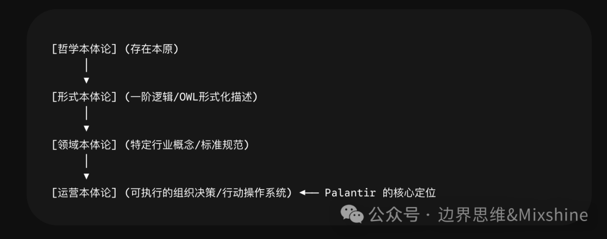
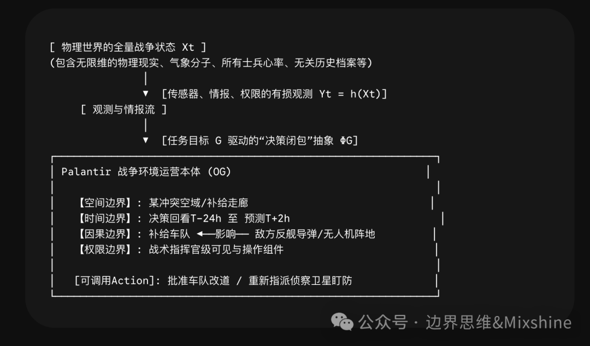
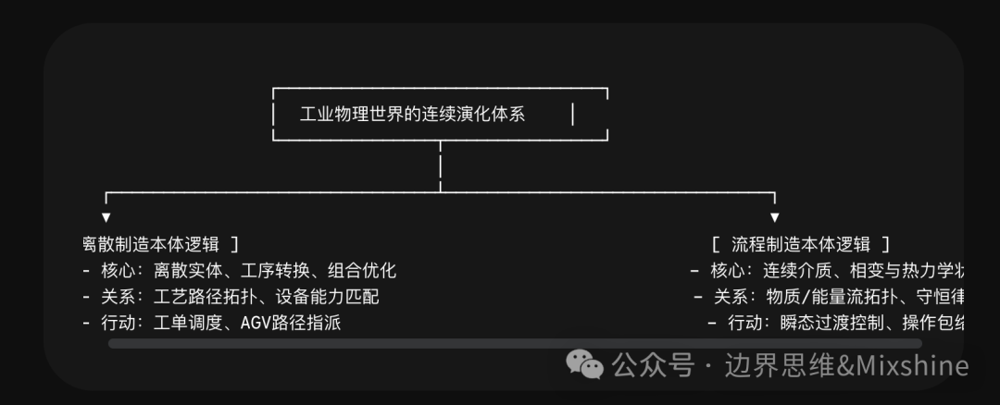
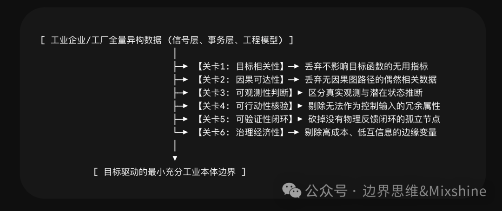
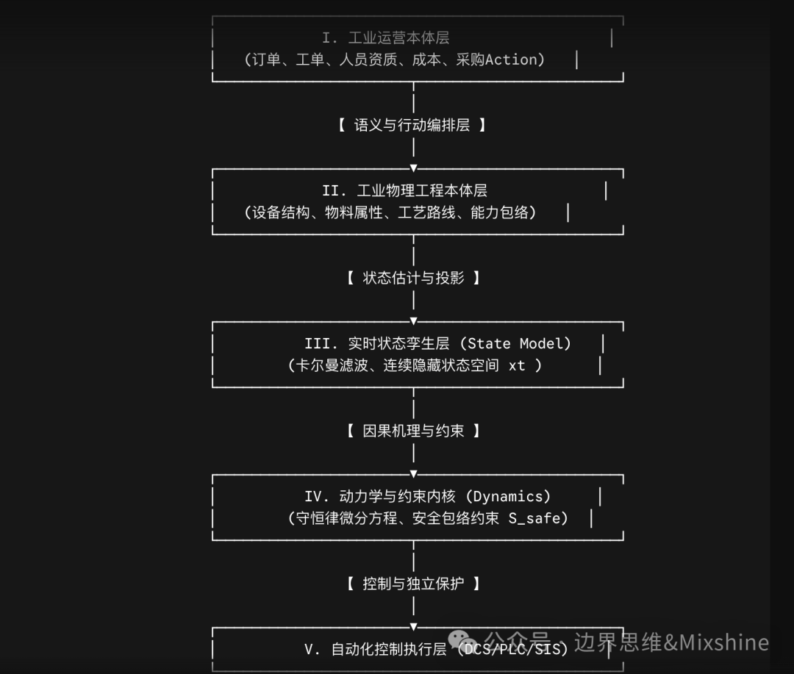
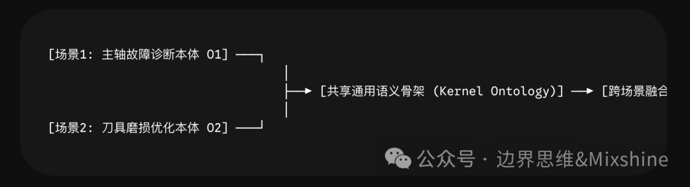

# 为什么工业不能照搬 Palantir Ontology-从决策本体到物理本体：

引言：所有企业都在谈本体，但“本体”正在成为一个危险的万能词

在全球数字化转型与工业人工智能（Industrial AI）的演进中，“本体（Ontology）”正以前所未有的频次出现在科技巨头的白皮书、学术前沿论文以及大型企业的IT战略规划中。随着Palantir将其“Ontology”推崇为Foundry平台与AIP（Artificial Intelligence Platform）的核心底层，并凭借该架构在国防、航空、全球供应链等领域取得瞩目的商业成功后，整个工业界乃至学术界都陷入了一种热潮：似乎只要构建了“本体”，就能一举打破数十年的数据孤岛，实现企业全量数字世界的完美映射，进而自动孵化出无所不能的工业智能体（Industrial Agent）。

然而，这种将“本体”万能化的倾向正在将工业数字化引入一个极其危险的系统性泥潭。

在大量的工程实践中，许多工业企业试图全盘照搬Palantir的模式，或者遵循传统语义网的学术路线，耗费数千万资金与数年时间，试图建设一个“覆盖全厂全量数据、包含所有设备指标、统一所有业务表”的宏大本体模型。其最终结果被证实大多数并没有达到预期效果：要么因为数据治理成本呈几何级数爆炸而中途崩盘；要么建成了结构无比复杂的“大一统知识图谱”，却在面对工厂底层的实时动态控制、工艺约束优化和功能安全边界时，显得苍白无力，无法闭环解决任何实际的物理世界问题。

这些惨痛失败的底层根源在于：业界对“本体”一词产生了根本性的概念混淆与认识论错位。

本文作为对工业AI与语义建模范式的客观审视，尝试梳理这一行业误区。我们必须明确，Palantir的Ontology绝非传统意义上的工业本体，两者在认识论根源、建模目标、技术架构及边界逻辑上存在着不可逾越的代差。盲目在工业物理世界复制Palantir的组织运营模型，无异于用治理公司的行政流程去试图控制一台高炉的非线性化学反应。

本文的核心命题在于：

Palantir Ontology与严格意义上的工业本体论，并不是两套相互替代的同类技术，而是位于不同抽象层级、服务于不同系统目标的两类世界建模机制。Palantir Ontology的本质，是围绕组织决策与业务行动建立的“运营世界模型（Operational World Model）”；而工业本体论的本质，则是围绕物理对象、工程语义、状态演化、工艺约束和控制边界建立的“工业世界形式化模型（Industrial Physical World Model）”。

两者的分野不是简单的技术路线之争，而是“组织如何认识并作用于世界”与“世界本身如何存在、变化并约束行动”的底层第一性原理差异。

# 第一部分：回到第一性原理——本体究竟是什么

## 第一章：从哲学本体论到工程本体论的演进与错位

要理清这场技术错位，我们必须沿袭知识发生学（Genetic Epistemology）的路径，追溯“本体”这一概念在人类思想史与工程史上的四次核心演进。

图1结构示意

### 1.哲学本体论（Philosophical Ontology）

源自古希腊形而上学（Metaphysics），以亚里士多德的《形而上学》为代表，探究的是“作为存在的存在（Being as being）”以及世界的终极存在本原、范畴与结构。它回答的是最根本的形而上学问题：世界上究竟存在什么？物质、时间、空间和因果性的本质是什么？

### 2.形式本体论（Formal Ontology）

20世纪末，随着计算机科学特别是人工智能知识工程（Knowledge Engineering）的兴起，Tom Gruber给出了工程界最著名的定义：“本体是共享概念模型的明确形式化规范（An explicit specification of a conceptualization）。”这一阶段，本体沦为计算机科学的工具，试图用严格的描述逻辑（Description Logics）、一阶谓词逻辑以及诸如OWL（Web Ontology Language）、RDF等技术，将人类的认知概念形式化，以便让机器理解。其唯一目标是描述逻辑的完备性、形式公理体系的严密性以及跨系统的语义互操作。

### 3.领域本体论（Domain Ontology）

将形式本体论应用到特定垂直领域（如制造、医疗、军事、金融），形成标准的概念与关系网络。例如在制造业，Industrial Ontologies Foundry (IOF)试图基于上层BFO（Basic Formal Ontology）建立一套覆盖全球供应链与工厂语义的权威词表。这类本体的本质是“静态的行业标准数字字典”。

### 4.运营本体论（Operational Ontology）

这是由Palantir等产业实践者真正推向工程巅峰的第四类本体。它的核心目标既不是探讨哲学的存在，也不是追求学术上逻辑描述的绝对完备，更不是做一个死板的语义词典，而是：为了组织决策、工作流驱动与业务行动闭环，而构造的一个可运行的、多模态的组织运营世界表示。

行业的关键错位在于，许多人拿着形式本体论的学术尺子去度量Palantir的运营本体，又试图用Palantir的运营本体去硬套工业生产中的物理存在，导致语义强度与工程实践发生严重崩塌。

## 第二章：任何本体都是对现实世界的有损投影与信息压缩

从信息论与认识论的第一性原理出发，现实世界本身是一个无限维的、连续的动力学系统。任何数字系统，无论其算力多么庞大，存储多么廉价，都绝无可能将现实世界“一比一、无损地”搬进计算机。

数字系统对现实世界的建模，本质上都是一种目的性的投影、选择性的抽象与高级的信息压缩。

我们在这里构建一个通用的本体选择性抽象函数。设现实世界的全量物理与信息状态为X_{world}。系统需要完成的任务或特定的组织决策目标为G。本体并不试图去复制或逼近X_{world}，而是构造一个在目标G下的最小充分集表示：

其中，Phi_G是由决策目标G决定的选择、抽象与压缩函数。

因此，一个合格本体的工程检验标准绝不是看它有多接近真实世界（O_G approx X_{world}是无效命题），而是看它在完成目标G时是否满足目标相关充分性（Goal-Relevant Sufficiency）。这可以进一步表达为在信息论框架下的互信息（Mutual Information）与计算治理成本的博弈模型：

其中：

·I(O_G; G)表示本体所包含的概念与状态对决策目标G的有效信息量（不确定性的消除程度）。

·C(O_G)表示为了采集、清洗、治理、维护、授权该本体所付出的算力、系统复杂性以及跨组织协同的综合成本。

·C_{budget}是组织所能承受的最大治理资源包络。

任何本体建设，本质上都是在进行“降低认知与系统的自由度，换取更高阶的业务决策意义”。没有目的性的信息丢弃，就没有可计算的本体模型。

## 第三章：本体边界的底层判据——“决策闭包”

既然本体不可能也不应该包含全量数据，那么它的边界究竟该如何划定？本文在这里提出一个工业AI建模的核心概念：决策闭包（Decision Closure）。

决策闭包是指：为了完成某项特定的状态判断、因果溯因、优化编排或控制行动，系统必须能够沿着本体定义的对象（Objects）、关系（Relations）、状态（States）、规则（Rules）、证据（Evidence）和行动链条（Action Chains），完成从问题输入到结果验证的最小闭环边界。

一个本体的生命力与合法性，不应由“企业当前拥有多少个IT系统和数据库表”来逆向决定，而必须由正向的决策闭包链条确定：

图2结构示意

[决策目标G]│▼[状态判断S]│▼[相关对象E]│▼[必要关系R]│▼[约束与逻辑C]│▼[可选行动A]│▼[结果验证V]

基于此，本体的最简结构与边界判定方程可以严格形式化定义为以下六元组：

O_G = {E_G, R_G, S_G, C_G, A_G, V_G}

·E_G（Entities）：为了达成目标G，系统不可或缺的实体（实体或概念）集合。

·R_G（Relations）：这些实体之间必须维系的工程、业务或时空语义关系。

·S_G（States）：需要对实体进行持续观测、状态估计或隐藏变量推断的状态空间。

·C_G（Constraints）：支配这些对象和状态演化的物理定律、业务规则、工艺边界及安全不变量。

·A_G（Actions）：被允许对对象执行的、可改变状态的原子行动或工作流。

·V_G（Verifications）：行动执行后，用于闭环验证和反馈现实世界变化的证据与度量指标。

当且仅当这六个要素能够在一个明确的边界内构成自洽、可运行的闭环时，该本体的边界才是完整的。任何超越该闭包的数据都是冗余的噪声，任何低于该闭包的模型都是存在致命信息缺失的“断头路”。

# 第二部分：Palantir Ontology的根本原理、案例与适用边界

## 第四章：Palantir真正解决的不是数据孤岛，而是决策断裂

在大型组织（如跨国巨头、军工集团、国防部）中，传统的IT架构通常按照功能烟囱（ERP、CRM、MES、各类型数据库）搭建。过去的数字化尝试（如数据中台、Data Lake）其核心叙事是“统一存储与统一治理”，试图把所有表聚拢在一起。

然而，这类尝试在业务决策层遭遇了集体失败。CEO、指挥官或供应链总监面对成千上万张清洗过的宽表，依然无法做出决策，因为他们看到的是技术视角的“记录”，而不是业务视角的“现实”。分析模型（如Python预测脚本、BI报表）和实际的业务操作系统（执行采购、下达调拨命令）是彻底断裂的。

Palantir敏锐地洞察到了这一点。Foundry和AIP中心的Ontology，根本不是为了做一个“薄语义层”，而是为了在大型异构数据之上，强行封装一层面向组织决策闭环的可执行语义操作系统。

Palantir的核心第一性原理，是通过对象、链接、行动和安全的四重整合，将组织内部的原始数据和割裂的工作流，转化为一种高密度的、可行动的组织运营世界模型。它不解决“数据怎么存”，它只解决数据如何通过四次核心转换，变成业务决策的弹药。

图3结构示意

## 第五章：Palantir架构逻辑的“四次核心转换”

### 1.第一次转换：从技术记录到业务对象（Rows to Objects）

Palantir将源系统中的数据库行、API响应、流媒体日志等，通过其映射层，全部转换成现实中业务人员用自然语言讨论的“名词”——对象类型（Object Types）。例如，将ERP系统中表T001_A的一条记录，转化为对象“A350客机（注册号：B-LAL）”或“第101空降师第1旅”。这是一种由底向上的实体抽象与身份解析（Identity Resolution）。

### 2.第一次转换到第二次转换：从技术连接键到现实关系（Join Keys to Links）

传统的数据库通过外键或关联表（Join Keys）实现表关联，这是纯技术视角的。Palantir将其升维为“现实关系（Link Types）”。例如，抛弃where A.id = B.plane_id的代码，直接定义关系：“[零件X] -Installed_On（安装于）- [飞机Y]”或“[部队A] -Assigned_To（配属到）- [作战任务B]”。关系成为了本体中的一等公民，具备一阶逻辑的直观性。

### 3.第三次转换：从割裂的分析模型到绑定的对象逻辑（Analytics to Logic）

在传统架构中，数据、指标计算公式和机器学习模型是分离的。算法工程师写了一万行机器学习代码预测设备故障，而业务人员在另一个系统里看报表。Palantir将计算指标（Functions）、机器学习预测模型（Models）直接作为属性和方法“绑定”在对象本体上。 当一个业务人员查看“部件C”这个对象时，该对象的本体定义中就直接包含了它的实时健康度= Function_A(流数据)以及未来7天失效概率= Model_B(当前状态)。对象自己拥有了表达自身状态的计算逻辑。

### 4.第四次转换：从普通数据修改到可治理行动（Data Writes to Governed Actions）

这是Palantir运营本体区别于传统知识图谱的决定性特征。知识图谱通常是“只读的”只供查询，而Palantir的本体是“可写的”、“具备可行动性的（Actionable）”。Palantir引入了Action机制。一个Action代表组织中可以执行的“动词”——例如“批准采购订单”、“重新调度物资路线”、“拉响战备警报”。 当Action被触发时，它不仅通过高阶事务（Transaction）修改本体中的对象属性和链接状态，同时通过后置写入器（Side-effects / Write-back），将这一决策结果自动逆向写回源头的传统系统（如ERP或MES），或触发外部API。 更关键的是，这个Action全程受到Palantir极其严苛的、单元格级别的安全与权限权限治理层（Security & ACLs）管控。谁能点这个动词、什么状态下能点、点完之后产生什么连锁政治/财务风险，全部在本体层实施硬治理。

## 第六章：经典案例剖析——Palantir战争环境本体的边界与约束

为了最深刻地理解Palantir的边界逻辑，我们必须拆解其最经典的王牌应用场景：Gotham/Foundry系统在联合全域指挥控制（JADC2）或现代战场环境下的任务决策。

图4结构示意

### 1.现实世界的全量战争状态：近乎无限维的混沌

在真实的物理世界中，战争是一场绝对的、无限维的、高自由度的动力学混沌。它包含了：

·交战区内每一平方厘米的精确三维地形、土壤湿度、每一粒扬尘对光学传感器的折射；

·数万名士兵的实时心率、心理压力、消耗的每一颗子弹；

·所有武器装备的每一处微小机械疲劳度；

·大到全球卫星气象系统，小到微波通信中的每一个电磁扰动。

如果一个数字化系统试图建设一个“全量战争本体”，第一步就会死于数据采集与系统自由度爆炸。在系统控制论中，这属于状态空间不可度量。真实的战争全量状态可写为时间轴上的连续状态向量X_t。

### 2.系统能获得的有限观测

通过军事红外卫星、前线无人机、电子侦察站及人工情报，系统得到的只能是一个受到传感器范围、通信带宽、敌方欺骗和噪声严重干扰的有损部分观测（Partial Observation）：

Y_t = h(X_t, V_t)

其中h是观测函数，V_t是外界环境和敌方对抗产生的强噪声。这天然决定了系统不可能复现“战争真相”。

### 3.任务目标决定Palantir本体的边界与约束

此时，前线指挥官接到了一个明确的决策任务G：“判断未来2小时内，某补给车队穿越A区域时是否会遭遇敌方反舰导弹/隐蔽无人机阵地的突袭，并为该车队生成一条低风险的闭环改道建议。”

Palantir的本体论在这个任务驱动下，通过四种极其硬性的约束边界，在浩瀚的物理世界全量数据中，一刀切出了一个“最小充分的局部运营世界”：

### 空间边界（Spatial Boundary）

本体自动过滤掉全球其他战区的军力部署，仅将A区域及周边导弹射程半径内的地理网格、关键道路节点、掩体地形等实体纳入本体。

### 时间边界（Temporal Boundary）

它不关心三年以前的战争档案，也不做未来两月的战略推演，其时间视窗死死锁在：回看过去24小时的敌军活动迹象（用于状态估计），以及预测未来2小时的车队移动轨迹（用于因果推断）。

### 因果边界（Causal Boundary）

在千亿个对象中，只有“车队、路线、敌方导弹阵地、当前云层遮挡度、防空雷达状态、护航无人机”这几个具有直接或间接因果改变潜能的对象被赋予实体地位。后方军需仓库的办公桌椅数量、友军在五百公里外的非相关机动，全部作为零相关数据被屏蔽在外。

### 权限边界（Security/Classification Boundary）

这是最关键的约束。战场本体内存在着严重的政治与军事隔离：

在系统底层，本体确实将“美军特种部队精确坐标”和“盟军常规步兵路线”连接在了一起。但是，当一个常规战术分队指挥官登录系统时，Palantir的本体引擎（Ontology Engine）根据其安全标记（Security Tags），实施了动态修剪——特种部队的属性在本体图譜中被彻底隐形，或者被模糊处理为一个“友军泛化区域”。这确保了决策行动既符合现实，又绝对合规安全。

### 4.解决的结果化问题与内在逻辑原理

在这个战争案例中，Palantir并不回答“整场战争的最终胜负概率是多少”这种虚无的形而上学问题。它精准解决了三个结果化的工程问题：

·状态融合与不确定性消除（Sensor Fusion）：将分散在独立系统里的红外辐射信号、雷达截面异动、前线线报，融合为一个具体的、高置信度的敌方“导弹发射车”对象，并赋予其状态属性（Ready to Fire）。

·行动冲突推演（Action Simulation）：通过在本体上运行一个Scenario（仿真沙盘），当指挥官尝试调用Action “指令车队改道B路线”时，系统沿本体链接自动检查B路线的“道路通行能力（Link Property）”与“敌方火力覆盖区（Constraint）”是否冲突。

·一键闭环执行（Transactional Write-back）：指挥官确认路线后，点击“执行”。系统通过Action自动将新路线推送到车队终端，并向防空总队发起“协同盯防”工单，完成一次战术组织的高效运转。

这就是Palantir的核心价值：它建模的是组织（指挥部与前线部队）如何认识这个战场并作用于这个战场；它从来不试图去建模战场本身万物的物理演化本质。

## 第七章：Palantir适用行业的结构共性与底层“硬天花板”

通过对Palantir在空中客车（Skywise平台）、英国国家医疗服务体系（NHS）、BP石油等公开案例的深入剖析，我们可以总结出它所适用的行业具备以下四大高度一致的结构共性（Structural Commonalities）：

行业结构共性

典型案例表现

数据高度异构，但决策必须跨系统协同

空客Skywise需要同时调用PLM、生产工单、全球供应商库存、航班延期日志，完成单机维修决策。

决策对象极为明确，但关系网络错综复杂

NHS医疗物资调度中，“疫苗-冷链车-医院-感染率-接种点”构成了高密度关系网络。

决策需要高频跨越“分析分析”与“事务执行”

供应链优化中，发现库存短缺（分析）后必须立刻在ERP中下达采购单（执行）。

权限、合规与信息隔离是组织的生命线

金融反洗钱、多国联合军演，必须保证“同一套数据、严密的视图隔离”。

然而，正因为Palantir的所有设计都在服务于“组织运营与业务闭环”，当它试图跨越边界、进入工业物理底座时，就会一头撞上其技术架构底层的“硬天花板”。这些边界构成了它不适用于工业核心生产本体的决定性证据：

### 边界一：它主要是运营语义，不等于物理因果语义

在Palantir本体中，“[反应釜A] -Belongs_To（属于）- [一号车间]”或者“[操作工B] -Certified_For（具备资质）- [设备C]”，这是组织关系与业务合规。 但在工业生产中，核心问题是：“当乙烯进料量增加5%时，反应釜内的热平衡将如何变化？催化剂的选择性会发生怎样的非线性衰减？”Palantir的关系网络无法自发推导这种基于守恒律的物理因果。它可以在对象上挂一个Python算法脚本来展示结果，但这只是“把计算结果贴在看板上”，对象的语义本质没有改变。

### 边界二：对象图不等于动力学状态空间模型

Palantir建模的核心数据结构是基于图（Graph-like）的离散实体与静态属性关系。尽管它支持时序数据（Time Series Linkage），但它对对象的理解是“状态的切片展示”。 工业核心本体面对的是连续的、高耦合的动力学系统。一个工业对象的状态演化受制于其常微分或偏微分方程：

对象的当前状态、输入控制变量u(t)和外界扰动d(t)，决定了它在下一时刻的连续过渡态。Palantir的Ontology架构不具备这种对状态连续演化、时滞和惯性的底层的形式化数学表达能力。

### 边界三：业务规则（Business Rules）不等于物理硬约束（Hard Physical Constraints）

Palantir的Action校验逻辑是事务性的。例如：if (库存< 10)阻止执行Action调拨。这属于可由人意志修改的业务或管理规则。而工业本体要处理的是：“当反应器内壁压力超过4.5 MPa时，材料将发生不可逆塑性形变，触发物理爆炸。”这属于不可违背的物理硬约束与功能安全边界。两者的约束强度完全不在一个数量级。在Palantir中，规则失效最多导致账目报错或管理混乱；在工业生产中，约束失效意味着机器毁坏与人员伤亡。

# 第三部分：工业本体论为什么是另一个问题

## 第八章：工厂是一个连续变化的动力系统，而非静态的对象关系图

当我们把视线从Palantir擅长的“市长办公室、陆军指挥部、采购总部”移到“化工园区、半导体晶圆厂、超高压电网”时，整个建模世界的底层逻辑发生了彻底的坍塌。

一个现代化的工厂，其本质根本不是“一堆离散的物理资产和业务对象的组合”，而是一个在空间上高度分布式拓扑、在时间上强耦合、受多重守恒定律严格支配的、部分可观测的连续/离散混合动力系统。

图5结构示意

在工业场景中，我们要建模的“母对象”往往不是一段明确的文本记录或分立的固体硬件，而是诸如“在管道内以45m/s高速流动的多相混合流体”、“处于超临界状态下的催化反应气体”。这些对象没有固定的物理边界，其身份是随时间不断发生相变（Phase Change）和化学反应的。

因此，工业AI的母模型逻辑，必须引入控制论的状态空间表示（State-Space Representation）与部分可观测马尔可夫决策过程（POMDP）：

工业本体的第一任务，不是去画出一张好看的“资产层级树状图”，而是必须首先在语义上定义：哪些是系统真正的内部状态向量x_t（多半不可测，如高炉内熔融铁水温度），哪些是系统可获得的观测物理量y_t，以及它们之间由偏微分方程表达的因果联系。

## 第九章：工业实体具备的五种“强物理语义属性”

任何能够被称为“工业物理本体”的模型，其定义的对象除了必须具备Palantir拥有的“ID、业务名称”外，还必须无条件完整回答以下五个关于“世界本身如何存在与演化”的问题：

### 1.物理实体性与材料约束（Physical Materiality）

对象是由什么物质构成的？其几何拓扑结构是什么？该材料的拉伸极限、热膨胀系数、疲劳曲线等底层物理不变量是什么？这决定了对象的耐受极限。

### 2.状态演化性与时域特征（Temporal-Dynamic Evolution）

对象的状态在时域上是如何连续退化的？比如一个轴承，其本体不仅记录当前的振动有效值，还必须形式化地描述其“疲劳裂纹扩展的巴黎公式（Paris' Law）”，以便让AI能够理解状态变化的瞬态过程（Transient Process）。

### 3.设备能力边界与包络（Capability Envelopes）

设备在物理和工程上“能做什么、不能做什么”。例如，一台多轴数控机床的本体，必须严密定义其主轴最高转速、最大切削扭矩以及定位精度的空间分布。这种能力模型（Capability Model）是AI智能体自主编排工艺路径（Process Planning）的基石。

### 4.工艺依赖与多场耦合（Process Dependencies & Multiphysics）

对象绝非孤立存在。在流程工业中，精馏塔本体必须定义气液两相在塔盘上的质量交换、热量平衡以及压力梯度。它必须描述流体力学、热力学与化学反应动力学的多场耦合（Multiphysics Coupling）语义。

### 5.灾难性物理安全后果（Catastrophic Safety Consequences）

每一个工业行动（Action）在本体中都必须挂接其“风险传播路径”。一旦触发某操作，在物理上是否会导致温度失控、超压或设备共振？它的越限后果不是“系统报错”，而是“工厂毁灭”。

## 第十章：工业本体论的数据边界判定——六种工程约束判定法

回到“工业本体的数据范围和边界在哪里”这一最具争议的工程核心问题。工业界必须彻底粉碎“全量数据大一统中心”的幻想。

工业本体的边界划定，绝不能采用“自底向上、有什么表接什么表”的集成逻辑，而必须采用“自顶向下、由决策闭包O_G驱动的六边界判定法（Six-Gate Filtering Method）”。

对于企业的一个明确的智能决策目标G（如：高炉长寿化热工制度优化、半导体晶圆良率异常追溯），某项工业数据或对象属性是否被允许进入本体，必须通过以下六道硬性工程关卡的严格审计：

图6结构示意

### 1.目标相关性约束（Goal Relevance）

该变量或实体是否会直接显式进入目标函数J的计算中？例如在“高炉炉壁烧穿风险预测”本体中，该反应的直接物理量相关，而全厂配电房的非相关电能计量表读数则直接在第一关被剔除。

### 2.因果可达性约束（Causal Reachability）

该变量与目标结果之间，在已知的工业机理或因果图（Causal Graph）中，是否存在可达的路径？如果一个变量（如操作工的工龄）与晶圆良率之间仅存在统计学上的假性相关（Spurious Correlation），而无任何物理/工艺层面的因果传导机制，则拒绝其进入核心物理本体，防止AI学习到虚假规律。

### 3.可观测性约束（Observability Gate）

该状态量在物理上能否被传感器直接测量？如果不能（如电机转子的内部实时温度），它能否通过现有的可测输出量，经由状态观测器（如卡尔曼滤波器、龙伯格观测器）进行数学估计？若既不可测又不可估计，该变量在本体中必须被显式标注为“隐藏潜在变量（Latent Variable）”，并限制其参与直接推理，不能伪装成已知事实。

### 4.可行动性约束（Actionability Constraints）

系统在获取了这一本体属性后，是否有对应可调节的执行机构（如执行阀门、变频器、调度工单）去施加干预？如果系统面对一个指标（如环境大气绝对湿度）只能观测、完全无法控制且该指标不影响工艺参数的自动调整，那么它在运行本体中仅作为环境背景参数，不作为核心状态对象。

### 5.验证性约束（Verifiability Validation）

对该本体对象执行某项Action后，物理世界是否能在确定的时延内（Time Delay）返回可被传感器捕获的反馈信号（Feedback Evidence）？如果一个关系链条是“断头路”，即系统施加了操作，却永远无法验证其物理后果，这无法构成强化学习或智能体的闭环学习模型。

### 6.治理经济性约束（Governance Economics）

这是决定工程能否落地的现实约束。采集、清洗、维系该数据的实时高频同步（如100Hz的振动原始波形数据）并对其进行长期本体存储的综合总成本C_{cost}，是否显著低于其为决策不确定性消除所带来的经济效益（互信息增益收益）？如果产出远低于投入，则该数据边界应被果断压缩。

通过这六道硬性工程过滤，工业本体的构建直接摆脱了“大一统”数据中心的工程诅咒，形成了一种高密度、高价值、边界清晰的“目标驱动型本体子图”。

# 第四部分：两种本体论的根本分野与核心差异矩阵

## 第十一章：运营世界模型与物理世界模型的全方位碰撞

为了让各学科专家能够以最严谨的视角审视两者的代差，我们从认识论、科学母题到系统工程底座，对Palantir运营本体与严格工业物理本体进行全方位的对比：

比较维度

Palantir运营本体论（Operational Ontology）

严格工业物理本体论（Industrial Physical Ontology）

第一系统目标

组织运营决策与业务行动的高效编排

物理-工程世界的可解释、可预测、可验证状态表示

核心建模对象

业务实体（如订单、客户）、组织角色、战术任务、运营资源

物理资产、连续介质、相变过程、热力学状态、设备能力边界

边界定义来源

任务闭包、决策工作流需求、组织权限红线

工艺约束边界、控制系统边界、物理三大守恒律边界

底层核心关系

业务属于、合规指派、任务依赖、组织隶属（离散、语义化）

结构空间几何、时间演化、工艺物理耦合、守恒因果关系

世界状态观

对象的静态/历史属性切片，关注“数据记录是否一致”

连续/离散混合状态空间，关注“隐藏状态估计的置信度”

时间表达机制

离散的事件流（Event Stream）、静态时序点（Timestamp）

连续时间的微分/差分动力学、瞬态过渡演化、确定性时延

约束的本原强度

软性业务规则、流程审批阻断、事务ACID校验（人为可改）

硬性物理规律（质量/能量守恒）、材料极限、独立安全层

行动（Action）本质

事务性修改、数据库回写、API调用编排（无瞬态时间）

动力学控制输入（Control Input）、安全包络内的参数干预

结果验证机制

业务日志审计、人工审批流、报表指标对齐反馈

物理传感器闭环反馈、高精度数字孪生仿真、稳定性判定

映射真实世界方式

现实世界在组织行动层面的选择性投影与效率工具

物理现实在工程机理与控制边界上的多层形式化形式化

典型工程优势

异构系统数据对象化极快，组织流程协同与安全治理能力极强

确保AI行动的工程正确性、物理可行性与生产绝对安全性

典型工程局限

完全无法提供底层物理机理、控制稳定性和功能安全保证

建设成本极高，若无上层运营绑定，往往缺乏直接业务价值

这幅差异矩阵彻底揭示了为什么工业企业直接照搬Palantir会发生严重水土不服：两者的第一性原理完全指向了不同的科学母题——Palantir解决的是“组织内部的信息熵与协同效率”；工业本体解决的是“物理世界的能量耗散与物质控制”。

# 第五部分：工业场景究竟需要什么样的本体架构？

## 第十二章：提出下一代范式——“工业运营—物理双层本体架构”

既然Palantir的运营本体在跨系统决策、权限治理和行动回写上具备无可比拟的优势，而工业物理本体在机理、控制与安全上是不可替代的刚需，那么工业AI的终极解法绝非二选一，而是将两者进行彻底的解耦与多层共生。

下一代工业AI核心底座范式——“工业运营—物理双层本体架构（Industrial Twin-Layer Ontology Architecture）”。

图7结构示意

该系统架构严格分为五个互联的层级，实现从最上层的宏大业务决策，到最下层的确定性物理控制的逐级翻译与安全保护：

### 第一层：工业运营本体层（Operational Ontology Layer）

这一层处于架构的顶端，完美吸收Palantir的核心思想。它负责将ERP、SCADA、供应链系统中的异构事务数据对象化，建立关于“订单、工单、人员、供应商、客户、生产成本”的对象图谱，并绑定管理规则与细粒度的组织安全权限。它负责回答：“组织现在想从这一批原料中获取多少最大利润？”

### 第二层：工业物理工程本体层（Physical Engineering Ontology Layer）

作为承上启下的核心纽带。该层定义工厂物理世界的资产拓扑结构（如符合ISA-88/ISA-95标准的设备层级）、材料的物理/化学属性词表、以及工艺过程的逻辑关系。它将最上层的离散业务名词（如“生产计划”）翻译成物理实体能够理解的工程概念（如“加热炉工况参数”）。

### 第三层：实时状态孪生层（Real-time State Twin Layer）

该层彻底告别静态数据。它利用工厂底层的实时工业物联网（IIoT）高频流数据，通过底层内置的扩展卡尔曼滤波（EKF）、工业机理观测器或高精度虚拟传感器（Soft Sensors），对物理实体的隐藏状态向量进行连续的、高置信度的状态估计（State Estimation）。它维系的是关于物理世界“此刻真实状态”的最优信念（Belief State）hat{x}_t。

### 第四层：动力学与因果约束内核（Dynamics & Constraint Kernel）

这是架构的“物理守护神”。它内部固化了该工业领域的核心常微分/偏微分方程组（机理模型）以及基于热力学、动力学的物理硬约束。它实时计算当前状态下的安全包络空间（Safe Envelope Area）S_{safe}：

当上层运营本体通过Agent发起一个Action意图时，该意图必须作为控制边界输入传入该层。该内核通过高速仿真推演，判定该Action是否会使系统在时域的过渡态演化中撞击安全包络边界。若判定安全，则予以放行；若判定违背物理约束，则实行架构级的一票否决。

### 第五层：自动化控制执行层（Deterministic Control & Protection Layer）

处于架构最底层，由工厂现有的分布式控制系统（DCS）、可编程逻辑控制器（PLC）以及独立的安全仪表系统（SIS）构成。它不参与高阶复杂的本体推理，只接受第四层下发的高确定性、低时延的设定值（Setpoints）或控制指令，并在毫秒级闭合物理控制环（Control Loops），确保物理世界的绝对稳定。

整个架构的形式化系统表达方程为：

通过这种双层解耦与多层共生，工业AI智能体（Industrial Agent）终于获得了一个完美的运行舞台：在大模型（LLM）的调度下，它既能像操作Palantir一样灵活地编排组织业务Action，又绝对无法逾越物理守恒律与功能安全的雷池一步。

## 第十三章：工业本体如何沿高价值场景逐步生长（发生学路线）

在明确了双层架构后，如何将其落地？那种期望花五年时间先建一个“全厂通用本体”的路线在工程上已被证明是一座死胡同。

真实的工业本体建设必须遵循认知发生学（Genetic Epistemology）的渐进路线：“从单一高价值场景构建最小可用本体（MVP），沿场景链条像晶体析出一样逐步生长与融合。”

图8结构示意

具体工程落地的十步迭代循环法如下：

### 1.定义核心决策目标（Define GoalG）

明确界定业务痛点。例如：“在保证反应釜不发生局部过热的前提下，提高某化学中间体的单位小时产率3%。”

### 2.梳理业务与控制决策（Identify Decisions）

理清为了达到这个目标，AI或操作员需要执行哪些具体的调优决策？（如：调整冷却水流量、改变催化剂补充流速）。

### 3.划定决策闭包的实体集（Isolate EntitiesE_G）

使用六边界判定法，精准挑出与此反应直接相关的反应釜、进料阀、温度计等最简实体。排除其余无关资产。

### 4.定义实时物理状态空间（Map State SpaceS_G）

确定反应过程的物理状态向量（如：内部真实反应热浓度、催化剂活性指数），设计其状态估计模型。

### 5.注入物理、工艺与安全约束（Inject ConstraintsC_G）

将材料耐温极限、化学反应的动力学反应速率常数等硬性公式固化进本体约束层。

### 6.设计可行动操作包络（Design Action SpaceA_G）

明确定义系统可以执行的参数调整动词，以及每个动词的物理调节范围上下限。

### 7.建立传感器证据链验证（Wire VerificationV_G）

指定由哪些压力表、流量计和色谱分析仪的实时回传信号，作为判定Action效果的客观证据。

### 8.配置组织细粒度权限（Configure Security）

设定操作该场景Action的安全密级（如：仅高级工艺总监级AI Agent可调控核心阀门）。

### 9.场景本体独立投产上线（Go Live as MVP Subgraph）

将该小巧、自洽的场景本体注入智能体底座，直接闭环解决该场景的生产调优问题，快速变现商业价值。

### 10.跨场景本体晶体化融合（Crystalline Growth）

当第二个高价值场景（如：下游产品的精炼纯化优化）开始建设时，遵循相同的十步法构建本体子图O_2。O_1与O_2通过底层的共享核心语义骨架（Kernel Ontology）（如IOF定义的通用物理量、时间与空间规范）进行实体对齐（Entity Alignment），两个子图自发融合成一个更大、更丰富的企业级本体网络：

工业本体不是被“规划”出来的，而是通过一个又一个能闭环解决物理实际问题的最小充分世界，在共享语义骨架的约束下，像晶体一样自发析出、生长并融合出来的。

# 结论：本体不是对世界的复制，而是行动者进入世界的接口

工业场景到底需不需要讲本体？答案是绝对需要，但我们需要的绝不是Palantir式的、纯粹为了组织流程效率而生的“业务运营本体”，而是一套能够融合物理机理、动力学演化与功能安全边界的“双层闭环本体”。

Palantir创造了数字化历史上最伟大的范式转型之一：它深刻地证明了，数据如果只被组织成数据库里的记录或报表上的指标，就永远只是死资产；数据只有被组织成一个“可行动、可治理、可验证、具备严密安全权限”的对象世界，才能真正赋予行动者做出决定并改变现实的力量。这一思想，是工业AI和智能体建设必须继承的宝贵财富。

然而，工业物理世界拥有比人类行政组织远为坚硬的底层逻辑。在组织运营中，规则的逾越最多导致业务链条的混乱与亏损；但在物理世界中，守恒律的违背与安全边界的撞击，带来的有可能是灾难性的毁灭。

Palantir的本体论告诉我们，组织应该如何高效地认识这个世界并作用于这个世界。而严格的工业本体论则必须进一步用形式化数学语言去严密回答：物理世界本身是如何存在、如何变化，以及它为什么会允许或拒绝人类的这种作用。

做为工业AI实践者，需要客观思考“建设全厂大一统数据中心”的宏大叙事迷思，尝试“决策闭包”驱动的、高价值场景渐进生长的双层本体路线以及更多符合工业场景的实际落地路径。唯有如此，我们才能真正将大模型的灵活组织协同能力，与底层自动化系统的确定性物理控制完美结合，建立起真正坚固、安全且极具生产力的工业智能世界模型。这不仅是工业AI从概念走向大规模产业落地的必由之路，更是人类工程建模思想史在智能时代的终极跃迁。
