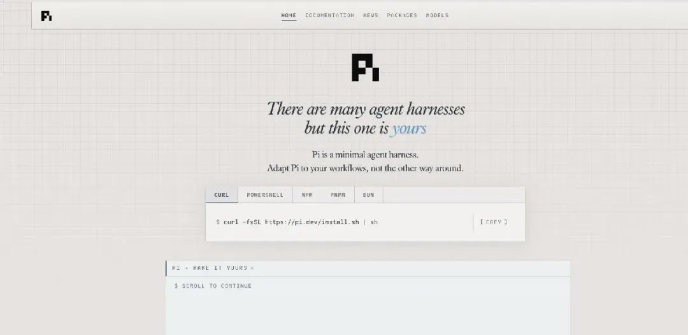
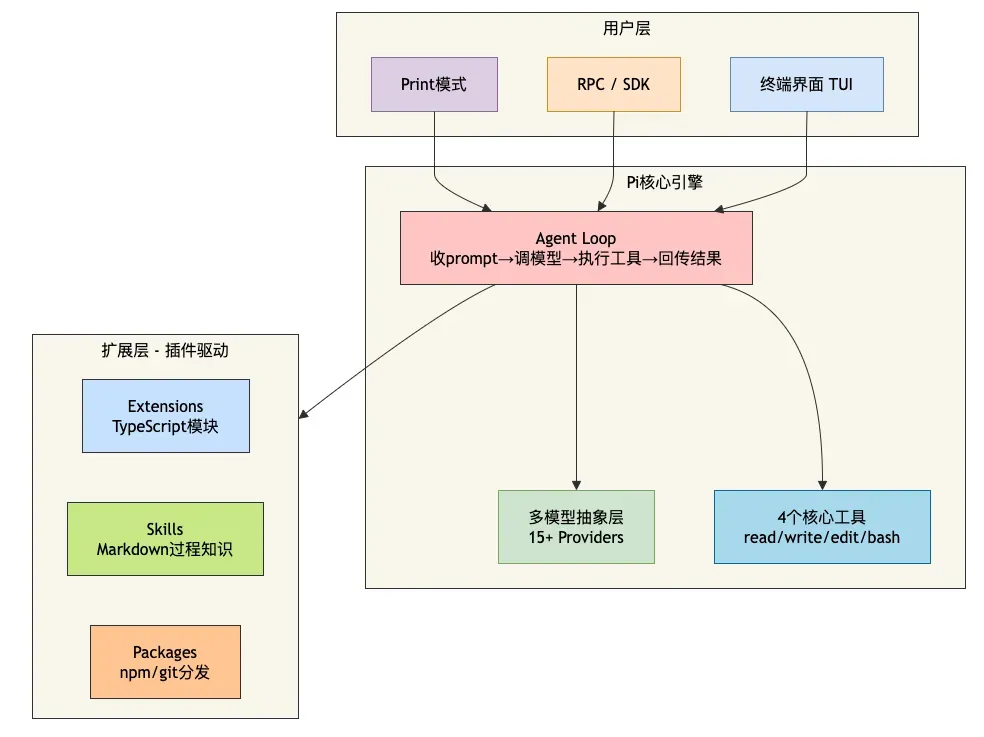

# 为什么越来越多人用 Pi ？

来源丨经授权转自苏三说技术（ID：susanSayJava）作者丨苏三前言系统提示词只有200 Token，GitHub狂揽8.6万Star，它凭什么成了Claude Code最强平替？最近这段时间，我的技术群几乎被同一个名字刷屏了——Pi。第一次听说Pi的时候，我以为又是什么新的AI编程工具。毕竟这个赛道已经挤满了Claude Code、Codex、Cursor……再多一个也不稀奇。但深入研究之后，我发现Pi跟其他工具完全不是一路子。当别人都在疯狂堆功能的时候，Pi在玩命做减法。Claude Code的系统提示词有14000 Token，内置十几个工具。Cursor、Windsurf也在不停地往里面塞新功能——子代理、计划模式、MCP、权限弹窗、后台Bash、TODO管理。而Pi呢？系统提示词只有200 Token。核心工具就4个——Read、Write、Edit、Bash。一个把功能做到极致复杂，一个把功能做到极致简单。结果呢？Pi在GitHub上狂揽8.6万Star。被开发者评为“目前唯一能真正平替Claude Code的Agent架构”。今天这篇文章，我就把Pi为什么越来越多人用的原因，从头到尾给你拆解一遍。一、Pi到底是什么？Pi是由libGDX创始人Mario Zechner创建的开源终端AI编程Agent。核心思想可以用一句话概括：给你原语（Primitives），而不是预烹饪好的功能（Features）。它在设计上做了一件非常反直觉的事：刻意删掉了其他工具拼命添加的功能。不支持MCP不支持内置子代理不支持内置计划模式没有权限弹窗没有内置TODO管理甚至没有绑定任何特定模型但Pi留下了四个“原语级别”的工具：工具说明read读取文件内容（支持文本和图片）write写入/创建文件edit精确替换文件内容bash执行bash命令这套组合拳打出来的效果非常惊人：Pi的系统提示词+工具定义加起来不到1000 Token。而Claude Code光系统提示词就占了14000 Token。Mario Zechner在解释Pi的设计理念时说了一段非常扎心的话：“这一代最先进的大模型其实已经非常擅长几件事：读文件、写文件、改文件，以及调用bash。很多情况下，bash本身就是最通用的工具接口。你不需要教模型怎么做，只需要告诉它有什么工具可用。”这句话点出了Pi的核心逻辑：当今的前沿模型已经被RL训练得足够好了，它们本身就理解编码Agent是什么、该怎么做。不需要10000 Token的长篇大论来教它们工作。二、一张图看懂Pi的核心架构在深入代码之前，我们先建立一个整体认知。Pi的核心架构极其简单——本质上就是一个while循环：调用LLM，给它配上4个工具，再根据模型返回的结果决定是否继续调用。这种极简设计带来的直接好处是：它的复杂度是可控的、可理解的、可扩展的。三、为什么越来越多人用Pi？3.1 原因一：便宜到离谱99.93%的缓存命中率。这是Pi最让人震惊的数据。有开发者把DeepSeek接入Pi后，约99.93%的输入Token都成功命中缓存。换句话说，**缓存不命中率只有0.07%**——绝大部分重复上下文无需重新计算。为什么Pi能做到这么离谱的缓存命中率？因为Pi的系统提示词只有200 Token。其他Coding Agent的系统提示词动不动就上万Token，每次调用都要把这些Token重新发给模型。而Pi只有200 Token，加上工具定义也不到1000 Token。系统提示词越短，能命中缓存的Token比例就越高，调用成本就越低。Composio团队横向测试了8款主流Agent Harness，把DeepSeek V4 Flash塞进去跑真实任务。结果Pi完成一次成功任务的平均成本最低，只需要约0.028美元。而Claude Code直接干到了Pi的7倍价格。DeepSeek的Token已经卖得很便宜了，Pi还能让用户花得更少。3.2 原因二：不锁模型告别“平台依赖症”。2026年6月底，Claude Code搞了一波大规模封号。它通过读取用户本机时区（如果是Asia/Shanghai就把日期格式改掉）、检查是否使用中转域名等方式，把系统提示词里的字符替换成不同的Unicode编码。这些信息被回传到Anthropic服务器，后端直接判断你是不是中国用户。换IP、换节点、换中转，都没用。因为它检测的不是你的网络环境，是你的设备环境。这件事让很多开发者意识到了一个问题：把生产资料绑定在任何单一工具上都是危险的。而Pi从一开始就不绑定任何特定模型。它可以接：Claude的APIKimiDeepSeekOpenAIGooglexAI、Groq等15个以上的供应商你今天用Claude的API跑Pi，模型能力本身不打折。但你不再依赖Claude Code这个客户端。账号被封了，模型还在，换个供应商接上就能继续干活。3.3 原因三：兼容已有积累Skill和AGENTS.md无缝迁移。如果你已经在Claude Code里积累了一堆Skill，Pi装完之后会自动读取~/.agents/skills这个目录——不用做任何迁移，Pi直接识别，开箱即用。同样的，Pi也支持AGENTS.md。你之前在项目根目录里写好的项目上下文文件，Pi打开项目的时候会自动加载。你积累下来的那套项目规范、约束、边界，换到Pi里一行不用改。3.4 原因四：可扩展想要什么功能，自己装。Pi默认只给了4个工具。但如果你需要计划模式、子Agent、MCP、Git检查点或权限控制，可以通过扩展和Skills逐件装上去。打个比方：其他工具是精装房，交房的时候什么都有，但你不能自己改格局。Pi是毛坯房，水电齐全、四面墙盖好，最后装修成工作室、电竞房还是三室一厅，全看你自己折腾。一个真实的案例：有开发者基于Pi搭建了一套配置，包含了17个插件、18个全局Skill、2个MCP服务器。用一键安装脚本，把Pi打造成了一个能多代理协作、能省Token、能跑浏览器的全能终端编码Agent。四、三步跑通Pi光说理论不够，我们来看怎么快速上手Pi。4.1 第一步：安装PiPi通过npm安装，需要Node.js环境：npm install -g @earendil-works/pi-coding-agentPi官方文档推荐使用--ignore-scripts标志：npm install -g --ignore-scripts @earendil-works/pi-coding-agent4.2 第二步：配置API KeyPi支持多种认证方式：方式一：环境变量（推荐）# 以DeepSeek为例exportDEEPSEEK_API_KEY="你的API Key"# 或者AnthropicexportANTHROPIC_API_KEY="你的API Key"# 启动Pipi方式二：OAuth登录（订阅账号）pi /login# 选择供应商并完成OAuth认证支持的订阅服务包括：Claude Pro/Max、ChatGPT Plus/Pro、GitHub Copilot、Google Gemini CLI等。4.3 第三步：进入Pi的交互界面安装并配置好API Key之后，直接在终端输入pi即可进入交互模式：pi启动后，终端界面从上到下依次是：启动头部：显示快捷键提示、已加载的AGENTS.md、模板、技能、扩展消息区域：用户消息、AI回复、工具调用结果编辑器：输入区域，边框颜色表示thinking级别底部状态栏：工作目录、会话名称、Token用量、费用、当前模型常用快捷键：快捷键功能Ctrl+C清空编辑器Ctrl+C × 2退出piEscape取消/中止当前操作Ctrl+L打开模型选择器Shift+Tab循环切换thinking级别常用命令：命令功能/loginOAuth认证/model切换模型/resume恢复之前的会话/new开始新会话/session显示会话信息/tree浏览会话树/compact手动压缩上下文/exit退出4.4 实战：在Java项目中使用Pi假设你有一个Spring Boot项目，想要Pi帮你修复一个单元测试。直接在终端里输入：pi然后输入任务描述：帮我把这个Spring Boot项目里所有失效的单元测试修好Pi会自动：用read读取测试文件用bash执行测试命令（如mvn test）分析错误输出用edit修改有问题的测试代码再次运行测试验证整个过程都在终端里完成，你不需要切换任何工具。五、Pi vs Claude Code的差异我把Pi和Claude Code放在一起做了个对比：对比维度PiClaude Code系统提示词~200 Token~14000 Token核心工具4个（read/write/edit/bash）10+个模型绑定不绑定，支持15+供应商仅Claude开源协议MIT闭源扩展方式插件/Skills/TypeScript有限（Skill）设计哲学做减法做加法MCP支持不支持，用CLI工具替代原生支持权限管理默认YOLO模式弹窗确认成本极低（~0.028美元/任务）高（7倍于Pi）GitHub Stars8.6万+12.4万+六、优缺点优点1. 极致省钱系统提示词只有200 Token，配合DeepSeek的缓存机制能达到99.93%的缓存命中率。完成任务的平均成本仅0.028美元，是Claude Code的七分之一。2. 不锁模型支持15+个模型供应商。Claude封了换Kimi，Kimi不行换DeepSeek，永远不用担心被单一平台绑架。3. 完全开源MIT协议，可以自由使用、修改、商用。4. 兼容已有积累自动读取~/.agents/skills和AGENTS.md。你在Claude Code里积累的Skill和项目规范，换到Pi里一行不用改。5. 可无限扩展默认只有4个工具，但通过Extensions、Skills、Packages可以按需添加任何功能。从毛坯房到精装房，你自己决定。6. 极简设计，完全可控Pi本质上就是一个while循环，你能完全理解它在做什么。不像其他工具那样像个黑箱。缺点1. 默认功能太少刚装上Pi的时候，你会觉得“这也太简陋了”。没有计划模式、没有子Agent、没有MCP、没有权限弹窗。想要这些功能，得自己装扩展。2. 需要一定的动手能力Pi的理念是“给你造AI助手的工厂”，不是“给你一个AI助手”。你需要自己去配置、去扩展、去折腾。3. 终端门槛Pi是纯终端工具，没有图形界面。对不习惯命令行的开发者不太友好。4. 生态相对年轻虽然发展很快，但相比Claude Code的生态，Pi的插件和扩展数量还在快速增长中。七、适用场景场景推荐程度理由追求极致性价比✅✅✅ 强烈推荐成本是Claude Code的七分之一不想被单一平台绑定✅✅✅ 强烈推荐支持15+模型供应商已积累Claude Code Skill✅✅✅ 强烈推荐无缝迁移，一行不改喜欢折腾和定制✅✅✅ 强烈推荐毛坯房设计，想怎么装就怎么装日常编码辅助✅✅✅ 强烈推荐轻量高效，响应快团队共享工作流✅✅✅ 强烈推荐配置可复制、可分享想要开箱即用的体验⚠️ 需评估默认功能太少，需要自己折腾不熟悉终端的开发者⚠️ 需评估纯终端操作，有学习成本八、写在最后回到最初的问题：为什么越来越多人用Pi？答案其实不复杂——当其他工具都在疯狂堆功能的时候，Pi选择了做减法。Claude Code的系统提示词14000 Token，Pi只有200 Token。这个差距意味着什么？每一轮对话，Claude Code都要把14000 Token塞进上下文，Pi只需要200 Token。再加上DeepSeek的缓存机制，Pi能把输入Token的缓存命中率做到**99.93%**。而真正打动我的，是Pi背后的设计哲学：“对Agent来说，你刻意不做什么，比你做什么更重要。”当一个Agent变成你无法理解、无法预测的黑箱时，问题也许不是能力不够，而是复杂度本身。Pi的答案，是把系统收敛到一个最小内核：简单到你可以理解它、控制它，再通过扩展去生长。结果反而是——越简单，越可控。Claude Code是“给你一个AI助手”，Pi是“给你造AI助手的工厂”。你会发现——AI编程工具，可以这么轻、这么省、这么自由。开源地址GitHub：https://github.com/earendil-works/pi（8.6万+ Star）官方文档：https://pi.dev

来源丨经授权转自苏三说技术（ID：susanSayJava）作者丨苏三前言系统提示词只有200 Token，GitHub狂揽8.6万Star，它凭什么成了Claude Code最强平替？最近这段时间，我的技术群几乎被同一个名字刷屏了——Pi。第一次听说Pi的时候，我以为又是什么新的AI编程工具。毕竟这个赛道已经挤满了Claude Code、Codex、Cursor……再多一个也不稀奇。但深入研究之后，我发现Pi跟其他工具完全不是一路子。当别人都在疯狂堆功能的时候，Pi在玩命做减法。Claude Code的系统提示词有14000 Token，内置十几个工具。Cursor、Windsurf也在不停地往里面塞新功能——子代理、计划模式、MCP、权限弹窗、后台Bash、TODO管理。而Pi呢？系统提示词只有200 Token。核心工具就4个——Read、Write、Edit、Bash。一个把功能做到极致复杂，一个把功能做到极致简单。结果呢？Pi在GitHub上狂揽8.6万Star。被开发者评为“目前唯一能真正平替Claude Code的Agent架构”。今天这篇文章，我就把Pi为什么越来越多人用的原因，从头到尾给你拆解一遍。一、Pi到底是什么？Pi是由libGDX创始人Mario Zechner创建的开源终端AI编程Agent。核心思想可以用一句话概括：给你原语（Primitives），而不是预烹饪好的功能（Features）。它在设计上做了一件非常反直觉的事：刻意删掉了其他工具拼命添加的功能。不支持MCP不支持内置子代理不支持内置计划模式没有权限弹窗没有内置TODO管理甚至没有绑定任何特定模型但Pi留下了四个“原语级别”的工具：工具说明read读取文件内容（支持文本和图片）write写入/创建文件edit精确替换文件内容bash执行bash命令这套组合拳打出来的效果非常惊人：Pi的系统提示词+工具定义加起来不到1000 Token。而Claude Code光系统提示词就占了14000 Token。Mario Zechner在解释Pi的设计理念时说了一段非常扎心的话：“这一代最先进的大模型其实已经非常擅长几件事：读文件、写文件、改文件，以及调用bash。很多情况下，bash本身就是最通用的工具接口。你不需要教模型怎么做，只需要告诉它有什么工具可用。”这句话点出了Pi的核心逻辑：当今的前沿模型已经被RL训练得足够好了，它们本身就理解编码Agent是什么、该怎么做。不需要10000 Token的长篇大论来教它们工作。二、一张图看懂Pi的核心架构在深入代码之前，我们先建立一个整体认知。Pi的核心架构极其简单——本质上就是一个while循环：调用LLM，给它配上4个工具，再根据模型返回的结果决定是否继续调用。这种极简设计带来的直接好处是：它的复杂度是可控的、可理解的、可扩展的。三、为什么越来越多人用Pi？3.1 原因一：便宜到离谱99.93%的缓存命中率。这是Pi最让人震惊的数据。有开发者把DeepSeek接入Pi后，约99.93%的输入Token都成功命中缓存。换句话说，**缓存不命中率只有0.07%**——绝大部分重复上下文无需重新计算。为什么Pi能做到这么离谱的缓存命中率？因为Pi的系统提示词只有200 Token。其他Coding Agent的系统提示词动不动就上万Token，每次调用都要把这些Token重新发给模型。而Pi只有200 Token，加上工具定义也不到1000 Token。系统提示词越短，能命中缓存的Token比例就越高，调用成本就越低。Composio团队横向测试了8款主流Agent Harness，把DeepSeek V4 Flash塞进去跑真实任务。结果Pi完成一次成功任务的平均成本最低，只需要约0.028美元。而Claude Code直接干到了Pi的7倍价格。DeepSeek的Token已经卖得很便宜了，Pi还能让用户花得更少。3.2 原因二：不锁模型告别“平台依赖症”。2026年6月底，Claude Code搞了一波大规模封号。它通过读取用户本机时区（如果是Asia/Shanghai就把日期格式改掉）、检查是否使用中转域名等方式，把系统提示词里的字符替换成不同的Unicode编码。这些信息被回传到Anthropic服务器，后端直接判断你是不是中国用户。换IP、换节点、换中转，都没用。因为它检测的不是你的网络环境，是你的设备环境。这件事让很多开发者意识到了一个问题：把生产资料绑定在任何单一工具上都是危险的。而Pi从一开始就不绑定任何特定模型。它可以接：Claude的APIKimiDeepSeekOpenAIGooglexAI、Groq等15个以上的供应商你今天用Claude的API跑Pi，模型能力本身不打折。但你不再依赖Claude Code这个客户端。账号被封了，模型还在，换个供应商接上就能继续干活。3.3 原因三：兼容已有积累Skill和AGENTS.md无缝迁移。如果你已经在Claude Code里积累了一堆Skill，Pi装完之后会自动读取~/.agents/skills这个目录——不用做任何迁移，Pi直接识别，开箱即用。同样的，Pi也支持AGENTS.md。你之前在项目根目录里写好的项目上下文文件，Pi打开项目的时候会自动加载。你积累下来的那套项目规范、约束、边界，换到Pi里一行不用改。3.4 原因四：可扩展想要什么功能，自己装。Pi默认只给了4个工具。但如果你需要计划模式、子Agent、MCP、Git检查点或权限控制，可以通过扩展和Skills逐件装上去。打个比方：其他工具是精装房，交房的时候什么都有，但你不能自己改格局。Pi是毛坯房，水电齐全、四面墙盖好，最后装修成工作室、电竞房还是三室一厅，全看你自己折腾。一个真实的案例：有开发者基于Pi搭建了一套配置，包含了17个插件、18个全局Skill、2个MCP服务器。用一键安装脚本，把Pi打造成了一个能多代理协作、能省Token、能跑浏览器的全能终端编码Agent。四、三步跑通Pi光说理论不够，我们来看怎么快速上手Pi。4.1 第一步：安装PiPi通过npm安装，需要Node.js环境：npm install -g @earendil-works/pi-coding-agentPi官方文档推荐使用--ignore-scripts标志：npm install -g --ignore-scripts @earendil-works/pi-coding-agent4.2 第二步：配置API KeyPi支持多种认证方式：方式一：环境变量（推荐）# 以DeepSeek为例exportDEEPSEEK_API_KEY="你的API Key"# 或者AnthropicexportANTHROPIC_API_KEY="你的API Key"# 启动Pipi方式二：OAuth登录（订阅账号）pi /login# 选择供应商并完成OAuth认证支持的订阅服务包括：Claude Pro/Max、ChatGPT Plus/Pro、GitHub Copilot、Google Gemini CLI等。4.3 第三步：进入Pi的交互界面安装并配置好API Key之后，直接在终端输入pi即可进入交互模式：pi启动后，终端界面从上到下依次是：启动头部：显示快捷键提示、已加载的AGENTS.md、模板、技能、扩展消息区域：用户消息、AI回复、工具调用结果编辑器：输入区域，边框颜色表示thinking级别底部状态栏：工作目录、会话名称、Token用量、费用、当前模型常用快捷键：快捷键功能Ctrl+C清空编辑器Ctrl+C × 2退出piEscape取消/中止当前操作Ctrl+L打开模型选择器Shift+Tab循环切换thinking级别常用命令：命令功能/loginOAuth认证/model切换模型/resume恢复之前的会话/new开始新会话/session显示会话信息/tree浏览会话树/compact手动压缩上下文/exit退出4.4 实战：在Java项目中使用Pi假设你有一个Spring Boot项目，想要Pi帮你修复一个单元测试。直接在终端里输入：pi然后输入任务描述：帮我把这个Spring Boot项目里所有失效的单元测试修好Pi会自动：用read读取测试文件用bash执行测试命令（如mvn test）分析错误输出用edit修改有问题的测试代码再次运行测试验证整个过程都在终端里完成，你不需要切换任何工具。五、Pi vs Claude Code的差异我把Pi和Claude Code放在一起做了个对比：对比维度PiClaude Code系统提示词~200 Token~14000 Token核心工具4个（read/write/edit/bash）10+个模型绑定不绑定，支持15+供应商仅Claude开源协议MIT闭源扩展方式插件/Skills/TypeScript有限（Skill）设计哲学做减法做加法MCP支持不支持，用CLI工具替代原生支持权限管理默认YOLO模式弹窗确认成本极低（~0.028美元/任务）高（7倍于Pi）GitHub Stars8.6万+12.4万+六、优缺点优点1. 极致省钱系统提示词只有200 Token，配合DeepSeek的缓存机制能达到99.93%的缓存命中率。完成任务的平均成本仅0.028美元，是Claude Code的七分之一。2. 不锁模型支持15+个模型供应商。Claude封了换Kimi，Kimi不行换DeepSeek，永远不用担心被单一平台绑架。3. 完全开源MIT协议，可以自由使用、修改、商用。4. 兼容已有积累自动读取~/.agents/skills和AGENTS.md。你在Claude Code里积累的Skill和项目规范，换到Pi里一行不用改。5. 可无限扩展默认只有4个工具，但通过Extensions、Skills、Packages可以按需添加任何功能。从毛坯房到精装房，你自己决定。6. 极简设计，完全可控Pi本质上就是一个while循环，你能完全理解它在做什么。不像其他工具那样像个黑箱。缺点1. 默认功能太少刚装上Pi的时候，你会觉得“这也太简陋了”。没有计划模式、没有子Agent、没有MCP、没有权限弹窗。想要这些功能，得自己装扩展。2. 需要一定的动手能力Pi的理念是“给你造AI助手的工厂”，不是“给你一个AI助手”。你需要自己去配置、去扩展、去折腾。3. 终端门槛Pi是纯终端工具，没有图形界面。对不习惯命令行的开发者不太友好。4. 生态相对年轻虽然发展很快，但相比Claude Code的生态，Pi的插件和扩展数量还在快速增长中。七、适用场景场景推荐程度理由追求极致性价比✅✅✅ 强烈推荐成本是Claude Code的七分之一不想被单一平台绑定✅✅✅ 强烈推荐支持15+模型供应商已积累Claude Code Skill✅✅✅ 强烈推荐无缝迁移，一行不改喜欢折腾和定制✅✅✅ 强烈推荐毛坯房设计，想怎么装就怎么装日常编码辅助✅✅✅ 强烈推荐轻量高效，响应快团队共享工作流✅✅✅ 强烈推荐配置可复制、可分享想要开箱即用的体验⚠️ 需评估默认功能太少，需要自己折腾不熟悉终端的开发者⚠️ 需评估纯终端操作，有学习成本八、写在最后回到最初的问题：为什么越来越多人用Pi？答案其实不复杂——当其他工具都在疯狂堆功能的时候，Pi选择了做减法。Claude Code的系统提示词14000 Token，Pi只有200 Token。这个差距意味着什么？每一轮对话，Claude Code都要把14000 Token塞进上下文，Pi只需要200 Token。再加上DeepSeek的缓存机制，Pi能把输入Token的缓存命中率做到**99.93%**。而真正打动我的，是Pi背后的设计哲学：“对Agent来说，你刻意不做什么，比你做什么更重要。”当一个Agent变成你无法理解、无法预测的黑箱时，问题也许不是能力不够，而是复杂度本身。Pi的答案，是把系统收敛到一个最小内核：简单到你可以理解它、控制它，再通过扩展去生长。结果反而是——越简单，越可控。Claude Code是“给你一个AI助手”，Pi是“给你造AI助手的工厂”。你会发现——AI编程工具，可以这么轻、这么省、这么自由。开源地址GitHub：https://github.com/earendil-works/pi（8.6万+ Star）官方文档：https://pi.dev

来源丨经授权转自苏三说技术（ID：susanSayJava）作者丨苏三前言系统提示词只有200 Token，GitHub狂揽8.6万Star，它凭什么成了Claude Code最强平替？最近这段时间，我的技术群几乎被同一个名字刷屏了——Pi。第一次听说Pi的时候，我以为又是什么新的AI编程工具。毕竟这个赛道已经挤满了Claude Code、Codex、Cursor……再多一个也不稀奇。但深入研究之后，我发现Pi跟其他工具完全不是一路子。当别人都在疯狂堆功能的时候，Pi在玩命做减法。Claude Code的系统提示词有14000 Token，内置十几个工具。Cursor、Windsurf也在不停地往里面塞新功能——子代理、计划模式、MCP、权限弹窗、后台Bash、TODO管理。而Pi呢？系统提示词只有200 Token。核心工具就4个——Read、Write、Edit、Bash。一个把功能做到极致复杂，一个把功能做到极致简单。结果呢？Pi在GitHub上狂揽8.6万Star。被开发者评为“目前唯一能真正平替Claude Code的Agent架构”。今天这篇文章，我就把Pi为什么越来越多人用的原因，从头到尾给你拆解一遍。一、Pi到底是什么？Pi是由libGDX创始人Mario Zechner创建的开源终端AI编程Agent。核心思想可以用一句话概括：给你原语（Primitives），而不是预烹饪好的功能（Features）。它在设计上做了一件非常反直觉的事：刻意删掉了其他工具拼命添加的功能。不支持MCP不支持内置子代理不支持内置计划模式没有权限弹窗没有内置TODO管理甚至没有绑定任何特定模型但Pi留下了四个“原语级别”的工具：工具说明read读取文件内容（支持文本和图片）write写入/创建文件edit精确替换文件内容bash执行bash命令这套组合拳打出来的效果非常惊人：Pi的系统提示词+工具定义加起来不到1000 Token。而Claude Code光系统提示词就占了14000 Token。Mario Zechner在解释Pi的设计理念时说了一段非常扎心的话：“这一代最先进的大模型其实已经非常擅长几件事：读文件、写文件、改文件，以及调用bash。很多情况下，bash本身就是最通用的工具接口。你不需要教模型怎么做，只需要告诉它有什么工具可用。”这句话点出了Pi的核心逻辑：当今的前沿模型已经被RL训练得足够好了，它们本身就理解编码Agent是什么、该怎么做。不需要10000 Token的长篇大论来教它们工作。二、一张图看懂Pi的核心架构在深入代码之前，我们先建立一个整体认知。Pi的核心架构极其简单——本质上就是一个while循环：调用LLM，给它配上4个工具，再根据模型返回的结果决定是否继续调用。这种极简设计带来的直接好处是：它的复杂度是可控的、可理解的、可扩展的。三、为什么越来越多人用Pi？3.1 原因一：便宜到离谱99.93%的缓存命中率。这是Pi最让人震惊的数据。有开发者把DeepSeek接入Pi后，约99.93%的输入Token都成功命中缓存。换句话说，**缓存不命中率只有0.07%**——绝大部分重复上下文无需重新计算。为什么Pi能做到这么离谱的缓存命中率？因为Pi的系统提示词只有200 Token。其他Coding Agent的系统提示词动不动就上万Token，每次调用都要把这些Token重新发给模型。而Pi只有200 Token，加上工具定义也不到1000 Token。系统提示词越短，能命中缓存的Token比例就越高，调用成本就越低。Composio团队横向测试了8款主流Agent Harness，把DeepSeek V4 Flash塞进去跑真实任务。结果Pi完成一次成功任务的平均成本最低，只需要约0.028美元。而Claude Code直接干到了Pi的7倍价格。DeepSeek的Token已经卖得很便宜了，Pi还能让用户花得更少。3.2 原因二：不锁模型告别“平台依赖症”。2026年6月底，Claude Code搞了一波大规模封号。它通过读取用户本机时区（如果是Asia/Shanghai就把日期格式改掉）、检查是否使用中转域名等方式，把系统提示词里的字符替换成不同的Unicode编码。这些信息被回传到Anthropic服务器，后端直接判断你是不是中国用户。换IP、换节点、换中转，都没用。因为它检测的不是你的网络环境，是你的设备环境。这件事让很多开发者意识到了一个问题：把生产资料绑定在任何单一工具上都是危险的。而Pi从一开始就不绑定任何特定模型。它可以接：Claude的APIKimiDeepSeekOpenAIGooglexAI、Groq等15个以上的供应商你今天用Claude的API跑Pi，模型能力本身不打折。但你不再依赖Claude Code这个客户端。账号被封了，模型还在，换个供应商接上就能继续干活。3.3 原因三：兼容已有积累Skill和AGENTS.md无缝迁移。如果你已经在Claude Code里积累了一堆Skill，Pi装完之后会自动读取~/.agents/skills这个目录——不用做任何迁移，Pi直接识别，开箱即用。同样的，Pi也支持AGENTS.md。你之前在项目根目录里写好的项目上下文文件，Pi打开项目的时候会自动加载。你积累下来的那套项目规范、约束、边界，换到Pi里一行不用改。3.4 原因四：可扩展想要什么功能，自己装。Pi默认只给了4个工具。但如果你需要计划模式、子Agent、MCP、Git检查点或权限控制，可以通过扩展和Skills逐件装上去。打个比方：其他工具是精装房，交房的时候什么都有，但你不能自己改格局。Pi是毛坯房，水电齐全、四面墙盖好，最后装修成工作室、电竞房还是三室一厅，全看你自己折腾。一个真实的案例：有开发者基于Pi搭建了一套配置，包含了17个插件、18个全局Skill、2个MCP服务器。用一键安装脚本，把Pi打造成了一个能多代理协作、能省Token、能跑浏览器的全能终端编码Agent。四、三步跑通Pi光说理论不够，我们来看怎么快速上手Pi。4.1 第一步：安装PiPi通过npm安装，需要Node.js环境：npm install -g @earendil-works/pi-coding-agentPi官方文档推荐使用--ignore-scripts标志：npm install -g --ignore-scripts @earendil-works/pi-coding-agent4.2 第二步：配置API KeyPi支持多种认证方式：方式一：环境变量（推荐）# 以DeepSeek为例exportDEEPSEEK_API_KEY="你的API Key"# 或者AnthropicexportANTHROPIC_API_KEY="你的API Key"# 启动Pipi方式二：OAuth登录（订阅账号）pi /login# 选择供应商并完成OAuth认证支持的订阅服务包括：Claude Pro/Max、ChatGPT Plus/Pro、GitHub Copilot、Google Gemini CLI等。4.3 第三步：进入Pi的交互界面安装并配置好API Key之后，直接在终端输入pi即可进入交互模式：pi启动后，终端界面从上到下依次是：启动头部：显示快捷键提示、已加载的AGENTS.md、模板、技能、扩展消息区域：用户消息、AI回复、工具调用结果编辑器：输入区域，边框颜色表示thinking级别底部状态栏：工作目录、会话名称、Token用量、费用、当前模型常用快捷键：快捷键功能Ctrl+C清空编辑器Ctrl+C × 2退出piEscape取消/中止当前操作Ctrl+L打开模型选择器Shift+Tab循环切换thinking级别常用命令：命令功能/loginOAuth认证/model切换模型/resume恢复之前的会话/new开始新会话/session显示会话信息/tree浏览会话树/compact手动压缩上下文/exit退出4.4 实战：在Java项目中使用Pi假设你有一个Spring Boot项目，想要Pi帮你修复一个单元测试。直接在终端里输入：pi然后输入任务描述：帮我把这个Spring Boot项目里所有失效的单元测试修好Pi会自动：用read读取测试文件用bash执行测试命令（如mvn test）分析错误输出用edit修改有问题的测试代码再次运行测试验证整个过程都在终端里完成，你不需要切换任何工具。五、Pi vs Claude Code的差异我把Pi和Claude Code放在一起做了个对比：对比维度PiClaude Code系统提示词~200 Token~14000 Token核心工具4个（read/write/edit/bash）10+个模型绑定不绑定，支持15+供应商仅Claude开源协议MIT闭源扩展方式插件/Skills/TypeScript有限（Skill）设计哲学做减法做加法MCP支持不支持，用CLI工具替代原生支持权限管理默认YOLO模式弹窗确认成本极低（~0.028美元/任务）高（7倍于Pi）GitHub Stars8.6万+12.4万+六、优缺点优点1. 极致省钱系统提示词只有200 Token，配合DeepSeek的缓存机制能达到99.93%的缓存命中率。完成任务的平均成本仅0.028美元，是Claude Code的七分之一。2. 不锁模型支持15+个模型供应商。Claude封了换Kimi，Kimi不行换DeepSeek，永远不用担心被单一平台绑架。3. 完全开源MIT协议，可以自由使用、修改、商用。4. 兼容已有积累自动读取~/.agents/skills和AGENTS.md。你在Claude Code里积累的Skill和项目规范，换到Pi里一行不用改。5. 可无限扩展默认只有4个工具，但通过Extensions、Skills、Packages可以按需添加任何功能。从毛坯房到精装房，你自己决定。6. 极简设计，完全可控Pi本质上就是一个while循环，你能完全理解它在做什么。不像其他工具那样像个黑箱。缺点1. 默认功能太少刚装上Pi的时候，你会觉得“这也太简陋了”。没有计划模式、没有子Agent、没有MCP、没有权限弹窗。想要这些功能，得自己装扩展。2. 需要一定的动手能力Pi的理念是“给你造AI助手的工厂”，不是“给你一个AI助手”。你需要自己去配置、去扩展、去折腾。3. 终端门槛Pi是纯终端工具，没有图形界面。对不习惯命令行的开发者不太友好。4. 生态相对年轻虽然发展很快，但相比Claude Code的生态，Pi的插件和扩展数量还在快速增长中。七、适用场景场景推荐程度理由追求极致性价比✅✅✅ 强烈推荐成本是Claude Code的七分之一不想被单一平台绑定✅✅✅ 强烈推荐支持15+模型供应商已积累Claude Code Skill✅✅✅ 强烈推荐无缝迁移，一行不改喜欢折腾和定制✅✅✅ 强烈推荐毛坯房设计，想怎么装就怎么装日常编码辅助✅✅✅ 强烈推荐轻量高效，响应快团队共享工作流✅✅✅ 强烈推荐配置可复制、可分享想要开箱即用的体验⚠️ 需评估默认功能太少，需要自己折腾不熟悉终端的开发者⚠️ 需评估纯终端操作，有学习成本八、写在最后回到最初的问题：为什么越来越多人用Pi？答案其实不复杂——当其他工具都在疯狂堆功能的时候，Pi选择了做减法。Claude Code的系统提示词14000 Token，Pi只有200 Token。这个差距意味着什么？每一轮对话，Claude Code都要把14000 Token塞进上下文，Pi只需要200 Token。再加上DeepSeek的缓存机制，Pi能把输入Token的缓存命中率做到**99.93%**。而真正打动我的，是Pi背后的设计哲学：“对Agent来说，你刻意不做什么，比你做什么更重要。”当一个Agent变成你无法理解、无法预测的黑箱时，问题也许不是能力不够，而是复杂度本身。Pi的答案，是把系统收敛到一个最小内核：简单到你可以理解它、控制它，再通过扩展去生长。结果反而是——越简单，越可控。Claude Code是“给你一个AI助手”，Pi是“给你造AI助手的工厂”。你会发现——AI编程工具，可以这么轻、这么省、这么自由。开源地址GitHub：https://github.com/earendil-works/pi（8.6万+ Star）官方文档：https://pi.dev

来源丨经授权转自苏三说技术（ID：susanSayJava）作者丨苏三前言系统提示词只有200 Token，GitHub狂揽8.6万Star，它凭什么成了Claude Code最强平替？最近这段时间，我的技术群几乎被同一个名字刷屏了——Pi。第一次听说Pi的时候，我以为又是什么新的AI编程工具。毕竟这个赛道已经挤满了Claude Code、Codex、Cursor……再多一个也不稀奇。但深入研究之后，我发现Pi跟其他工具完全不是一路子。当别人都在疯狂堆功能的时候，Pi在玩命做减法。Claude Code的系统提示词有14000 Token，内置十几个工具。Cursor、Windsurf也在不停地往里面塞新功能——子代理、计划模式、MCP、权限弹窗、后台Bash、TODO管理。而Pi呢？系统提示词只有200 Token。核心工具就4个——Read、Write、Edit、Bash。一个把功能做到极致复杂，一个把功能做到极致简单。结果呢？Pi在GitHub上狂揽8.6万Star。被开发者评为“目前唯一能真正平替Claude Code的Agent架构”。今天这篇文章，我就把Pi为什么越来越多人用的原因，从头到尾给你拆解一遍。一、Pi到底是什么？Pi是由libGDX创始人Mario Zechner创建的开源终端AI编程Agent。核心思想可以用一句话概括：给你原语（Primitives），而不是预烹饪好的功能（Features）。它在设计上做了一件非常反直觉的事：刻意删掉了其他工具拼命添加的功能。不支持MCP不支持内置子代理不支持内置计划模式没有权限弹窗没有内置TODO管理甚至没有绑定任何特定模型但Pi留下了四个“原语级别”的工具：工具说明read读取文件内容（支持文本和图片）write写入/创建文件edit精确替换文件内容bash执行bash命令这套组合拳打出来的效果非常惊人：Pi的系统提示词+工具定义加起来不到1000 Token。而Claude Code光系统提示词就占了14000 Token。Mario Zechner在解释Pi的设计理念时说了一段非常扎心的话：“这一代最先进的大模型其实已经非常擅长几件事：读文件、写文件、改文件，以及调用bash。很多情况下，bash本身就是最通用的工具接口。你不需要教模型怎么做，只需要告诉它有什么工具可用。”这句话点出了Pi的核心逻辑：当今的前沿模型已经被RL训练得足够好了，它们本身就理解编码Agent是什么、该怎么做。不需要10000 Token的长篇大论来教它们工作。二、一张图看懂Pi的核心架构在深入代码之前，我们先建立一个整体认知。Pi的核心架构极其简单——本质上就是一个while循环：调用LLM，给它配上4个工具，再根据模型返回的结果决定是否继续调用。这种极简设计带来的直接好处是：它的复杂度是可控的、可理解的、可扩展的。三、为什么越来越多人用Pi？3.1 原因一：便宜到离谱99.93%的缓存命中率。这是Pi最让人震惊的数据。有开发者把DeepSeek接入Pi后，约99.93%的输入Token都成功命中缓存。换句话说，**缓存不命中率只有0.07%**——绝大部分重复上下文无需重新计算。为什么Pi能做到这么离谱的缓存命中率？因为Pi的系统提示词只有200 Token。其他Coding Agent的系统提示词动不动就上万Token，每次调用都要把这些Token重新发给模型。而Pi只有200 Token，加上工具定义也不到1000 Token。系统提示词越短，能命中缓存的Token比例就越高，调用成本就越低。Composio团队横向测试了8款主流Agent Harness，把DeepSeek V4 Flash塞进去跑真实任务。结果Pi完成一次成功任务的平均成本最低，只需要约0.028美元。而Claude Code直接干到了Pi的7倍价格。DeepSeek的Token已经卖得很便宜了，Pi还能让用户花得更少。3.2 原因二：不锁模型告别“平台依赖症”。2026年6月底，Claude Code搞了一波大规模封号。它通过读取用户本机时区（如果是Asia/Shanghai就把日期格式改掉）、检查是否使用中转域名等方式，把系统提示词里的字符替换成不同的Unicode编码。这些信息被回传到Anthropic服务器，后端直接判断你是不是中国用户。换IP、换节点、换中转，都没用。因为它检测的不是你的网络环境，是你的设备环境。这件事让很多开发者意识到了一个问题：把生产资料绑定在任何单一工具上都是危险的。而Pi从一开始就不绑定任何特定模型。它可以接：Claude的APIKimiDeepSeekOpenAIGooglexAI、Groq等15个以上的供应商你今天用Claude的API跑Pi，模型能力本身不打折。但你不再依赖Claude Code这个客户端。账号被封了，模型还在，换个供应商接上就能继续干活。3.3 原因三：兼容已有积累Skill和AGENTS.md无缝迁移。如果你已经在Claude Code里积累了一堆Skill，Pi装完之后会自动读取~/.agents/skills这个目录——不用做任何迁移，Pi直接识别，开箱即用。同样的，Pi也支持AGENTS.md。你之前在项目根目录里写好的项目上下文文件，Pi打开项目的时候会自动加载。你积累下来的那套项目规范、约束、边界，换到Pi里一行不用改。3.4 原因四：可扩展想要什么功能，自己装。Pi默认只给了4个工具。但如果你需要计划模式、子Agent、MCP、Git检查点或权限控制，可以通过扩展和Skills逐件装上去。打个比方：其他工具是精装房，交房的时候什么都有，但你不能自己改格局。Pi是毛坯房，水电齐全、四面墙盖好，最后装修成工作室、电竞房还是三室一厅，全看你自己折腾。一个真实的案例：有开发者基于Pi搭建了一套配置，包含了17个插件、18个全局Skill、2个MCP服务器。用一键安装脚本，把Pi打造成了一个能多代理协作、能省Token、能跑浏览器的全能终端编码Agent。四、三步跑通Pi光说理论不够，我们来看怎么快速上手Pi。4.1 第一步：安装PiPi通过npm安装，需要Node.js环境：npm install -g @earendil-works/pi-coding-agentPi官方文档推荐使用--ignore-scripts标志：npm install -g --ignore-scripts @earendil-works/pi-coding-agent4.2 第二步：配置API KeyPi支持多种认证方式：方式一：环境变量（推荐）# 以DeepSeek为例exportDEEPSEEK_API_KEY="你的API Key"# 或者AnthropicexportANTHROPIC_API_KEY="你的API Key"# 启动Pipi方式二：OAuth登录（订阅账号）pi /login# 选择供应商并完成OAuth认证支持的订阅服务包括：Claude Pro/Max、ChatGPT Plus/Pro、GitHub Copilot、Google Gemini CLI等。4.3 第三步：进入Pi的交互界面安装并配置好API Key之后，直接在终端输入pi即可进入交互模式：pi启动后，终端界面从上到下依次是：启动头部：显示快捷键提示、已加载的AGENTS.md、模板、技能、扩展消息区域：用户消息、AI回复、工具调用结果编辑器：输入区域，边框颜色表示thinking级别底部状态栏：工作目录、会话名称、Token用量、费用、当前模型常用快捷键：快捷键功能Ctrl+C清空编辑器Ctrl+C × 2退出piEscape取消/中止当前操作Ctrl+L打开模型选择器Shift+Tab循环切换thinking级别常用命令：命令功能/loginOAuth认证/model切换模型/resume恢复之前的会话/new开始新会话/session显示会话信息/tree浏览会话树/compact手动压缩上下文/exit退出4.4 实战：在Java项目中使用Pi假设你有一个Spring Boot项目，想要Pi帮你修复一个单元测试。直接在终端里输入：pi然后输入任务描述：帮我把这个Spring Boot项目里所有失效的单元测试修好Pi会自动：用read读取测试文件用bash执行测试命令（如mvn test）分析错误输出用edit修改有问题的测试代码再次运行测试验证整个过程都在终端里完成，你不需要切换任何工具。五、Pi vs Claude Code的差异我把Pi和Claude Code放在一起做了个对比：对比维度PiClaude Code系统提示词~200 Token~14000 Token核心工具4个（read/write/edit/bash）10+个模型绑定不绑定，支持15+供应商仅Claude开源协议MIT闭源扩展方式插件/Skills/TypeScript有限（Skill）设计哲学做减法做加法MCP支持不支持，用CLI工具替代原生支持权限管理默认YOLO模式弹窗确认成本极低（~0.028美元/任务）高（7倍于Pi）GitHub Stars8.6万+12.4万+六、优缺点优点1. 极致省钱系统提示词只有200 Token，配合DeepSeek的缓存机制能达到99.93%的缓存命中率。完成任务的平均成本仅0.028美元，是Claude Code的七分之一。2. 不锁模型支持15+个模型供应商。Claude封了换Kimi，Kimi不行换DeepSeek，永远不用担心被单一平台绑架。3. 完全开源MIT协议，可以自由使用、修改、商用。4. 兼容已有积累自动读取~/.agents/skills和AGENTS.md。你在Claude Code里积累的Skill和项目规范，换到Pi里一行不用改。5. 可无限扩展默认只有4个工具，但通过Extensions、Skills、Packages可以按需添加任何功能。从毛坯房到精装房，你自己决定。6. 极简设计，完全可控Pi本质上就是一个while循环，你能完全理解它在做什么。不像其他工具那样像个黑箱。缺点1. 默认功能太少刚装上Pi的时候，你会觉得“这也太简陋了”。没有计划模式、没有子Agent、没有MCP、没有权限弹窗。想要这些功能，得自己装扩展。2. 需要一定的动手能力Pi的理念是“给你造AI助手的工厂”，不是“给你一个AI助手”。你需要自己去配置、去扩展、去折腾。3. 终端门槛Pi是纯终端工具，没有图形界面。对不习惯命令行的开发者不太友好。4. 生态相对年轻虽然发展很快，但相比Claude Code的生态，Pi的插件和扩展数量还在快速增长中。七、适用场景场景推荐程度理由追求极致性价比✅✅✅ 强烈推荐成本是Claude Code的七分之一不想被单一平台绑定✅✅✅ 强烈推荐支持15+模型供应商已积累Claude Code Skill✅✅✅ 强烈推荐无缝迁移，一行不改喜欢折腾和定制✅✅✅ 强烈推荐毛坯房设计，想怎么装就怎么装日常编码辅助✅✅✅ 强烈推荐轻量高效，响应快团队共享工作流✅✅✅ 强烈推荐配置可复制、可分享想要开箱即用的体验⚠️ 需评估默认功能太少，需要自己折腾不熟悉终端的开发者⚠️ 需评估纯终端操作，有学习成本八、写在最后回到最初的问题：为什么越来越多人用Pi？答案其实不复杂——当其他工具都在疯狂堆功能的时候，Pi选择了做减法。Claude Code的系统提示词14000 Token，Pi只有200 Token。这个差距意味着什么？每一轮对话，Claude Code都要把14000 Token塞进上下文，Pi只需要200 Token。再加上DeepSeek的缓存机制，Pi能把输入Token的缓存命中率做到**99.93%**。而真正打动我的，是Pi背后的设计哲学：“对Agent来说，你刻意不做什么，比你做什么更重要。”当一个Agent变成你无法理解、无法预测的黑箱时，问题也许不是能力不够，而是复杂度本身。Pi的答案，是把系统收敛到一个最小内核：简单到你可以理解它、控制它，再通过扩展去生长。结果反而是——越简单，越可控。Claude Code是“给你一个AI助手”，Pi是“给你造AI助手的工厂”。你会发现——AI编程工具，可以这么轻、这么省、这么自由。开源地址GitHub：https://github.com/earendil-works/pi（8.6万+ Star）官方文档：https://pi.dev

来源丨经授权转自苏三说技术（ID：susanSayJava）作者丨苏三前言系统提示词只有200 Token，GitHub狂揽8.6万Star，它凭什么成了Claude Code最强平替？最近这段时间，我的技术群几乎被同一个名字刷屏了——Pi。第一次听说Pi的时候，我以为又是什么新的AI编程工具。毕竟这个赛道已经挤满了Claude Code、Codex、Cursor……再多一个也不稀奇。但深入研究之后，我发现Pi跟其他工具完全不是一路子。当别人都在疯狂堆功能的时候，Pi在玩命做减法。Claude Code的系统提示词有14000 Token，内置十几个工具。Cursor、Windsurf也在不停地往里面塞新功能——子代理、计划模式、MCP、权限弹窗、后台Bash、TODO管理。而Pi呢？系统提示词只有200 Token。核心工具就4个——Read、Write、Edit、Bash。一个把功能做到极致复杂，一个把功能做到极致简单。结果呢？Pi在GitHub上狂揽8.6万Star。被开发者评为“目前唯一能真正平替Claude Code的Agent架构”。今天这篇文章，我就把Pi为什么越来越多人用的原因，从头到尾给你拆解一遍。一、Pi到底是什么？Pi是由libGDX创始人Mario Zechner创建的开源终端AI编程Agent。核心思想可以用一句话概括：给你原语（Primitives），而不是预烹饪好的功能（Features）。它在设计上做了一件非常反直觉的事：刻意删掉了其他工具拼命添加的功能。不支持MCP不支持内置子代理不支持内置计划模式没有权限弹窗没有内置TODO管理甚至没有绑定任何特定模型但Pi留下了四个“原语级别”的工具：工具说明read读取文件内容（支持文本和图片）write写入/创建文件edit精确替换文件内容bash执行bash命令这套组合拳打出来的效果非常惊人：Pi的系统提示词+工具定义加起来不到1000 Token。而Claude Code光系统提示词就占了14000 Token。Mario Zechner在解释Pi的设计理念时说了一段非常扎心的话：“这一代最先进的大模型其实已经非常擅长几件事：读文件、写文件、改文件，以及调用bash。很多情况下，bash本身就是最通用的工具接口。你不需要教模型怎么做，只需要告诉它有什么工具可用。”这句话点出了Pi的核心逻辑：当今的前沿模型已经被RL训练得足够好了，它们本身就理解编码Agent是什么、该怎么做。不需要10000 Token的长篇大论来教它们工作。二、一张图看懂Pi的核心架构在深入代码之前，我们先建立一个整体认知。Pi的核心架构极其简单——本质上就是一个while循环：调用LLM，给它配上4个工具，再根据模型返回的结果决定是否继续调用。这种极简设计带来的直接好处是：它的复杂度是可控的、可理解的、可扩展的。三、为什么越来越多人用Pi？3.1 原因一：便宜到离谱99.93%的缓存命中率。这是Pi最让人震惊的数据。有开发者把DeepSeek接入Pi后，约99.93%的输入Token都成功命中缓存。换句话说，**缓存不命中率只有0.07%**——绝大部分重复上下文无需重新计算。为什么Pi能做到这么离谱的缓存命中率？因为Pi的系统提示词只有200 Token。其他Coding Agent的系统提示词动不动就上万Token，每次调用都要把这些Token重新发给模型。而Pi只有200 Token，加上工具定义也不到1000 Token。系统提示词越短，能命中缓存的Token比例就越高，调用成本就越低。Composio团队横向测试了8款主流Agent Harness，把DeepSeek V4 Flash塞进去跑真实任务。结果Pi完成一次成功任务的平均成本最低，只需要约0.028美元。而Claude Code直接干到了Pi的7倍价格。DeepSeek的Token已经卖得很便宜了，Pi还能让用户花得更少。3.2 原因二：不锁模型告别“平台依赖症”。2026年6月底，Claude Code搞了一波大规模封号。它通过读取用户本机时区（如果是Asia/Shanghai就把日期格式改掉）、检查是否使用中转域名等方式，把系统提示词里的字符替换成不同的Unicode编码。这些信息被回传到Anthropic服务器，后端直接判断你是不是中国用户。换IP、换节点、换中转，都没用。因为它检测的不是你的网络环境，是你的设备环境。这件事让很多开发者意识到了一个问题：把生产资料绑定在任何单一工具上都是危险的。而Pi从一开始就不绑定任何特定模型。它可以接：Claude的APIKimiDeepSeekOpenAIGooglexAI、Groq等15个以上的供应商你今天用Claude的API跑Pi，模型能力本身不打折。但你不再依赖Claude Code这个客户端。账号被封了，模型还在，换个供应商接上就能继续干活。3.3 原因三：兼容已有积累Skill和AGENTS.md无缝迁移。如果你已经在Claude Code里积累了一堆Skill，Pi装完之后会自动读取~/.agents/skills这个目录——不用做任何迁移，Pi直接识别，开箱即用。同样的，Pi也支持AGENTS.md。你之前在项目根目录里写好的项目上下文文件，Pi打开项目的时候会自动加载。你积累下来的那套项目规范、约束、边界，换到Pi里一行不用改。3.4 原因四：可扩展想要什么功能，自己装。Pi默认只给了4个工具。但如果你需要计划模式、子Agent、MCP、Git检查点或权限控制，可以通过扩展和Skills逐件装上去。打个比方：其他工具是精装房，交房的时候什么都有，但你不能自己改格局。Pi是毛坯房，水电齐全、四面墙盖好，最后装修成工作室、电竞房还是三室一厅，全看你自己折腾。一个真实的案例：有开发者基于Pi搭建了一套配置，包含了17个插件、18个全局Skill、2个MCP服务器。用一键安装脚本，把Pi打造成了一个能多代理协作、能省Token、能跑浏览器的全能终端编码Agent。四、三步跑通Pi光说理论不够，我们来看怎么快速上手Pi。4.1 第一步：安装PiPi通过npm安装，需要Node.js环境：npm install -g @earendil-works/pi-coding-agentPi官方文档推荐使用--ignore-scripts标志：npm install -g --ignore-scripts @earendil-works/pi-coding-agent4.2 第二步：配置API KeyPi支持多种认证方式：方式一：环境变量（推荐）# 以DeepSeek为例exportDEEPSEEK_API_KEY="你的API Key"# 或者AnthropicexportANTHROPIC_API_KEY="你的API Key"# 启动Pipi方式二：OAuth登录（订阅账号）pi /login# 选择供应商并完成OAuth认证支持的订阅服务包括：Claude Pro/Max、ChatGPT Plus/Pro、GitHub Copilot、Google Gemini CLI等。4.3 第三步：进入Pi的交互界面安装并配置好API Key之后，直接在终端输入pi即可进入交互模式：pi启动后，终端界面从上到下依次是：启动头部：显示快捷键提示、已加载的AGENTS.md、模板、技能、扩展消息区域：用户消息、AI回复、工具调用结果编辑器：输入区域，边框颜色表示thinking级别底部状态栏：工作目录、会话名称、Token用量、费用、当前模型常用快捷键：快捷键功能Ctrl+C清空编辑器Ctrl+C × 2退出piEscape取消/中止当前操作Ctrl+L打开模型选择器Shift+Tab循环切换thinking级别常用命令：命令功能/loginOAuth认证/model切换模型/resume恢复之前的会话/new开始新会话/session显示会话信息/tree浏览会话树/compact手动压缩上下文/exit退出4.4 实战：在Java项目中使用Pi假设你有一个Spring Boot项目，想要Pi帮你修复一个单元测试。直接在终端里输入：pi然后输入任务描述：帮我把这个Spring Boot项目里所有失效的单元测试修好Pi会自动：用read读取测试文件用bash执行测试命令（如mvn test）分析错误输出用edit修改有问题的测试代码再次运行测试验证整个过程都在终端里完成，你不需要切换任何工具。五、Pi vs Claude Code的差异我把Pi和Claude Code放在一起做了个对比：对比维度PiClaude Code系统提示词~200 Token~14000 Token核心工具4个（read/write/edit/bash）10+个模型绑定不绑定，支持15+供应商仅Claude开源协议MIT闭源扩展方式插件/Skills/TypeScript有限（Skill）设计哲学做减法做加法MCP支持不支持，用CLI工具替代原生支持权限管理默认YOLO模式弹窗确认成本极低（~0.028美元/任务）高（7倍于Pi）GitHub Stars8.6万+12.4万+六、优缺点优点1. 极致省钱系统提示词只有200 Token，配合DeepSeek的缓存机制能达到99.93%的缓存命中率。完成任务的平均成本仅0.028美元，是Claude Code的七分之一。2. 不锁模型支持15+个模型供应商。Claude封了换Kimi，Kimi不行换DeepSeek，永远不用担心被单一平台绑架。3. 完全开源MIT协议，可以自由使用、修改、商用。4. 兼容已有积累自动读取~/.agents/skills和AGENTS.md。你在Claude Code里积累的Skill和项目规范，换到Pi里一行不用改。5. 可无限扩展默认只有4个工具，但通过Extensions、Skills、Packages可以按需添加任何功能。从毛坯房到精装房，你自己决定。6. 极简设计，完全可控Pi本质上就是一个while循环，你能完全理解它在做什么。不像其他工具那样像个黑箱。缺点1. 默认功能太少刚装上Pi的时候，你会觉得“这也太简陋了”。没有计划模式、没有子Agent、没有MCP、没有权限弹窗。想要这些功能，得自己装扩展。2. 需要一定的动手能力Pi的理念是“给你造AI助手的工厂”，不是“给你一个AI助手”。你需要自己去配置、去扩展、去折腾。3. 终端门槛Pi是纯终端工具，没有图形界面。对不习惯命令行的开发者不太友好。4. 生态相对年轻虽然发展很快，但相比Claude Code的生态，Pi的插件和扩展数量还在快速增长中。七、适用场景场景推荐程度理由追求极致性价比✅✅✅ 强烈推荐成本是Claude Code的七分之一不想被单一平台绑定✅✅✅ 强烈推荐支持15+模型供应商已积累Claude Code Skill✅✅✅ 强烈推荐无缝迁移，一行不改喜欢折腾和定制✅✅✅ 强烈推荐毛坯房设计，想怎么装就怎么装日常编码辅助✅✅✅ 强烈推荐轻量高效，响应快团队共享工作流✅✅✅ 强烈推荐配置可复制、可分享想要开箱即用的体验⚠️ 需评估默认功能太少，需要自己折腾不熟悉终端的开发者⚠️ 需评估纯终端操作，有学习成本八、写在最后回到最初的问题：为什么越来越多人用Pi？答案其实不复杂——当其他工具都在疯狂堆功能的时候，Pi选择了做减法。Claude Code的系统提示词14000 Token，Pi只有200 Token。这个差距意味着什么？每一轮对话，Claude Code都要把14000 Token塞进上下文，Pi只需要200 Token。再加上DeepSeek的缓存机制，Pi能把输入Token的缓存命中率做到**99.93%**。而真正打动我的，是Pi背后的设计哲学：“对Agent来说，你刻意不做什么，比你做什么更重要。”当一个Agent变成你无法理解、无法预测的黑箱时，问题也许不是能力不够，而是复杂度本身。Pi的答案，是把系统收敛到一个最小内核：简单到你可以理解它、控制它，再通过扩展去生长。结果反而是——越简单，越可控。Claude Code是“给你一个AI助手”，Pi是“给你造AI助手的工厂”。你会发现——AI编程工具，可以这么轻、这么省、这么自由。开源地址GitHub：https://github.com/earendil-works/pi（8.6万+ Star）官方文档：https://pi.dev

来源丨经授权转自苏三说技术（ID：susanSayJava）作者丨苏三前言系统提示词只有200 Token，GitHub狂揽8.6万Star，它凭什么成了Claude Code最强平替？最近这段时间，我的技术群几乎被同一个名字刷屏了——Pi。第一次听说Pi的时候，我以为又是什么新的AI编程工具。毕竟这个赛道已经挤满了Claude Code、Codex、Cursor……再多一个也不稀奇。但深入研究之后，我发现Pi跟其他工具完全不是一路子。当别人都在疯狂堆功能的时候，Pi在玩命做减法。Claude Code的系统提示词有14000 Token，内置十几个工具。Cursor、Windsurf也在不停地往里面塞新功能——子代理、计划模式、MCP、权限弹窗、后台Bash、TODO管理。而Pi呢？系统提示词只有200 Token。核心工具就4个——Read、Write、Edit、Bash。一个把功能做到极致复杂，一个把功能做到极致简单。结果呢？Pi在GitHub上狂揽8.6万Star。被开发者评为“目前唯一能真正平替Claude Code的Agent架构”。今天这篇文章，我就把Pi为什么越来越多人用的原因，从头到尾给你拆解一遍。一、Pi到底是什么？Pi是由libGDX创始人Mario Zechner创建的开源终端AI编程Agent。核心思想可以用一句话概括：给你原语（Primitives），而不是预烹饪好的功能（Features）。它在设计上做了一件非常反直觉的事：刻意删掉了其他工具拼命添加的功能。不支持MCP不支持内置子代理不支持内置计划模式没有权限弹窗没有内置TODO管理甚至没有绑定任何特定模型但Pi留下了四个“原语级别”的工具：工具说明read读取文件内容（支持文本和图片）write写入/创建文件edit精确替换文件内容bash执行bash命令这套组合拳打出来的效果非常惊人：Pi的系统提示词+工具定义加起来不到1000 Token。而Claude Code光系统提示词就占了14000 Token。Mario Zechner在解释Pi的设计理念时说了一段非常扎心的话：“这一代最先进的大模型其实已经非常擅长几件事：读文件、写文件、改文件，以及调用bash。很多情况下，bash本身就是最通用的工具接口。你不需要教模型怎么做，只需要告诉它有什么工具可用。”这句话点出了Pi的核心逻辑：当今的前沿模型已经被RL训练得足够好了，它们本身就理解编码Agent是什么、该怎么做。不需要10000 Token的长篇大论来教它们工作。二、一张图看懂Pi的核心架构在深入代码之前，我们先建立一个整体认知。Pi的核心架构极其简单——本质上就是一个while循环：调用LLM，给它配上4个工具，再根据模型返回的结果决定是否继续调用。这种极简设计带来的直接好处是：它的复杂度是可控的、可理解的、可扩展的。三、为什么越来越多人用Pi？3.1 原因一：便宜到离谱99.93%的缓存命中率。这是Pi最让人震惊的数据。有开发者把DeepSeek接入Pi后，约99.93%的输入Token都成功命中缓存。换句话说，**缓存不命中率只有0.07%**——绝大部分重复上下文无需重新计算。为什么Pi能做到这么离谱的缓存命中率？因为Pi的系统提示词只有200 Token。其他Coding Agent的系统提示词动不动就上万Token，每次调用都要把这些Token重新发给模型。而Pi只有200 Token，加上工具定义也不到1000 Token。系统提示词越短，能命中缓存的Token比例就越高，调用成本就越低。Composio团队横向测试了8款主流Agent Harness，把DeepSeek V4 Flash塞进去跑真实任务。结果Pi完成一次成功任务的平均成本最低，只需要约0.028美元。而Claude Code直接干到了Pi的7倍价格。DeepSeek的Token已经卖得很便宜了，Pi还能让用户花得更少。3.2 原因二：不锁模型告别“平台依赖症”。2026年6月底，Claude Code搞了一波大规模封号。它通过读取用户本机时区（如果是Asia/Shanghai就把日期格式改掉）、检查是否使用中转域名等方式，把系统提示词里的字符替换成不同的Unicode编码。这些信息被回传到Anthropic服务器，后端直接判断你是不是中国用户。换IP、换节点、换中转，都没用。因为它检测的不是你的网络环境，是你的设备环境。这件事让很多开发者意识到了一个问题：把生产资料绑定在任何单一工具上都是危险的。而Pi从一开始就不绑定任何特定模型。它可以接：Claude的APIKimiDeepSeekOpenAIGooglexAI、Groq等15个以上的供应商你今天用Claude的API跑Pi，模型能力本身不打折。但你不再依赖Claude Code这个客户端。账号被封了，模型还在，换个供应商接上就能继续干活。3.3 原因三：兼容已有积累Skill和AGENTS.md无缝迁移。如果你已经在Claude Code里积累了一堆Skill，Pi装完之后会自动读取~/.agents/skills这个目录——不用做任何迁移，Pi直接识别，开箱即用。同样的，Pi也支持AGENTS.md。你之前在项目根目录里写好的项目上下文文件，Pi打开项目的时候会自动加载。你积累下来的那套项目规范、约束、边界，换到Pi里一行不用改。3.4 原因四：可扩展想要什么功能，自己装。Pi默认只给了4个工具。但如果你需要计划模式、子Agent、MCP、Git检查点或权限控制，可以通过扩展和Skills逐件装上去。打个比方：其他工具是精装房，交房的时候什么都有，但你不能自己改格局。Pi是毛坯房，水电齐全、四面墙盖好，最后装修成工作室、电竞房还是三室一厅，全看你自己折腾。一个真实的案例：有开发者基于Pi搭建了一套配置，包含了17个插件、18个全局Skill、2个MCP服务器。用一键安装脚本，把Pi打造成了一个能多代理协作、能省Token、能跑浏览器的全能终端编码Agent。四、三步跑通Pi光说理论不够，我们来看怎么快速上手Pi。4.1 第一步：安装PiPi通过npm安装，需要Node.js环境：npm install -g @earendil-works/pi-coding-agentPi官方文档推荐使用--ignore-scripts标志：npm install -g --ignore-scripts @earendil-works/pi-coding-agent4.2 第二步：配置API KeyPi支持多种认证方式：方式一：环境变量（推荐）# 以DeepSeek为例exportDEEPSEEK_API_KEY="你的API Key"# 或者AnthropicexportANTHROPIC_API_KEY="你的API Key"# 启动Pipi方式二：OAuth登录（订阅账号）pi /login# 选择供应商并完成OAuth认证支持的订阅服务包括：Claude Pro/Max、ChatGPT Plus/Pro、GitHub Copilot、Google Gemini CLI等。4.3 第三步：进入Pi的交互界面安装并配置好API Key之后，直接在终端输入pi即可进入交互模式：pi启动后，终端界面从上到下依次是：启动头部：显示快捷键提示、已加载的AGENTS.md、模板、技能、扩展消息区域：用户消息、AI回复、工具调用结果编辑器：输入区域，边框颜色表示thinking级别底部状态栏：工作目录、会话名称、Token用量、费用、当前模型常用快捷键：快捷键功能Ctrl+C清空编辑器Ctrl+C × 2退出piEscape取消/中止当前操作Ctrl+L打开模型选择器Shift+Tab循环切换thinking级别常用命令：命令功能/loginOAuth认证/model切换模型/resume恢复之前的会话/new开始新会话/session显示会话信息/tree浏览会话树/compact手动压缩上下文/exit退出4.4 实战：在Java项目中使用Pi假设你有一个Spring Boot项目，想要Pi帮你修复一个单元测试。直接在终端里输入：pi然后输入任务描述：帮我把这个Spring Boot项目里所有失效的单元测试修好Pi会自动：用read读取测试文件用bash执行测试命令（如mvn test）分析错误输出用edit修改有问题的测试代码再次运行测试验证整个过程都在终端里完成，你不需要切换任何工具。五、Pi vs Claude Code的差异我把Pi和Claude Code放在一起做了个对比：对比维度PiClaude Code系统提示词~200 Token~14000 Token核心工具4个（read/write/edit/bash）10+个模型绑定不绑定，支持15+供应商仅Claude开源协议MIT闭源扩展方式插件/Skills/TypeScript有限（Skill）设计哲学做减法做加法MCP支持不支持，用CLI工具替代原生支持权限管理默认YOLO模式弹窗确认成本极低（~0.028美元/任务）高（7倍于Pi）GitHub Stars8.6万+12.4万+六、优缺点优点1. 极致省钱系统提示词只有200 Token，配合DeepSeek的缓存机制能达到99.93%的缓存命中率。完成任务的平均成本仅0.028美元，是Claude Code的七分之一。2. 不锁模型支持15+个模型供应商。Claude封了换Kimi，Kimi不行换DeepSeek，永远不用担心被单一平台绑架。3. 完全开源MIT协议，可以自由使用、修改、商用。4. 兼容已有积累自动读取~/.agents/skills和AGENTS.md。你在Claude Code里积累的Skill和项目规范，换到Pi里一行不用改。5. 可无限扩展默认只有4个工具，但通过Extensions、Skills、Packages可以按需添加任何功能。从毛坯房到精装房，你自己决定。6. 极简设计，完全可控Pi本质上就是一个while循环，你能完全理解它在做什么。不像其他工具那样像个黑箱。缺点1. 默认功能太少刚装上Pi的时候，你会觉得“这也太简陋了”。没有计划模式、没有子Agent、没有MCP、没有权限弹窗。想要这些功能，得自己装扩展。2. 需要一定的动手能力Pi的理念是“给你造AI助手的工厂”，不是“给你一个AI助手”。你需要自己去配置、去扩展、去折腾。3. 终端门槛Pi是纯终端工具，没有图形界面。对不习惯命令行的开发者不太友好。4. 生态相对年轻虽然发展很快，但相比Claude Code的生态，Pi的插件和扩展数量还在快速增长中。七、适用场景场景推荐程度理由追求极致性价比✅✅✅ 强烈推荐成本是Claude Code的七分之一不想被单一平台绑定✅✅✅ 强烈推荐支持15+模型供应商已积累Claude Code Skill✅✅✅ 强烈推荐无缝迁移，一行不改喜欢折腾和定制✅✅✅ 强烈推荐毛坯房设计，想怎么装就怎么装日常编码辅助✅✅✅ 强烈推荐轻量高效，响应快团队共享工作流✅✅✅ 强烈推荐配置可复制、可分享想要开箱即用的体验⚠️ 需评估默认功能太少，需要自己折腾不熟悉终端的开发者⚠️ 需评估纯终端操作，有学习成本八、写在最后回到最初的问题：为什么越来越多人用Pi？答案其实不复杂——当其他工具都在疯狂堆功能的时候，Pi选择了做减法。Claude Code的系统提示词14000 Token，Pi只有200 Token。这个差距意味着什么？每一轮对话，Claude Code都要把14000 Token塞进上下文，Pi只需要200 Token。再加上DeepSeek的缓存机制，Pi能把输入Token的缓存命中率做到**99.93%**。而真正打动我的，是Pi背后的设计哲学：“对Agent来说，你刻意不做什么，比你做什么更重要。”当一个Agent变成你无法理解、无法预测的黑箱时，问题也许不是能力不够，而是复杂度本身。Pi的答案，是把系统收敛到一个最小内核：简单到你可以理解它、控制它，再通过扩展去生长。结果反而是——越简单，越可控。Claude Code是“给你一个AI助手”，Pi是“给你造AI助手的工厂”。你会发现——AI编程工具，可以这么轻、这么省、这么自由。开源地址GitHub：https://github.com/earendil-works/pi（8.6万+ Star）官方文档：https://pi.dev

来源丨经授权转自苏三说技术（ID：susanSayJava）

作者丨苏三

## 前言

> 系统提示词只有200 Token，GitHub狂揽8.6万Star，它凭什么成了Claude Code最强平替？

系统提示词只有200 Token，GitHub狂揽8.6万Star，它凭什么成了Claude Code最强平替？

最近这段时间，我的技术群几乎被同一个名字刷屏了——Pi。

第一次听说Pi的时候，我以为又是什么新的AI编程工具。

毕竟这个赛道已经挤满了Claude Code、Codex、Cursor……再多一个也不稀奇。

但深入研究之后，我发现Pi跟其他工具完全不是一路子。

当别人都在疯狂堆功能的时候，Pi在玩命做减法。

Claude Code的系统提示词有14000 Token，内置十几个工具。

Cursor、Windsurf也在不停地往里面塞新功能——子代理、计划模式、MCP、权限弹窗、后台Bash、TODO管理。

而Pi呢？

系统提示词只有200 Token。

核心工具就4个——Read、Write、Edit、Bash。

一个把功能做到极致复杂，一个把功能做到极致简单。

结果呢？

Pi在GitHub上狂揽8.6万Star。

被开发者评为“目前唯一能真正平替Claude Code的Agent架构”。

今天这篇文章，我就把Pi为什么越来越多人用的原因，从头到尾给你拆解一遍。

## 一、Pi到底是什么？

Pi是由libGDX创始人Mario Zechner创建的开源终端AI编程Agent。核心思想可以用一句话概括：

给你原语（Primitives），而不是预烹饪好的功能（Features）。

它在设计上做了一件非常反直觉的事：刻意删掉了其他工具拼命添加的功能。

不支持MCP

不支持内置子代理

不支持内置计划模式

没有权限弹窗

没有内置TODO管理

甚至没有绑定任何特定模型

但Pi留下了四个“原语级别”的工具：

工具说明read读取文件内容（支持文本和图片）write写入/创建文件edit精确替换文件内容bash执行bash命令

工具

说明

读取文件内容（支持文本和图片）

写入/创建文件

精确替换文件内容

执行bash命令

这套组合拳打出来的效果非常惊人：Pi的系统提示词+工具定义加起来不到1000 Token。

而Claude Code光系统提示词就占了14000 Token。

Mario Zechner在解释Pi的设计理念时说了一段非常扎心的话：

> “这一代最先进的大模型其实已经非常擅长几件事：读文件、写文件、改文件，以及调用bash。很多情况下，bash本身就是最通用的工具接口。你不需要教模型怎么做，只需要告诉它有什么工具可用。”

“这一代最先进的大模型其实已经非常擅长几件事：读文件、写文件、改文件，以及调用bash。很多情况下，bash本身就是最通用的工具接口。你不需要教模型怎么做，只需要告诉它有什么工具可用。”

这句话点出了Pi的核心逻辑：当今的前沿模型已经被RL训练得足够好了，它们本身就理解编码Agent是什么、该怎么做。不需要10000 Token的长篇大论来教它们工作。

## 二、一张图看懂Pi的核心架构

在深入代码之前，我们先建立一个整体认知。

Pi的核心架构极其简单——本质上就是一个while循环：调用LLM，给它配上4个工具，再根据模型返回的结果决定是否继续调用。

这种极简设计带来的直接好处是：它的复杂度是可控的、可理解的、可扩展的。

## 三、为什么越来越多人用Pi？

### 3.1 原因一：便宜到离谱

99.93%的缓存命中率。

这是Pi最让人震惊的数据。

有开发者把DeepSeek接入Pi后，约99.93%的输入Token都成功命中缓存。

换句话说，**缓存不命中率只有0.07%**——绝大部分重复上下文无需重新计算。

为什么Pi能做到这么离谱的缓存命中率？

因为Pi的系统提示词只有200 Token。

其他Coding Agent的系统提示词动不动就上万Token，每次调用都要把这些Token重新发给模型。

而Pi只有200 Token，加上工具定义也不到1000 Token。

系统提示词越短，能命中缓存的Token比例就越高，调用成本就越低。

Composio团队横向测试了8款主流Agent Harness，把DeepSeek V4 Flash塞进去跑真实任务。

结果Pi完成一次成功任务的平均成本最低，只需要约0.028美元。

而Claude Code直接干到了Pi的7倍价格。

DeepSeek的Token已经卖得很便宜了，Pi还能让用户花得更少。

### 3.2 原因二：不锁模型

告别“平台依赖症”。

2026年6月底，Claude Code搞了一波大规模封号。

它通过读取用户本机时区（如果是Asia/Shanghai就把日期格式改掉）、检查是否使用中转域名等方式，把系统提示词里的字符替换成不同的Unicode编码。

这些信息被回传到Anthropic服务器，后端直接判断你是不是中国用户。

换IP、换节点、换中转，都没用。因为它检测的不是你的网络环境，是你的设备环境。

这件事让很多开发者意识到了一个问题：把生产资料绑定在任何单一工具上都是危险的。

而Pi从一开始就不绑定任何特定模型。它可以接：

Claude的API

Kimi

DeepSeek

OpenAI

Google

xAI、Groq等15个以上的供应商

你今天用Claude的API跑Pi，模型能力本身不打折。但你不再依赖Claude Code这个客户端。

账号被封了，模型还在，换个供应商接上就能继续干活。

### 3.3 原因三：兼容已有积累

Skill和AGENTS.md无缝迁移。

如果你已经在Claude Code里积累了一堆Skill，Pi装完之后会自动读取~/.agents/skills这个目录——不用做任何迁移，Pi直接识别，开箱即用。

同样的，Pi也支持AGENTS.md。

你之前在项目根目录里写好的项目上下文文件，Pi打开项目的时候会自动加载。

你积累下来的那套项目规范、约束、边界，换到Pi里一行不用改。

### 3.4 原因四：可扩展

想要什么功能，自己装。

Pi默认只给了4个工具。但如果你需要计划模式、子Agent、MCP、Git检查点或权限控制，可以通过扩展和Skills逐件装上去。

打个比方：其他工具是精装房，交房的时候什么都有，但你不能自己改格局。Pi是毛坯房，水电齐全、四面墙盖好，最后装修成工作室、电竞房还是三室一厅，全看你自己折腾。

一个真实的案例：有开发者基于Pi搭建了一套配置，包含了17个插件、18个全局Skill、2个MCP服务器。

用一键安装脚本，把Pi打造成了一个能多代理协作、能省Token、能跑浏览器的全能终端编码Agent。

## 四、三步跑通Pi

光说理论不够，我们来看怎么快速上手Pi。

### 4.1 第一步：安装Pi

Pi通过npm安装，需要Node.js环境：

Pi官方文档推荐使用--ignore-scripts标志：

### 4.2 第二步：配置API Key

Pi支持多种认证方式：

方式一：环境变量（推荐）

方式二：OAuth登录（订阅账号）

支持的订阅服务包括：Claude Pro/Max、ChatGPT Plus/Pro、GitHub Copilot、Google Gemini CLI等。

### 4.3 第三步：进入Pi的交互界面

安装并配置好API Key之后，直接在终端输入pi即可进入交互模式：

启动后，终端界面从上到下依次是：

启动头部：显示快捷键提示、已加载的AGENTS.md、模板、技能、扩展

消息区域：用户消息、AI回复、工具调用结果

编辑器：输入区域，边框颜色表示thinking级别

底部状态栏：工作目录、会话名称、Token用量、费用、当前模型

常用快捷键：

快捷键功能Ctrl+C清空编辑器Ctrl+C × 2退出piEscape取消/中止当前操作Ctrl+L打开模型选择器Shift+Tab循环切换thinking级别

快捷键

功能

清空编辑器

退出pi

取消/中止当前操作

打开模型选择器

循环切换thinking级别

常用命令：

命令功能/loginOAuth认证/model切换模型/resume恢复之前的会话/new开始新会话/session显示会话信息/tree浏览会话树/compact手动压缩上下文/exit退出

命令

功能

OAuth认证

切换模型

恢复之前的会话

开始新会话

显示会话信息

浏览会话树

手动压缩上下文

退出

### 4.4 实战：在Java项目中使用Pi

假设你有一个Spring Boot项目，想要Pi帮你修复一个单元测试。直接在终端里输入：

然后输入任务描述：

Pi会自动：

用read读取测试文件

用bash执行测试命令（如mvn test）

分析错误输出

用edit修改有问题的测试代码

再次运行测试验证

整个过程都在终端里完成，你不需要切换任何工具。

## 五、Pi vs Claude Code的差异

我把Pi和Claude Code放在一起做了个对比：

对比维度PiClaude Code系统提示词~200 Token~14000 Token核心工具4个（read/write/edit/bash）10+个模型绑定不绑定，支持15+供应商仅Claude开源协议MIT闭源扩展方式插件/Skills/TypeScript有限（Skill）设计哲学做减法做加法MCP支持不支持，用CLI工具替代原生支持权限管理默认YOLO模式弹窗确认成本极低（~0.028美元/任务）高（7倍于Pi）GitHub Stars8.6万+12.4万+

对比维度

Pi

Claude Code

（read/write/edit/bash）

10+个

，支持15+供应商

仅Claude

闭源

插件/Skills/TypeScript

有限（Skill）

，用CLI工具替代

原生支持

默认YOLO模式

弹窗确认

（~0.028美元/任务）

高（7倍于Pi）

12.4万+

## 六、优缺点

### 优点

1. 极致省钱系统提示词只有200 Token，配合DeepSeek的缓存机制能达到99.93%的缓存命中率。完成任务的平均成本仅0.028美元，是Claude Code的七分之一。

2. 不锁模型支持15+个模型供应商。Claude封了换Kimi，Kimi不行换DeepSeek，永远不用担心被单一平台绑架。

3. 完全开源MIT协议，可以自由使用、修改、商用。

4. 兼容已有积累自动读取~/.agents/skills和AGENTS.md。你在Claude Code里积累的Skill和项目规范，换到Pi里一行不用改。

5. 可无限扩展默认只有4个工具，但通过Extensions、Skills、Packages可以按需添加任何功能。从毛坯房到精装房，你自己决定。

6. 极简设计，完全可控Pi本质上就是一个while循环，你能完全理解它在做什么。不像其他工具那样像个黑箱。

### 缺点

1. 默认功能太少刚装上Pi的时候，你会觉得“这也太简陋了”。没有计划模式、没有子Agent、没有MCP、没有权限弹窗。想要这些功能，得自己装扩展。

2. 需要一定的动手能力Pi的理念是“给你造AI助手的工厂”，不是“给你一个AI助手”。你需要自己去配置、去扩展、去折腾。

3. 终端门槛Pi是纯终端工具，没有图形界面。对不习惯命令行的开发者不太友好。

4. 生态相对年轻虽然发展很快，但相比Claude Code的生态，Pi的插件和扩展数量还在快速增长中。

## 七、适用场景

场景推荐程度理由追求极致性价比✅✅✅ 强烈推荐成本是Claude Code的七分之一不想被单一平台绑定✅✅✅ 强烈推荐支持15+模型供应商已积累Claude Code Skill✅✅✅ 强烈推荐无缝迁移，一行不改喜欢折腾和定制✅✅✅ 强烈推荐毛坯房设计，想怎么装就怎么装日常编码辅助✅✅✅ 强烈推荐轻量高效，响应快团队共享工作流✅✅✅ 强烈推荐配置可复制、可分享想要开箱即用的体验⚠️ 需评估默认功能太少，需要自己折腾不熟悉终端的开发者⚠️ 需评估纯终端操作，有学习成本

场景

推荐程度

理由

✅✅✅ 强烈推荐

成本是Claude Code的七分之一

✅✅✅ 强烈推荐

支持15+模型供应商

✅✅✅ 强烈推荐

无缝迁移，一行不改

✅✅✅ 强烈推荐

毛坯房设计，想怎么装就怎么装

✅✅✅ 强烈推荐

轻量高效，响应快

✅✅✅ 强烈推荐

配置可复制、可分享

⚠️ 需评估

默认功能太少，需要自己折腾

⚠️ 需评估

纯终端操作，有学习成本

## 八、写在最后

回到最初的问题：为什么越来越多人用Pi？

答案其实不复杂——当其他工具都在疯狂堆功能的时候，Pi选择了做减法。

Claude Code的系统提示词14000 Token，Pi只有200 Token。

这个差距意味着什么？

每一轮对话，Claude Code都要把14000 Token塞进上下文，Pi只需要200 Token。

再加上DeepSeek的缓存机制，Pi能把输入Token的缓存命中率做到**99.93%**。

而真正打动我的，是Pi背后的设计哲学：

> “对Agent来说，你刻意不做什么，比你做什么更重要。”

“对Agent来说，你刻意不做什么，比你做什么更重要。”

当一个Agent变成你无法理解、无法预测的黑箱时，问题也许不是能力不够，而是复杂度本身。

Pi的答案，是把系统收敛到一个最小内核：简单到你可以理解它、控制它，再通过扩展去生长。结果反而是——越简单，越可控。

> Claude Code是“给你一个AI助手”，Pi是“给你造AI助手的工厂”。

Claude Code是“给你一个AI助手”，Pi是“给你造AI助手的工厂”。

你会发现——AI编程工具，可以这么轻、这么省、这么自由。

开源地址

GitHub：https://github.com/earendil-works/pi（8.6万+ Star）

官方文档：https://pi.dev

