# 【分享】我是如何使用 AI 创作长视频脚本的？

如果你试过让 AI 帮你写视频脚本，大概率有过这种体验：字数够了，结构也齐了，但读起来观点空洞，一股 AI 味。

但是如果要让我回到几年前完全手搓脚本的工作方式，肯定是回不去了。

后来我换了一种用 AI 的方式，结果有两个变化：

- 播放量：我在 B 站原本只有几千播放的视频，变成了期期播放破万。
- 时间：以前写一条 10 到 20 分钟的视频脚本要花一整天，现在大概两三个小时。

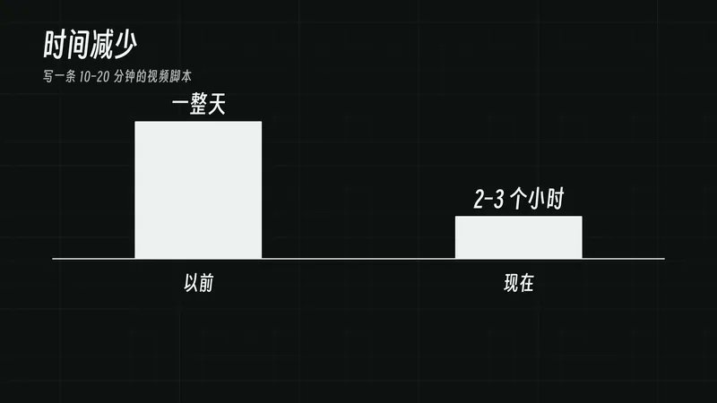

用到的工具只有三样：一块白板、Codex 和 YouMind。先说一句，本期没有任何广告，晨光文具和 YouMind 都没给我一分钱。

这篇文章是我最新一期视频的文字版。无论你做知识分享、商业口播，还是长视频播客，都可以直接照着用。

## 先说结论：别让 AI 写，跟 AI 聊

很多人用 AI 写脚本，就是打开 Agent 对话框扔一句话：

> 帮我写一篇关于某某话题的 5 分钟脚本。

这样出来的东西，基本都空洞、全是套话。原因很简单：你只给了它一个题目，它不知道你经历过什么，也没有你的判断。它只能拿全网最平均的说法来填空。

所以我的整套流程，核心就是一件事：先把"我"喂给 AI，再通过对话把"我"说清楚。拆开来是四步：

1. 在 YouMind 建项目，不设限地倒出观点和素材；
2. 站在白板前，和 AI 共创三段式大纲；
3. 用 Codex 实时语音，把逐字稿"聊"出来；
4. 用 YouMind 文字转语音，倍速听稿、打磨、控时。

下面一步一步说。

<!-- more -->

## 第一步：在 YouMind 建项目，先把脑子倒空

每一期视频，我都会在 YouMind 上单独建一个项目。这期要用的所有东西，都放在这一个项目里。

如果是观点类的单人播客或口播，我会先新建一个文档，把想讲的观点和想法全部写进去。

这时候记住两件事：不要考虑结构，也不要急着删改。想到什么就写什么。这一步要的是量，取舍是下一步的事。

如果是知识分享类的视频，就要先做素材收集。我用 YouMind 的浏览器插件，看到相关的视频、网页，一键就能收进这期的项目里。

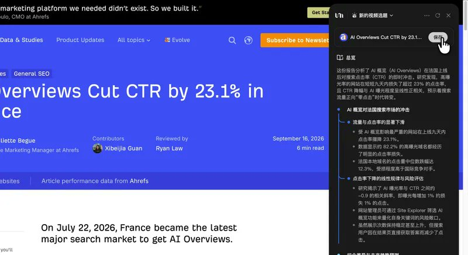

调研也可以直接在 YouMind 里做。如果需要深度调研，我会再搭配 Manus、ChatGPT Pro 和 Kimi。这里要夸一下 Kimi 的 Agent 集群调研，是我目前体验最好的深度调研工具。

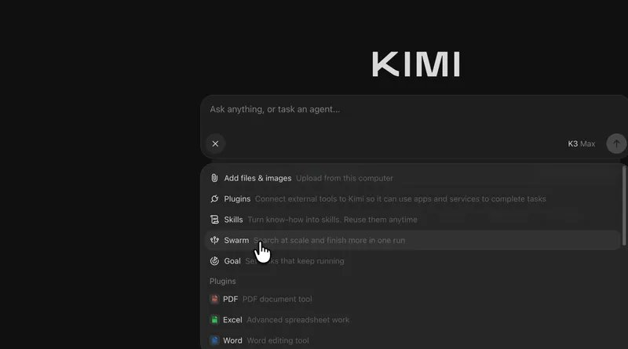

观点和资料都齐了，就可以进入大纲。

## 第二步：站到白板前，和 AI 共创大纲

从这一步开始，我的做法就和大多数人不太一样了。

我会让 YouMind 的 Agent 把上一步准备好的素材下载到本地，然后在 Codex 里建一个项目文件夹，把资料都拖进去。接着打开 Codex 的语音对话模式，站到白板前，一边写一边和 GPT 讨论大纲。

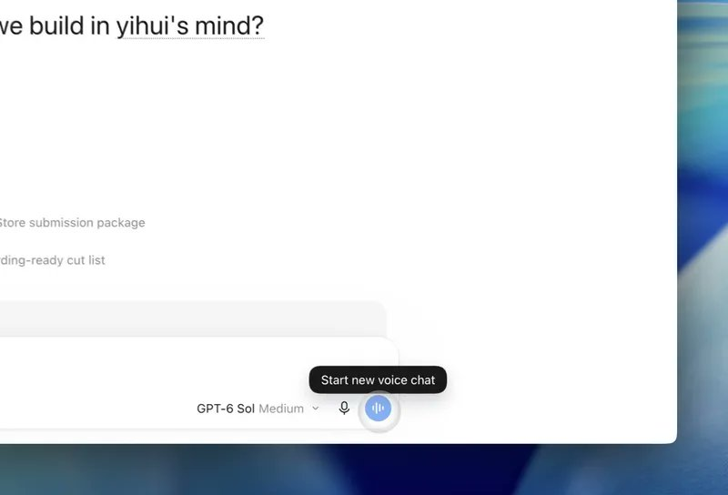

这里敲一下黑板：

- 一定要用 Codex 桌面端的语音模式，而不是 ChatGPT。两者在工具调用和上下文获取上差别非常大。Codex 能直接读项目文件夹里的资料，还能边聊边帮你改文档。
- 不要用其他模型的语音模式。目前 OpenAI 的实时语音对话，市面上没有对手。

大纲的本质：收敛和取舍

这一步其实不难。在上一步整理资料的时候，大概率你脑子里已经有大纲了，现在只是和 AI 聊着把它定下来。

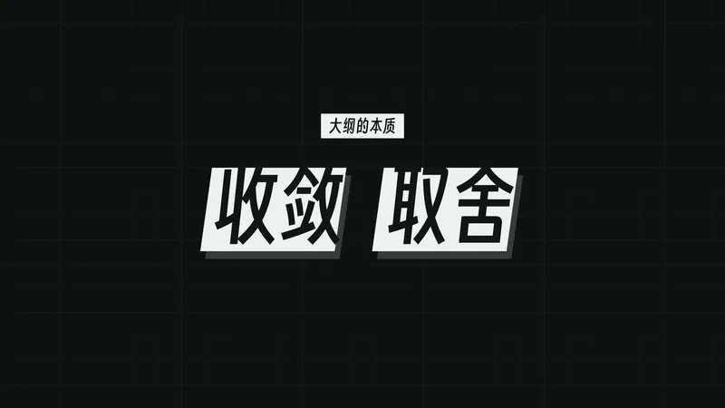

我一般把大纲切成三块：

- 开头的 Hook：要吸引人，给观众一个看下去的理由。
- 中间的论证：从前面倒出来的所有观点里，只挑三四个核心观点或知识点。
- 结尾的升华：很多大博主会在结尾拔高一下整期视频的认知层次，同时引导互动和关注。影视飓风、星球研究所的结尾都是教科书级别的，值得学。

为什么都用 AI 了，还要用白板？

经常有人问我：熠辉，你都在用最先进的 AI 了，怎么还在用白板？

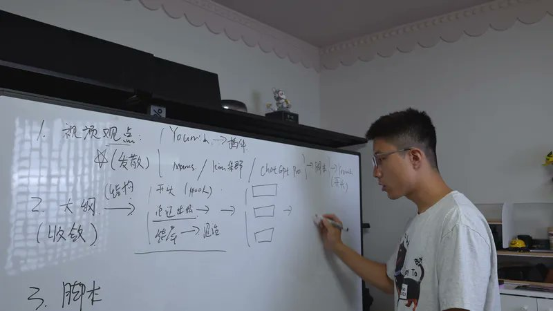

这是我的个人习惯。脑子里想法特别多的时候，坐在电脑前很容易陷进细节里。一旦站到白板前，身体和嘴巴动起来，脑子会更活跃，也更专注。所有要点都摆在眼前，补一条、挪一条、划掉一条都很直观。你也可以试试。

## 第三步：用实时语音把逐字稿"聊"出来

大纲定了，接下来是整个脚本最重要、也最耗时的部分：逐字稿。

我相信大部分自媒体新手写逐字稿时，都会遇到和我一样的两个问题。

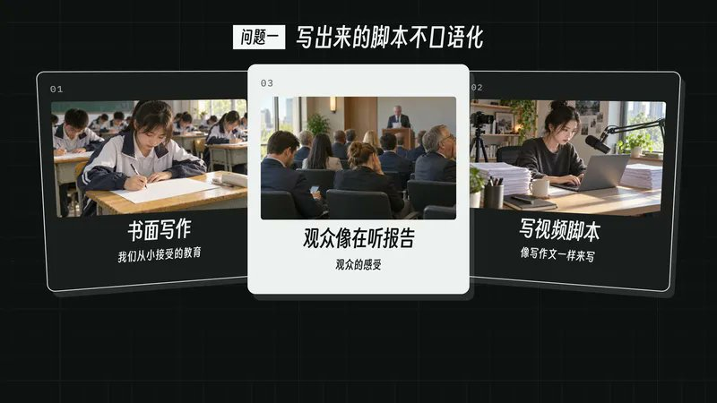

第一，写出来的脚本不口语化。 我们从小受的都是书面写作训练，如果像写作文一样写脚本，观众听起来就像在听报告。

第二，观点之间的过渡。 开头怎么切到核心内容？中间几个论点之间怎么自然衔接？这恰恰是脚本最需要打磨的地方。

这两个问题，我的解法还是：打开 Codex 的实时语音，直接通过对话把脚本聊出来。开头的钩子怎么放，中间这段的逐字稿怎么说，你可以自己说，也可以让 Codex 先说一版给你听。

好处很直接：你和 AI 说出来的话，天然就是口语。

吐槽一下：它老打断我

当然，Codex 的语音也有痛点：它很爱打断我说话。所以我们的对话里经常出现这样的画面：

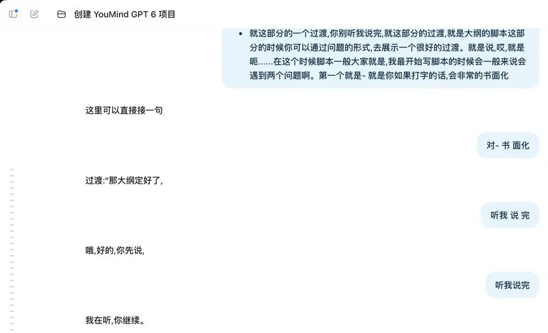

导出对话，交给 YouMind 成稿

聊完之后，哪怕对话记录有几万字也不用慌。我会让 Codex 把整段对话完整导出成一份文档，放进 YouMind。

这时候，YouMind 项目里已经整整齐齐有了三样东西：对话记录、视频大纲、原始观点。

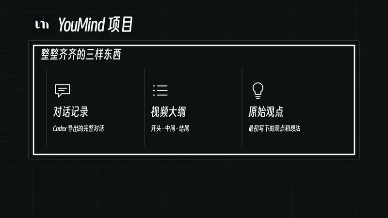

接下来选一个模型，让 Agent 基于这三份文档写脚本就行了。这也是 YouMind 的优势：可以自由选模型，而且它本身做了一些 Harness，写出来的效果会好不少。

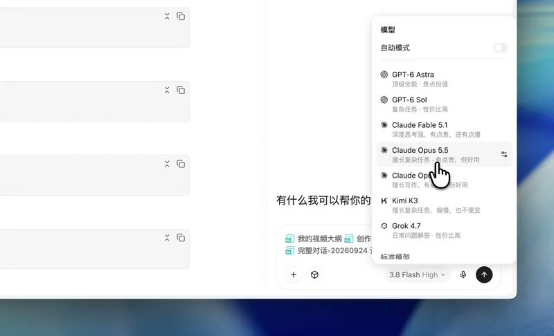

分享一个我自己的模型选择技巧：

- 偏硬核、知识型的内容：用 Claude Opus 4.6 或 Opus 5.5。文字干脆，逻辑咬合严谨。
- 普通知识分享、生活化选题，或者偏漫谈的长播客：用 Gemini 3.8 Flash。语感更松弛自然，成稿读起来像老朋友在耳边唠嗑。

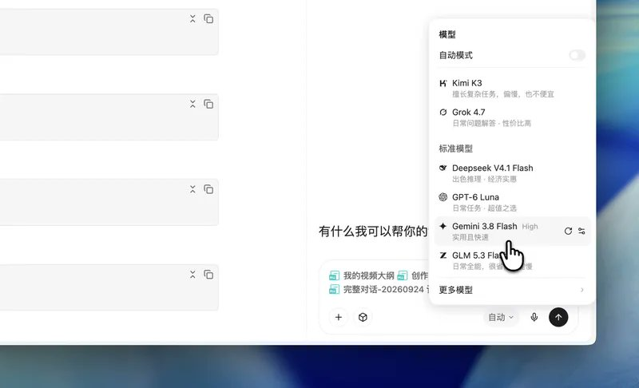

## 第四步：文字转语音，倍速听稿、边听边改

初稿出来之后，进入最后一步：打磨。

逐字稿一定要"读出来"才能发现问题。但我很讨厌反复念稿，一篇二十分钟的稿子，读三遍就是一个小时。

所以我用的是 YouMind 的文字转语音：点开原文，选一个音色，生成音频，然后倍速听。男生的话，我个人比较推荐"苏哲"这个音色。

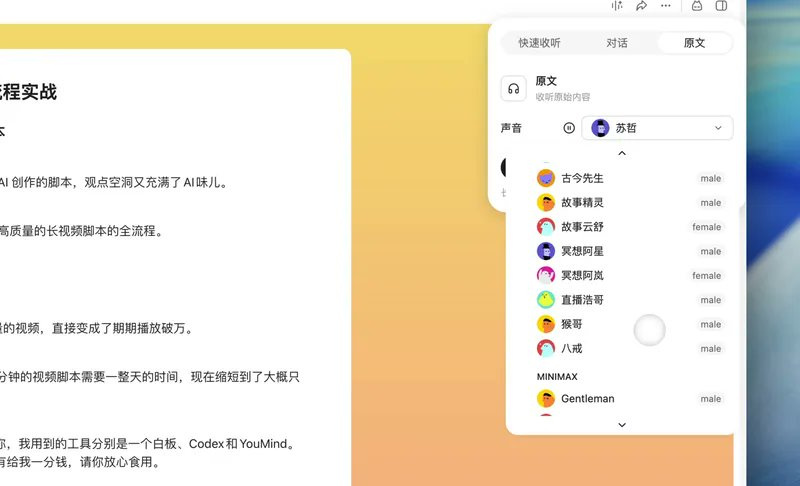

脚本有问题的地方，一听就能发现。听到别扭的地方，我直接在侧边栏对话框里给修改意见，让 AI 改；或者自己在编辑器里改，都很方便。

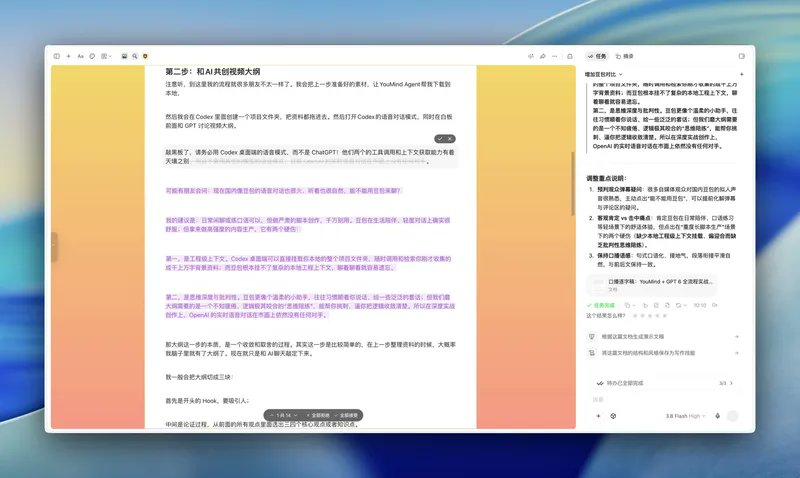

转成语音还有第二个好处：录制前就能准确预估视频时长。

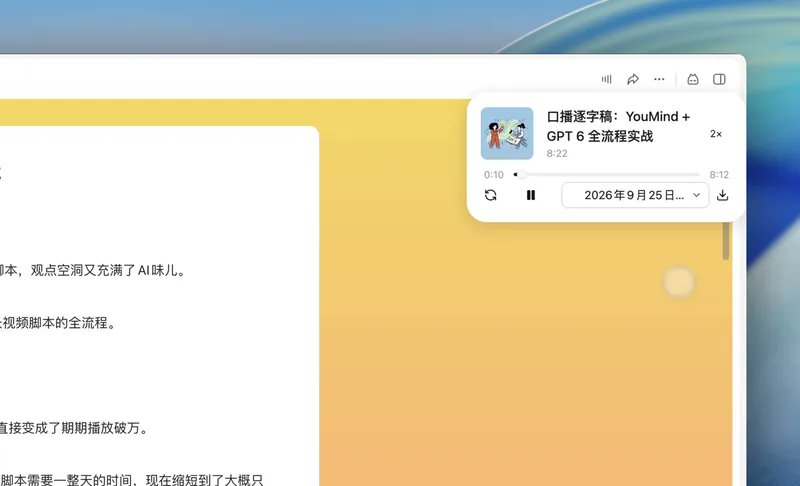

接商业合作或参加平台活动时，时长通常有要求。比如甲方要求控制在 3 到 5 分钟，B 站的单人播客活动又要求超过 20 分钟。转成语音之后，脚本够不够、超没超，一眼就知道，不用自己再完整读一遍。这个功能对我来说真的非常实用。

这样一边听一边让 Agent 改，大概半小时，整份脚本就完工了。

## 回顾：四步写完一条长视频脚本

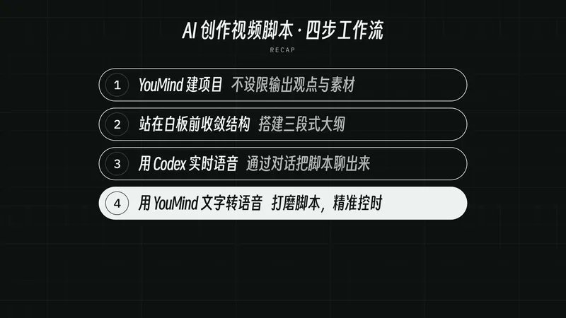

最后快速回顾一下这套流程：

1. YouMind 建项目：不设限地倒出观点和素材；
2. 站在白板前收敛结构：搭好"钩子—论证—升华"三段式大纲；
3. 用 Codex 实时语音：通过对话把逐字稿聊出来；
4. 用 YouMind 文字转语音：倍速听稿，打磨表达，精准控时。

回头看，真正让脚本变好的并不是哪个模型更强，而是顺序变了。以前是 AI 先写、我来改，改来改去还是它的腔调。现在是我先说、AI 帮我理，最后成稿说的是我自己的话。

脚本搞定后，剩下的录制、分镜和后期剪辑，我还有一套 Agent 工作流在支撑提效。

如果这篇对你有帮助，欢迎点赞、在看、转发。下一期，我会把 AI 剪辑这套工作流也完整拆出来。