# WorkBuddy 加两个自建的 skill，我实现了公众号自由


大家好，我是萝卜~

上次写 WorkBuddy 加飞书跑公众号内容飞轮那篇，后台好几个朋友来问，能不能把文章写完到进草稿箱这一段单独拆开讲讲。

以前我发一篇文章，排版、封面、配图这几步加起来要花起码大几十分钟。现在这一块我基本不碰了，文章丢给 WorkBuddy，过几分钟它就排好版、配好图，然后直接就在草稿箱里了。

靠的是 WorkBuddy 加上我自己做的两个 skill，一个管排版，一个管视觉，都已经上架 WorkBuddy 开放平台。今天从头到尾跑一遍，照着做就能用上。

如果你对于 WorkBuddy 和 飞书还不太了解，那可以先看看这篇文章。

> 引用推文：zhouluobo (@zhouluobo)
> https://x.com/zhouluobo/status/2099013306371424260

# 准备工作

首先需要先获取自己公众号的开发者信息，这个是公众号平台官方的能力，所以是绝对安全的，不存在任何的违规行为。

我们整个流程大致是这样的，手工写完文章（或者自动生成文章）-》使用WorkBuddy的skill配图+封面→ 使用WorkBuddy的skill排版 -》WorkBuddy调用接口创建草稿-》打开公众号后台检查，无误后手动点击发布。


先登录微信开发者平台，扫码登陆就行。

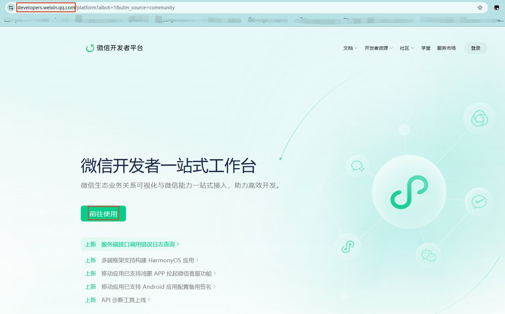

登陆之后到"我的业务"里面点击公众号

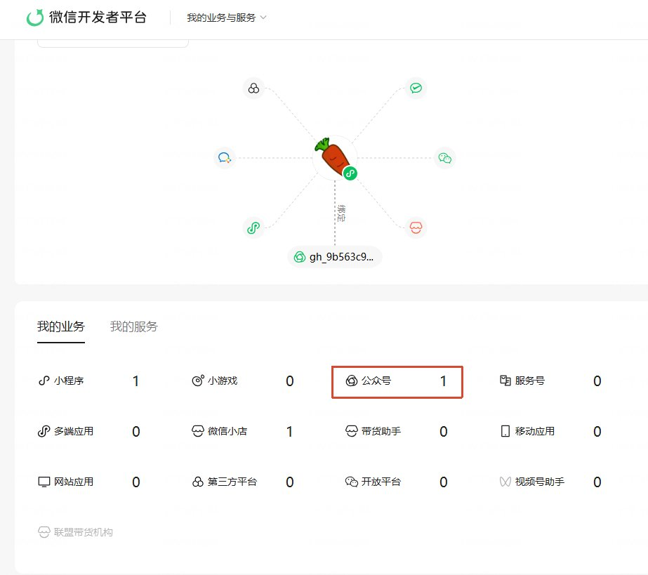

然后就能看到对应的 AppID 和 AppSecret 了。

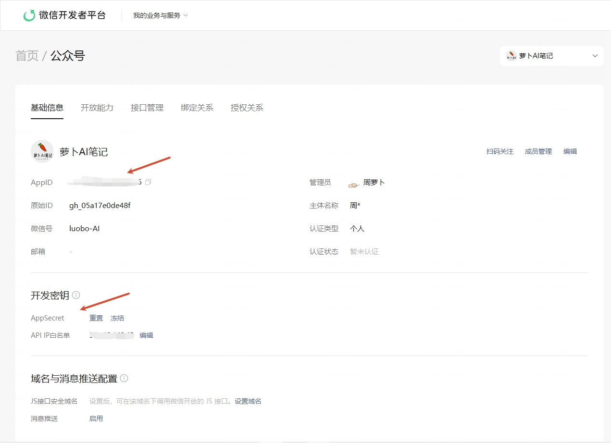

AppSecret 非常重要，千万不要在公开场合暴露出去哦。

还有一个 API IP 白名单，这个也需要设置一下，一般来说你就在百度里面输入 IP，然后把得到的 IP 地址填到白名单就行了。

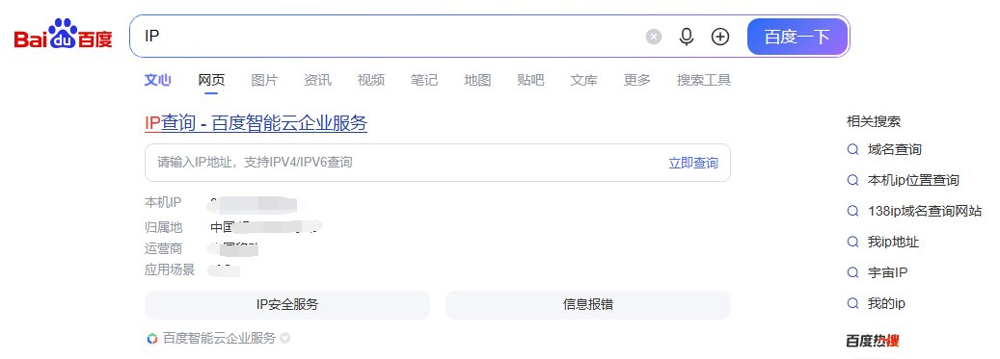

到这里准备工作基本完成了

# 让 WorkBuddy 完成一切

下面的事情，我觉得其实都可以交给 WorkBuddy，比如我把下面的提示词发送给 WorkBuddy，它就会一步步的帮我把后面的一切都做好。

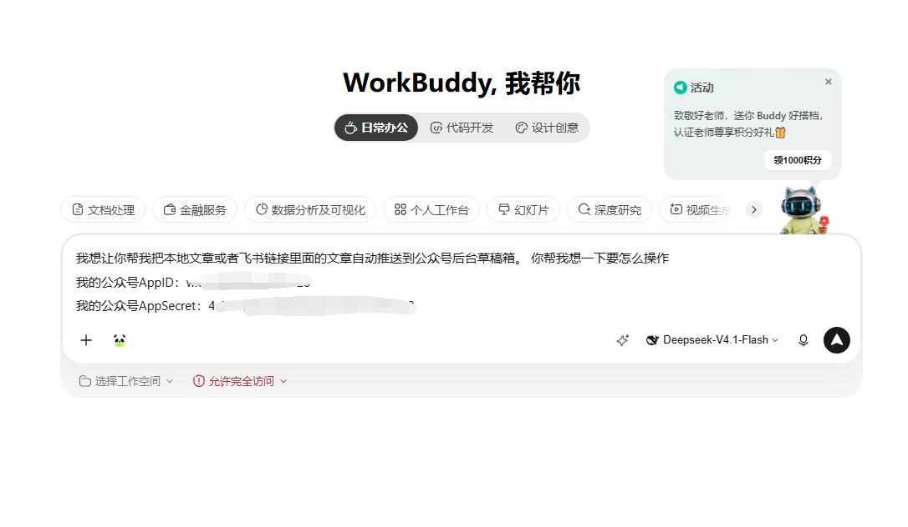

很快 WorkBuddy 就帮我测试好了，一切都没有问题。

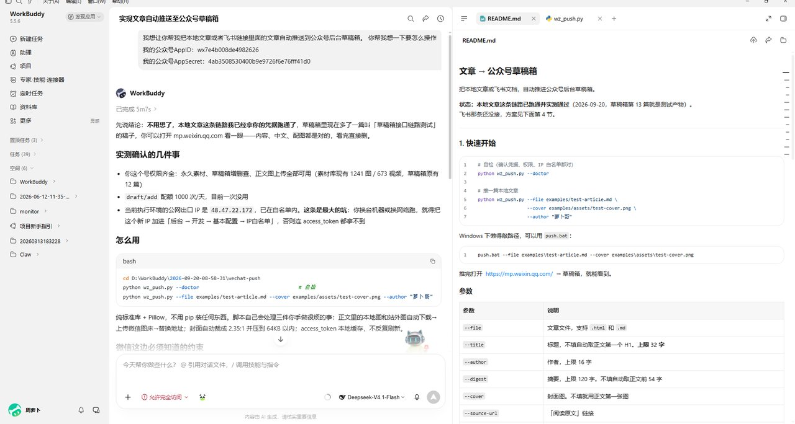

已经可以在草稿箱看到这篇测试文章了。


流程跑通之后，就可以让 WorkBuddy 把这个过程做成一个 skill，这样就不需要每次都手工提供 AppID 和AppSecret 了。

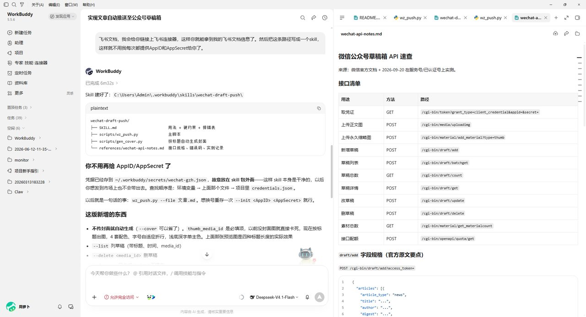

# 两个自建 skill

下面再来说说两个自建 skill，都是我开发的，用来辅助每天的公众号日常，分别是文章排版和文章视觉。

我已经上架到 WorkBuddy 开放平台了，目前已经审批通过，大家在 WorkBuddy 的 skill 页面就能搜索到哦。

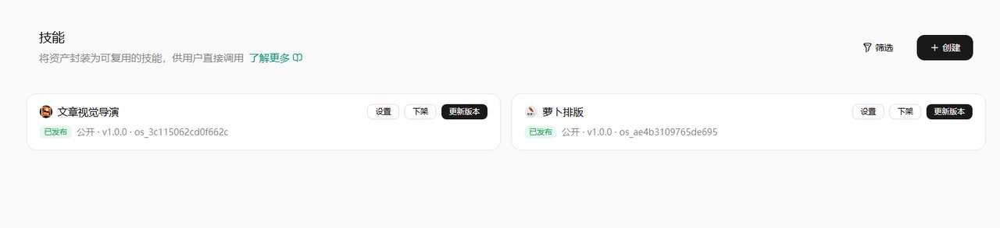

直接在 skill 广场搜索就行

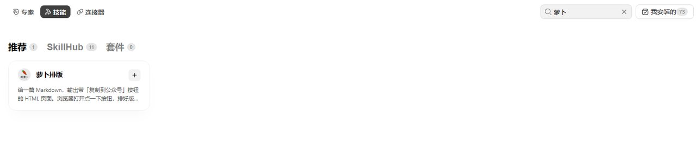
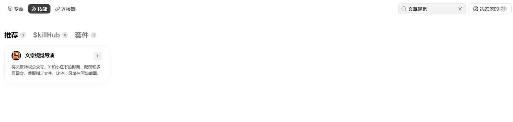

使用上面两个 skill，可以极大的帮助你缩短公众号的写作流程，真的值得去试一试哦。

# 跑一遍完整流程

比如我飞书文档上有这样一篇文章，要是以前啊，我会先下载为 markdown 文件，再复制到排版工具里面进行排版，封面和配图会放到 ChatGPT 里面去生成，一整套下来纯纯的耗费时间。

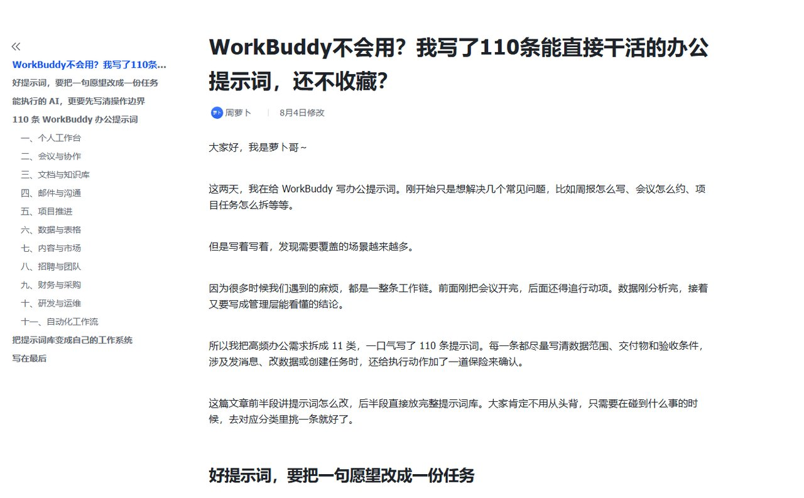

现在直接交给 WorkBuddy 和相关的 skill 就完事了。

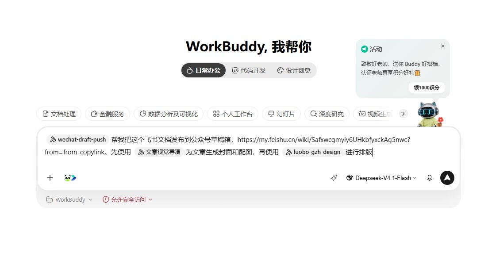

很快我们就能得到想要的产物了，包括已经排好版可以一键复制的 HTML 页面，封面图片和文章内文配图。

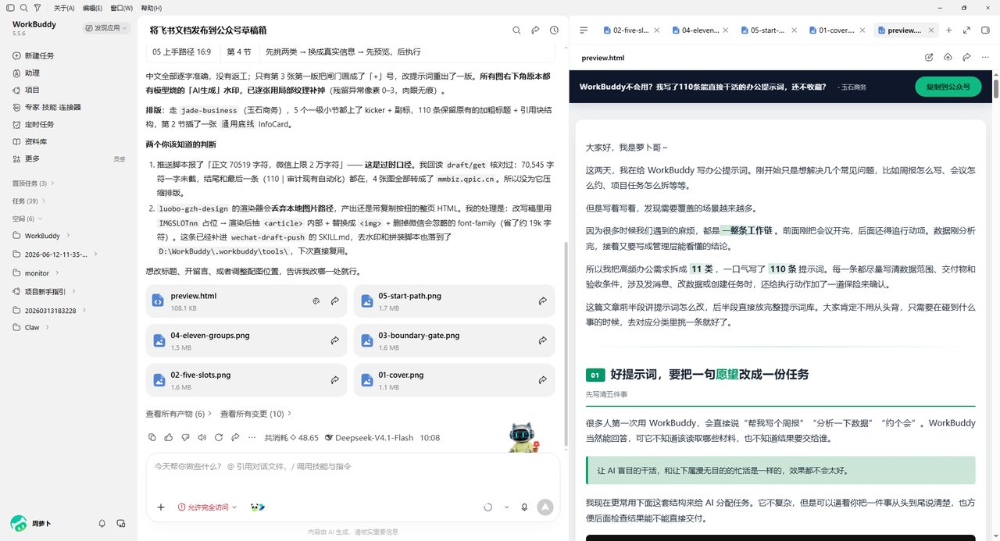

文章也安静的躺在草稿箱喽。


当然肯定还有朋友想要更进一步，连文章也不想写，那下面再演示一下怎么自动写文章。

其实我自己的感觉就是，对于偏理论的内容，让 AI 自动写文章还是可以的，偏教程类的文章就算了，因为教程需要个人的感受和大量截图视频才真实，纯 AI 写出来的教程，谁看啊。

还有就是一些情感类、时事类等等赛道，也是可以让 AI 先打底的，当然最能打动读者的，肯定还是你的个人特色哈。

所以这里展示的自动写文章，仅仅是展示一下 AI 目前所能达到的能力，不代表可以自己啥也不管哦。

```
以飞书文档中"OpenAI"目录下的文章为写作风格，写一篇介绍AI基础概念的公众号文章，包括不限于skill，mcp，Agent，Prompt，Context，Tool，Memory / RAG， Workflow，Evals等等。并使用 skill 进行去AI味处理。
```

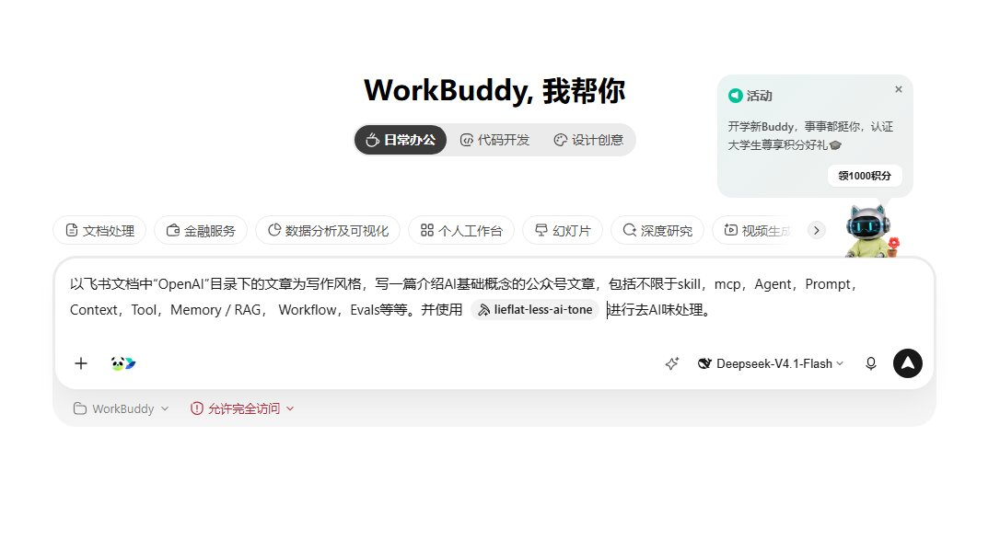

细心的朋友可能看到了，我这里的去 AI 味提到了一个 skill，这个是网上一位大佬开源的，号称是从 283 万字的语料中整理得出的，我用过，确实比一般的去 AI 味的工具要好很多，推荐给大家。


很快我们就能得到一篇非常不错的 AI 科普文章，因为我没有提要配图和发布到草稿箱，所以 WorkBuddy 只生成了文章。

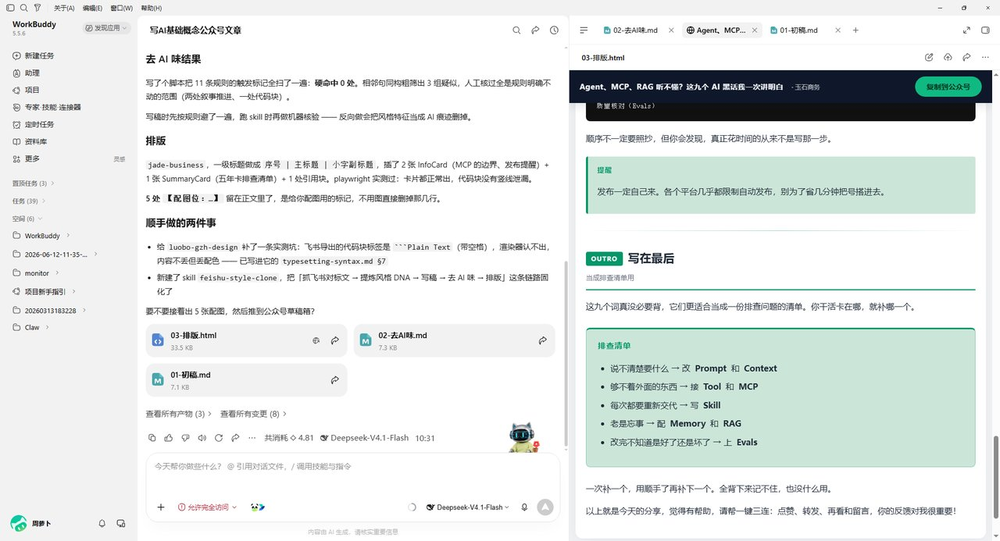

要想配图和发布到草稿箱，就继续一句话让 WorkBuddy 接着干就好了。

```
为上面的文章配图并生成封面，并发布到草稿箱
```

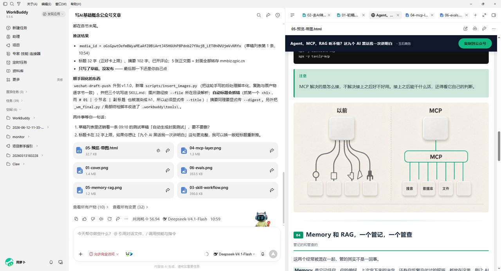

看到没有，还是太方便了。

# 写在最后

看到"公众号自由"四个字，很多人会以为从写到发全都能甩手，但是呢我这套流程省掉的，其实主要是排版、配图、传草稿这些体力活。

自动发布我是绝对不碰的，AI 把稿子送进草稿箱就行了，之后我会打开后台从头看一遍再点发送，封号的风险真的没必要冒，这一眼也花不了几分钟。

至于写什么、截哪张图、踩过哪些坑，这部分还得你自己来。

对我来说，公众号自由就是把时间从这些重复操作里省出来，多留给选题和文章本身。你也可以先去 Skill 广场搜"文章排版"和"文章视觉"，拿一篇自己的文章试试，看它能替你省下多少时间。
