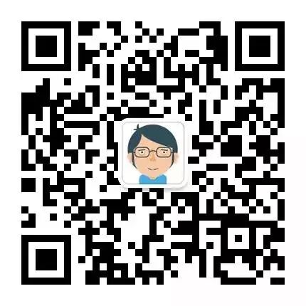
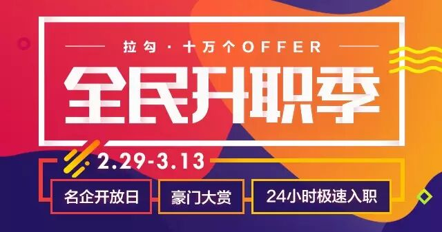

# 你的价值去哪儿了？

> 池建强回应 Fenng（冯大辉）"对我有什么好处？"一文的番外篇。核心观点：你自身的价值决定了你的人脉和资源，而不是反过来。当价值和影响力达到临界点，资源和优秀的人会自然聚集。提升个人价值的唯一路径——长年累月的有效知识积累。做好的产品和正确的事，创作的价值远远大于混圈子。

<!-- more -->

## 作者信息

- **作者**：池建强
- **发布**：2016-02-28
- **背景**：回应 Fenng 老师的《对我有什么好处？》

## 开篇：冯老师的纠结

冯大辉（Fenng）在文章《对我有什么好处？》中表达了对网络世界的失望，写出了这样一句充满纠结的话：

> 人应该是自私的，但人不能总是太自私。人不能总是太自私，但人应该是利己的。

冯老师"以彼之道还施彼身"和"乾坤大挪移"——对网络世界的拒绝，内心是不接受的。

## 作者的经历与反思

早年作者"年少轻狂"，去参加会议、做分享、见创业者，聊了一些不知其然也不知其所以然的话题。然后问自己：**这么做的价值是什么？好像没什么价值。** 好朋友还是好朋友，陌生人还是陌生人。

> **如果你觉得自己的时间没有价值，那可能是你自己本身也没什么价值。**

## 策略调整：反问"对我有什么意义"

遇到陌生人邀请参加活动时，作者不再直接拒绝，而是用反问句式：

> **"你觉得我参加你们这个活动对我有什么意义呢？"**

大部分人遇到这个问题就慌了——因为这个世界上大部分人都是从自己的角度、立场和利益去考虑问题。邀请你已经是看得起你了，还想怎么样呢？

如果真的有人能告诉你参加活动的理由，说明他是认真思考过的，至少值得尊重——那么就可以权衡价值，再确定是否参加。

## 核心价值观点

> **你自身的价值决定了你的人脉和资源，而不是反过来。**

当价值和影响力达到某个临界点时，资源和优秀的人会自然聚集到身边——就像化学反应一样自然：分子破裂成原子，原子重新排列组合生成新物质。

**怎么提升个人价值？**

> 这些坚持、练习和不顾一切，归结到最后，就是**有效知识的积累**。
>
> 无论你聪明也好，笨也罢，只要坚持进行有效知识的积累，五年，十年，时间的可怕力量就会凸现出来，你会在某一刻度翻越了那个临界点，然后，大地花开，万物生长，世界会为你打开更多的大门。

## 好的产品 > 混圈子

> **做好的产品和正确的事情，创作的价值远远大于混圈子。**

当一个人的价值无限大的时候，理论上他的资源也是无限大的。

作者举例：如果张小龙发来微信说要聊一个小时，作者会放下火锅直接打飞的去广州——因为龙哥那一个小时值得付出的价值。当年第一次见罗永浩，也不知道他想干啥，反正想法就是"先看见活的罗永浩再说"——这就是他们的价值。

## 价值是通行证

有了价值，认识优秀的人就会变成一件容易的事情：

> 地振高岗，一派西山千古秀。
> 门朝大海，三合河水万年流。
> 一支穿云箭，千军万马来相见。

两人见面一对暗号，拍手相庆——好了，咱们都是价值派的师兄师弟师姐师妹。

## 最后的拷问

> **如果你身边没那么多优秀的人，你最好想想，你的价值去哪儿了？**

## 关键洞察

1. **价值决定人脉，非人脉决定价值**：自身价值达到临界点后，资源和优秀的人会自然聚集
2. **临界点效应**：有效知识积累五年十年，在某一刻度翻越临界点，世界会为你打开更多大门
3. **反问式过滤**：遇到活动邀请反问"对我有什么意义"，筛选掉没有认真思考过的邀约
4. **创作 > 混圈子**：做好产品和正确的事，创作的价值远远大于社交
5. **价值吸引价值**：张小龙、罗永浩等人的价值就是通行证，两人一对暗号就一拍即合
6. **自我拷问**："如果你身边没那么多优秀的人，你最好想想，你的价值去哪儿了"
7. **"对我有什么好处"的哲学回应**：利己不等于自私，但价值是唯一正当的利己方式
8. **时间的可怕力量**：有效知识的积累在长周期中产生指数级回报——这不是激励语，是复利事实
9. **2016年的观点在 2026 年仍然成立**：AI 时代降低了门槛，但价值判断的逻辑没有改变——创作仍然是价值的核心来源
