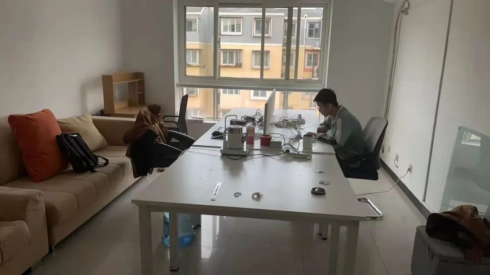
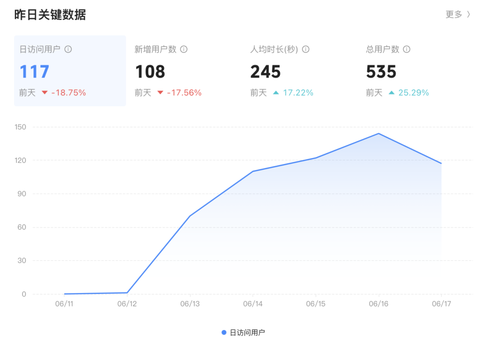
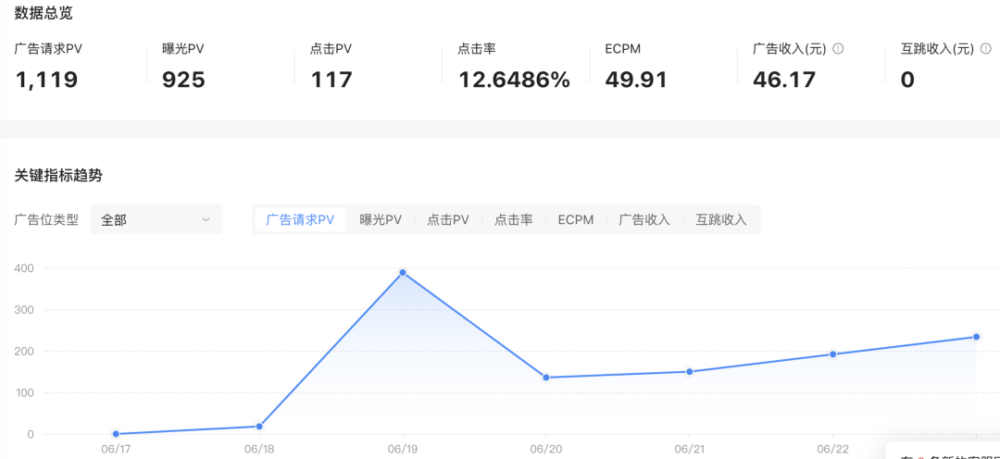
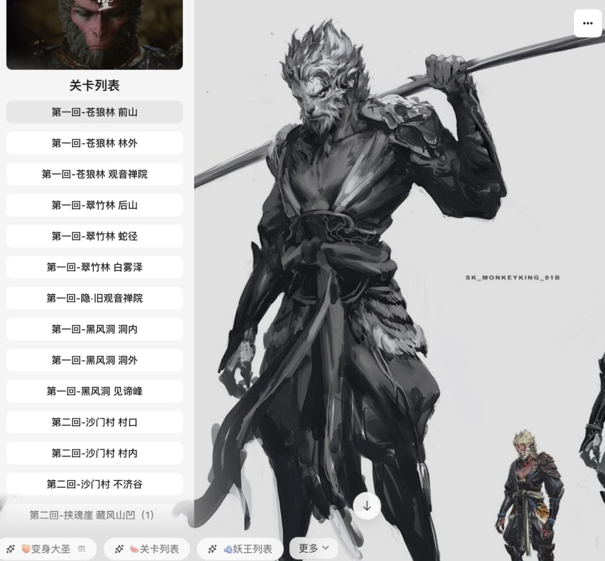
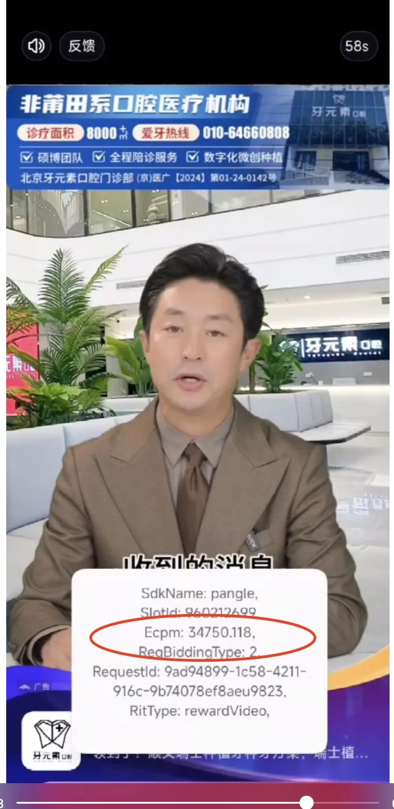

# 创业半年回顾

> 一位来自北京、10年网赚/APP出海/AI软件从业者的辞职创业半年复盘，记录了从满怀憧憬到冷静反思的全过程，包含AI产品受挫、副业踩坑、最终转向外包的完整心路。

<!-- more -->

## 作者信息

- **作者**：出海那些事
- **所在地**：北京
- **目前在做**：网赚、APP出海、AI软件
- **入行年限**：超10年

## 精读正文

### 一、辞职创业：勇敢迈出第一步

2025年3月15日，作者向老板提出离职，与三位志同道合的朋友共同踏上创业之旅。起初满怀激情，但资金短缺、市场竞争激烈等现实问题很快显现，带来了巨大压力。

### 二、美好的开始与现实的碰撞

创业初期投入AI软件研发，做了AI聊天、AI音乐、AI工具站、数字人等产品，但市场反响冷淡，推广困难重重。

### 三、从高大上到摆地摊的转型

为生存开始尝试各类副业和网赚项目，但大多昙花一现：

**抖音小游戏广告**：开发小游戏投放广告引流。

**AI工具站**：开发各类AI工具站，效果一般。

**小程序开发**：尝试小程序副业。

**黑悟空文字游戏**：蹭黑悟空热点开发文字版游戏，引流私域效果不佳。

**网络联盟广告**：大量外包做这个，被割了几千，广告费收入只够电费。

> **核心教训**：报班学习抖音和微信小程序赚钱课程被骗得血本无归，深刻体会到"割韭菜"的残酷现实。创业路上充满陷阱，只有保持理智和谨慎才能避免被割。

### 四、选择外包：稳扎稳打，积累经验

经历多次失败后，转向软件外包业务线。虽然工作辛苦且收入不高，但提供了稳定收入来源，逐渐积累了实战经验并提升了技能水平。

### 五、展望未来

作者计划持续更新"割韭菜细节"和防割/反收割策略，认为在信息泛滥的时代保持清醒头脑和敏锐洞察力至关重要。

## 关键洞察

1. **AI创业窗口并未想象中好走**：2025年AI赛道已高度拥挤，AI聊天/音乐/数字人等产品获客成本极高
2. **副业速成课程是高概率陷阱**：抖音、小程序、网赚类课程本质是"割学员"，需要警惕
3. **外包虽非长久之计，但可作为生存过渡**：稳定现金流 > 高想象空间
4. **创业核心是现金流管理**：半年下来从"高大上"到"摆地摊"，本质是收入结构被迫下移
5. **被割经历是最宝贵的资产**：把这些坑记录下来本身就有价值（防割/反收割内容方向）
