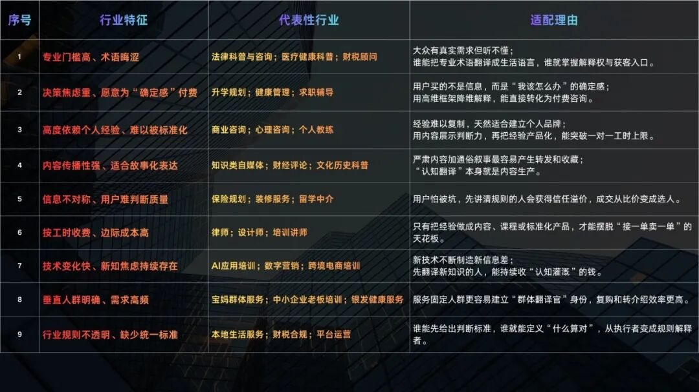
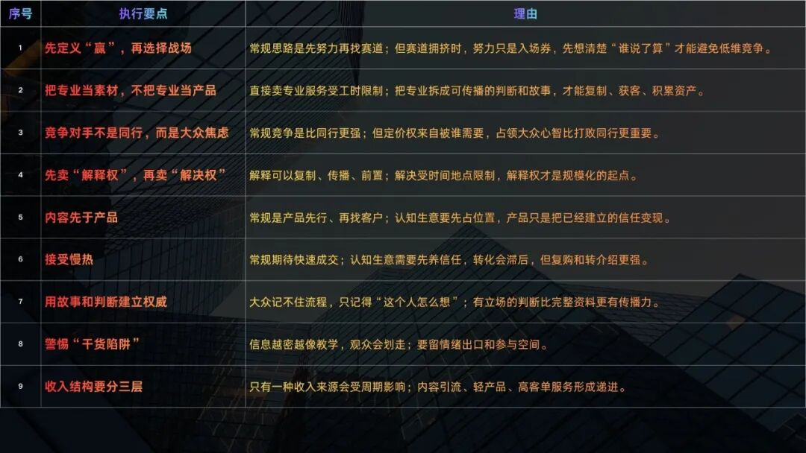
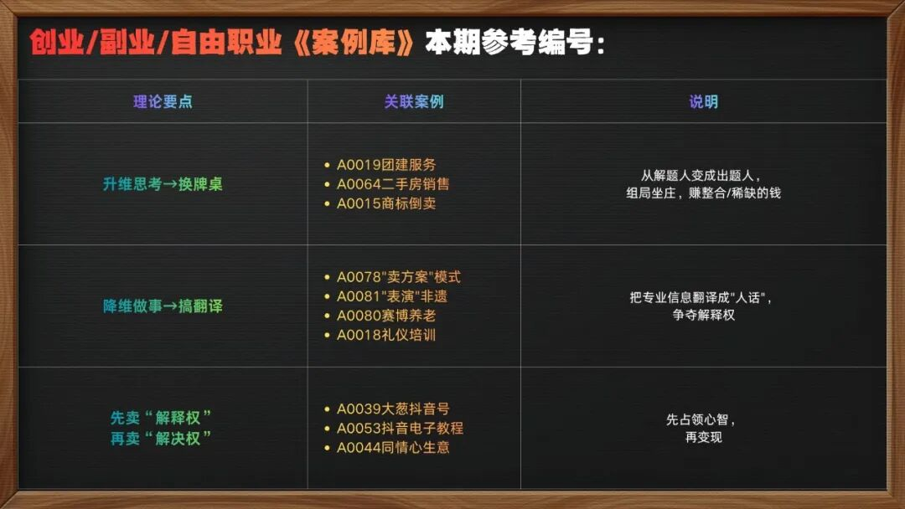
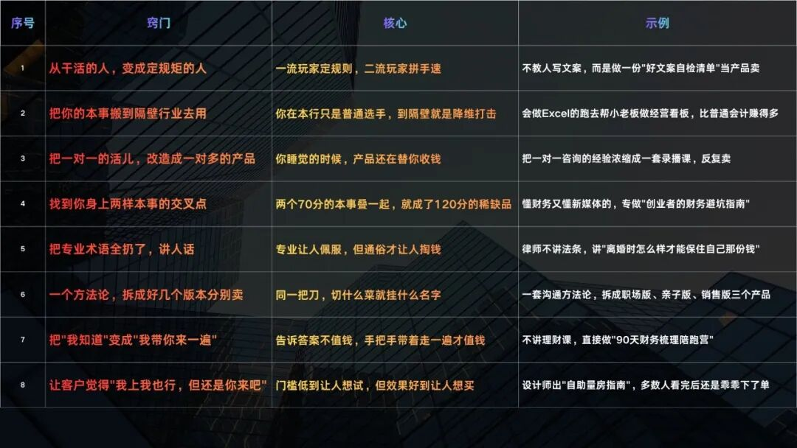
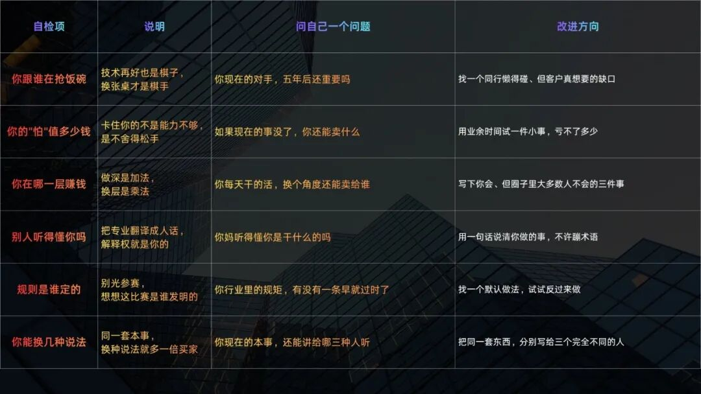

# 有一种赚钱的方式叫做：升维思考，降维做事

> 有一种赚钱方式，越不干活，越有人买单。吃透这种打法的人，不是最勤奋，却往往获利最大。升维不是"想得深"，而是"换牌桌"；降维不是"放低身段"，而是"搞翻译"。谁能把专业内容翻译成人话，谁就掌握了解释权。

<!-- more -->

## 作者信息

- **作者**：澎湃王侯
- **发布**：2026-08-16
- **系列**：《低成本创收图谱》第二期

## What?

高手不求把专业做得更精通，转而重新定义"什么才算赢"，先拉升自己的维度，再向下碾压，收割低维。

## Why?

### 一、升维≠想得深，升维=换牌桌

升维不是"想得深"，而是"换牌桌"。你追求比同行更专业，不如让同行的努力失去意义。

**核心案例：罗翔**

他不去跟别的律师死磕打官司，而跑到互联网上普法。别人在法庭上卷生卷死，他直接跳到"人性幽暗"和"正义哲学"的维度。如果他像别人一样去接案子赚钱，连现在的成就的百分之一都达不到。

> 罗翔最厉害的不是讲法律，是他让大众第一次觉得，法律跟人性有关、跟我们自己有关，这个比法律本身更值钱。

**升维的本质：把自己从解题人变成出题人。**

- 在原有维度里，你只是一颗棋子
- 升维，是跳出行业看行业，你是棋手

主人公们自身的实力并没有变，本质上都是在换牌桌。**他们不是更强了，是更会挑地方了。**

理论虽然正确也好懂，但轮到我们自己往往大脑不听。卡在哪儿？一个字：**怕**。怕换了之后万一还不如现在呢？怕离开了自己唯一擅长的事就啥都不是。

> 换牌桌最难的不是怎么换，是敢不敢换。

### 二、降维≠放低身段，降维=搞翻译

降维的核心是：**搞翻译，说人话。**

**核心案例：罗翔的翻译功夫**

把术语满天飞的法律翻译成"法外狂徒张三"的故事，把"紧急避险"翻译成"快饿死的时候吃大熊猫犯不犯法"。这是在用哲学家的脑子去降维打击脱口秀的场子，还顺便把律师的活儿干了。

> 把山顶的水引到平原，还让平原觉得这是一种恩赐。

**谁能把专业内容翻译成人话，谁就掌握了解释权。**

这门生意很久之前就有人做了——春秋战国诸子百家，竞争的就是"如何解释这个世界"。谁的学说被采纳，谁就能影响一个时代、掌控一个时代。

**米其林轮胎与餐厅指南：**

米其林原本只卖轮胎，后来开始做餐厅指南。他们并不是开餐厅，而是制作一种餐饮界的权威指南——只是告诉人们"什么叫好吃"。很难想象全世界厨师都在争抢的那颗星是一个轮胎公司印出来的。最初本意只是想让你多开车、多磨胎，结果成了美食界的最高法院，掌握了对美食的解释权。

> 结果越来越多的车主愿意开车去很远的地方吃饭，轮胎也越卖越好。他们家的轮胎并没有更高级，只是重新定义了"为什么要开车"。

搞翻译、说人话的例子还有很多，本质上都是在争夺解释权。**解释权是入场券，谁拿着这张券，谁就能进场。**

## How?

### 适合的行业特征

符合以下几种特征的行业，非常适合这种打法（一看就懂，适合新人小白选择）：

特别第四种——适合故事化表达的知识类自媒体领域，这是最容易理解的形式，也是起步成本最低的。

**关键辨析：自媒体不是行业，是工具**

自媒体就像微信——有人用它聊天，有人用它工作，有人用它卖货，但微信本身不是一个行业。自媒体是一种时代的风口，而 AI 并不是。

> 自媒体改变了传统的生产框架和社会结构。它是一种能够帮你实现"升维思考，降维做事"最有用的工具。
>
> AI 不一样，AI 只是起到了"提效"的作用，你本来该干什么，最终还是在干什么。

### 执行要点

这种打法区别于普通打法的特殊性：

- 核心要点包括：警惕"干货陷阱"——越专业就越是在劝退观众
- 大白话也是学问：伟人们把复杂的路线问题翻译成朗朗上口的话语，如"不管黑猫白猫，抓住老鼠就是好猫""发展体育运动，增强人民体质""抗美援朝，保家卫国"
- 白居易写完诗读给不识字的老太太听，听不懂就改，直到老太太也能明白
- 作者自述：以前就是干货狂魔，每期万字起步，结果听众记不住——慢慢明白这有多么吃力不讨好

### 自检工具

## 结语

**三层对照：**

| 层级 | 状态 | 价值 |
|------|------|------|
| 1. 执行层 | 死磕专业技能 | 最累的一层 |
| 2. 翻译层 | 研究"怎么让甲方听明白" | 开始有点值钱了 |
| 3. 规则层 | 思考"怎么定义这个行业的某些标准" | 将来必定大有可为 |

> 绝大多数人一辈子停留在第一层，还抱怨为什么自己这么努力却没回报。

### 最终总结

> 升维思考让你看见答案，降维做事让你拿到红利。

> 升维不是让你变得专业高深，不是让你"装"，是让你站在更高处看见牌桌；
>
> 降维不是让你变得廉价，不是让你"跪"，而是让你把高处理解的东西递到低处的人手里。

> **从此，你赚的不再是辛苦钱，是认知差。**

## 关键洞察

1. **升维=换牌桌**：不是想得更深，而是跳出行业看行业，从解题人变出题人，从棋子变棋手
2. **罗翔案例的核心**：让大众觉得法律跟人性有关、跟自己有关——这比法律本身更值钱
3. **升维的障碍是"怕"**：怕换了之后还不如现在，怕离开唯一擅长的事就啥都不是
4. **降维=搞翻译**：把山顶的水引到平原，让平原觉得是恩赐；谁能把专业翻译成人话，谁就掌握解释权
5. **米其林隐喻**：轮胎公司做餐厅指南，掌握解释权后轮胎卖得更好——不是产品更好，是重新定义了"为什么要"
6. **解释权=入场券**：谁拿着入场券谁就能进场
7. **自媒体是工具不是行业**：自媒体改变生产框架和社会结构；AI 只是提效工具，你做啥最终还是做啥
8. **干货陷阱**：越专业越劝退观众，大白话才是学问（白居易/伟人的接地话语）
9. **三层金字塔**：执行层（死磕技能，最累）→ 翻译层（让人听明白，值钱）→ 规则层（定义行业标准，大有可为）
10. **赚认知差而非辛苦钱**：升维看见答案，降维拿到红利
