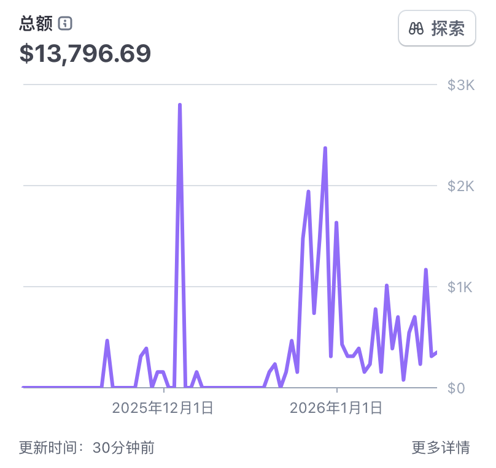
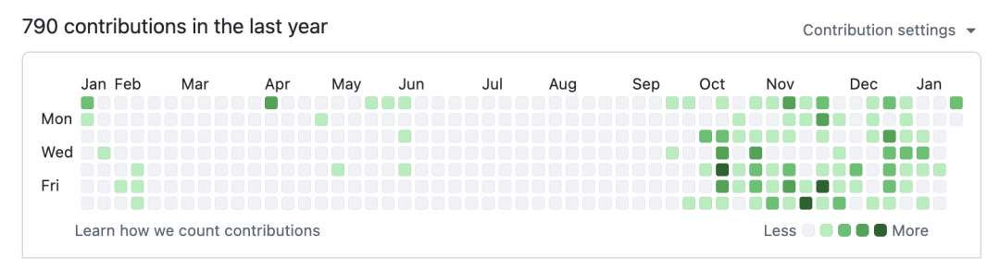

# 【周报1.19】一个创业 10 年的程序员，走上了一人开发之路，月入万刀

> 一位大厂 10 年、创业 4 次、经历过千万级融资的程序员，被收购后辞职重启，从一个人、一台电脑开始独立开发。第一个月 MRR 逼近 1 万美金，核心感悟：正反馈比计划重要，个体开发者应从用户需求出发而非追技术，编程已进入"不看代码只看结果"的奇点时代。

<!-- more -->

## 作者信息

- **作者**：Corly
- **发布**：2026-01-19
- **背景**：大厂 10 余年，先后创业 4 次，经历过千万级融资，带过团队，公司被收购后辞职重启

## 第一个月经营数据

| 指标 | 数据 |
|------|------|
| 上线 Web 站 | 多个 |
| 单站最高日收入 | 100-200 美金 |
| MRR | 逼近 1 万美金 |
| 最大客户 | 2000 美金 |

## 背景

公司被收购后辞职，选择从一个人开始，从独立站出海、App 出海方向做一人公司。

## 一个月结果：不是计划，是已经发生的事

几个 Web 站都已有收入，其中一个站最高日入 100-200 美金，MRR 逼近 1 万美金。

> 这个数字并不算什么里程碑，但它非常重要——它给了我足够的信心，让我能继续走下去。

## 上站逻辑：赌正反馈，不是赌赚钱

**关键词选择**：从新词、老词、品牌词中选了一个当下热词——**nano banana**。

**一开始并不奔着赚钱去的，更多是为了得到正反馈。**

- SEO 关注了一年多，之前更多是让团队做
- 最开始的日子非常朴素，直到有一天终于有人付费
- 12 月系统学 Google Ads，开始投放，慢慢跑出放量

> **正反馈极其重要。只有这个东西，才能让我每天从睡梦中爬起来，去改 bug，去手动给用户发送积分。**

## 一人公司：亲自面对所有问题

与团队创业完全不同，投放一开问题密集出现，没有任何人可以甩锅，只能自己上。

**一个关键事件**：耐心指导一个美国客户，一步步教完整的操作流程，该客户最终支付了 2000 美金。

> **这个世界真的很大，需求是无穷的。很多被看不起的"套壳"，在真实世界里，确实存在大量需求。**

## 技术奇点：写了 20 年代码，现在几乎不看代码

- 编程 20 多年，最早手动扣字符，现在写程序基本不看代码，只看结果
- 更像需求方/业务方，而不是程序员
- 真正的起点是 6-7 月发布的 Claude Code，之后编程效率至少提升百倍以上
- 判断：再过半年到一年，编程会以另一种形态存在——**普通人通过自然语言编程，并不是不可能**

> 正是因为这个判断，我才选择现在重新下场。

## 产品心法：走过歧途

一度因有了收入而走进误区——**拿着锤子找钉子**。

尝试做 AI 短剧，从 Agent 到 Workflow 到手动实现工作流引擎，从 LangChain 到 Claude SDK Agent，几乎都试了一遍。结果是消耗了 2-3 周，陷入技术泥潭。

> **对个体开发者来说，一定要从用户需求出发，而不是一上来就做自己的品牌。因为即使你把品牌做出来了，没有流量，就没有反馈；没有反馈，就没有坚持下去的信心。**

## 关于投资：不急，但不是拒绝

有投资人希望他"再出山"继续做传统投流或 App 模式。

> 等我哪天能稳定做到月入 10 万美金，我会很乐意再找投资，把事情放大。
>
> 但在那之前，我更想把这条路，一个人走扎实。

## 关键洞察

1. **正反馈 > 计划**：独立开发不是靠规划推进，而是靠正反馈驱动，正反馈是每天爬起来改 bug 的唯一动力
2. **个体开发者陷阱**：有了收入后容易"拿着锤子找钉子"（追求技术复杂度），正确路径是从用户需求出发而非从技术出发
3. **套壳的价值被严重低估**：被看不起的套壳工具在真实世界有大量需求，最大客户 2000 美金就是证据
4. **编程奇点判断**：Claude Code 发布后编程效率提升百倍，"不看代码只看结果"已成常态，窗口期很短（半年到一年），这是选择现在下场的核心理由
5. **MRR 逼近 1 万美金的意义**：不是里程碑，而是信心——验证了方向正确
6. **"月入 10 万美金"作为融资阈值**：不排斥投资但坚持先一个人走扎实，给自己设了明确的资金门槛
7. **SEO 关键词策略**：选择当下热词而非传统新词/老词，是"赌正反馈"的具体落地
8. **一人公司的核心约束**：没有甩锅对象，所有问题自己解决——包括手把手教美国客户操作流程
