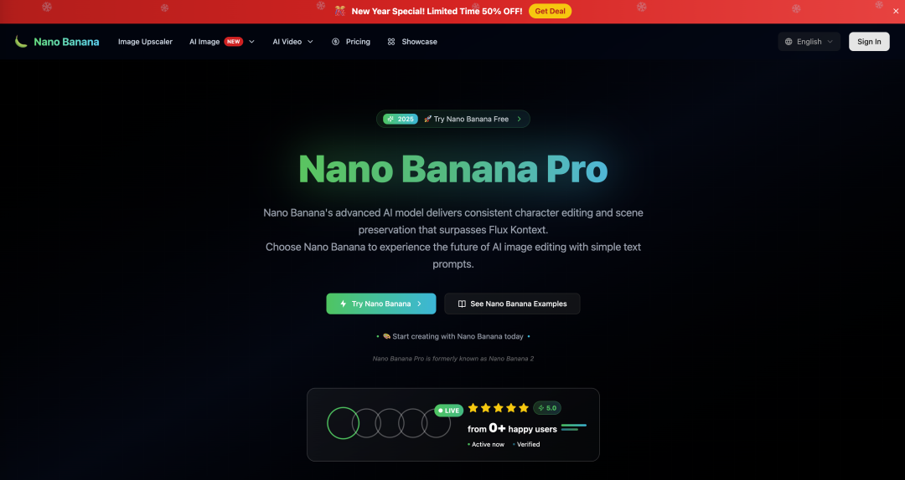
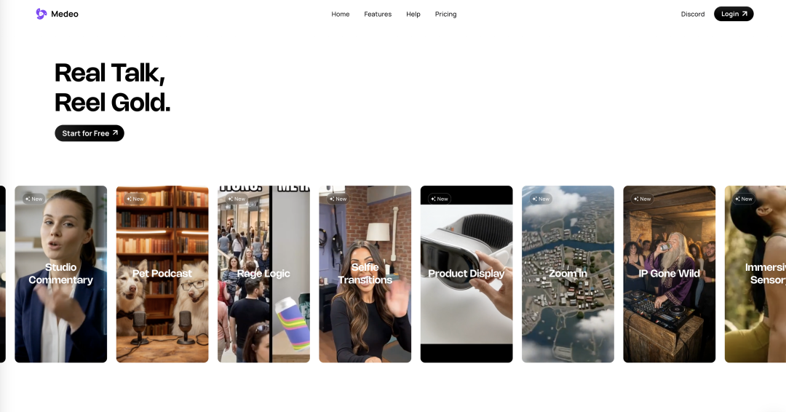
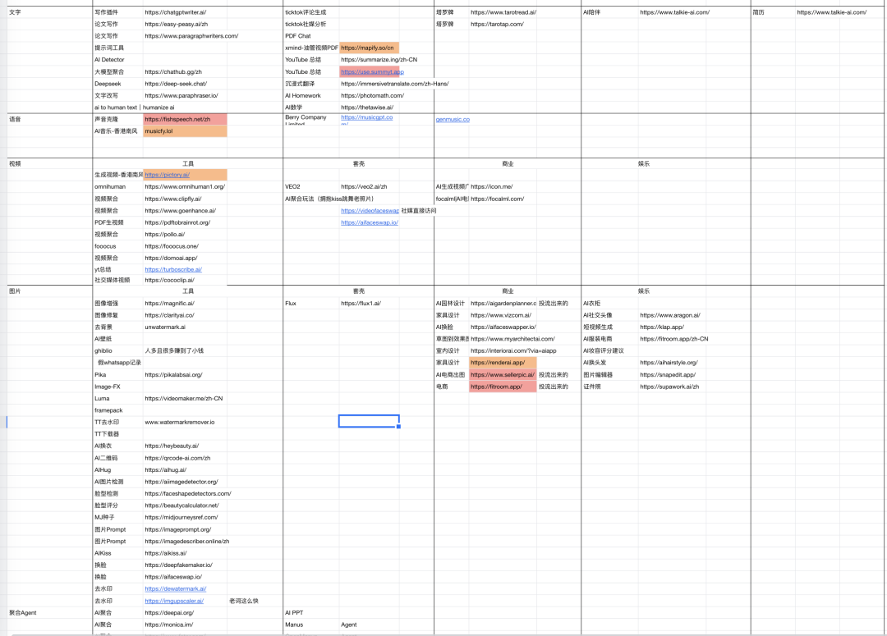

# 独立开发选品避坑指南：如何选对方向，尽快赚到第一个美金

> 一位创业 10 年的程序员走上独立开发之路，从实战角度给出选品方法论：新热点小工具 → 聚合站 → 品牌站三阶段路线，强调"先活下来再谈理想"，核心目标是尽快赚到第一个美金。

<!-- more -->

## 作者信息

- **作者**：Corly
- **发布**：2026-01-21

## 核心观点

> **独立开发，选品就是决定你生死的头等大事。方向一旦偏了，你做得越认真，死得就越快。**

敲下第一行代码前，把"选品"想透，远比写代码重要。

## 一、先活下来，再谈理想

很多开发者一上来就想做"改变世界"的创新产品，但服务器账单会先把你打垮。早期评价产品好坏的标准不是够不够酷，而是**有没有人愿意付钱**。

### 三个阶段的方法论

#### 阶段 1：围绕"新热点"做小工具

每当新模型、新工具爆发时，都会出现短暂窗口期：搜索需求暴增，但能用的产品很少。

> 哪怕做一个功能极简的"套壳"工具，只要能解决具体痛点，就能收割第一批付费用户。

- **案例**：Nano Banana（nanobanana.org）——用户根本不在意背后是哪个模型，只要快速出结果
- 

#### 阶段 2：做"聚合站"，卖的是省事

单点功能太薄时，整合能力本身就是价值——降低用户的决策成本。

- **案例**：Viddo（viddo.ai）——把文生视频、图生视频等 AI 能力整合在一起，用户不用到处找工具、比价格
- 

#### 阶段 3：品牌站——"富余"时的追求

有品牌感的工具需要积累信任，前期很难见到钱。

- **案例**：Medeo（medeo.app）
- **建议**：等你赚到第一笔钱后，再来谈品牌和理想
- 

## 二、用户心理：赚谁的钱，逻辑完全不同

- 不同地区用户的付费行为差别巨大
- 海外规则更公平，用户更愿意给"小而美"的产品一个机会
- 这就是独立开发者普遍往海外跑的根本原因

## 三、流量红利：搜索引擎对"个体户"的善意

Google 对独立开发者要友好得多。一个非常实用的 SEO 技巧：

> **关键词即域名。**

只要页面结构清晰，Google 就会给你排在前面。这种"名副其实"的站点，对早期项目来说几乎是白给的流量。

相比之下，国内搜索环境长期被大平台占据，没品牌、没预算的独立开发者生存空间极其狭窄。

## 四、技术克制：别选那种"太重"的路

AI 编程工具让一个人顶一个团队成了可能，但千万别因此产生错觉。

**警惕"商业模式太重"的项目：** 社交平台、即时通讯——这些依赖沉重的运营和持续冷启动成本。

**理想选品标准：** 结构简单、需求明确、能快速上线并尝试收费。哪怕功能不炫酷，只要跑通付费闭环，就已经赢过了 90% 的人。

## 五、核心目标：赚到你的第一个美金

赚到第一个美金的意义不在于钱本身，而在于：

> **它验证了"你做的事有人愿意付费"这个最基本的假设。**

这是从 0 到 1 的质变，是选品正确的最有力证据。

## 总结

独立开发如何盈利？**选品定生死。**

不要急着证明你有多牛，也不要一上来就死磕创新。先活下来，先赚到第一个美金，先完成从 0 到 1 的转变。当你完整跑通一次商业闭环后，再回头看选品，你会发现：很多深坑，其实一开始就能避开。

## 关键洞察

1. **选品三阶段**：新热点小工具（快钱）→ 聚合站（省事的价值）→ 品牌站（长线），按优先级递进
2. **套壳不是原罪**：Nano Banana 等案例表明，热点窗口期套壳工具一样可以赚第一桶金
3. **海外流量红利**：Google 对独立开发者友好，"关键词即域名"是白给流量的实操技巧
4. **技术克制的核心**：警惕"大而全"和"模式太重"的项目，结构简单 + 付费闭环 = 胜出
5. **第一个美金的信号意义**：不在于金额，而在于验证"有人愿意付费"这个基本假设
6. **方向偏了，越努力死越快**：出海试错门槛看似低，但时间成本极高，一两个月无正反馈足以摧毁信心
