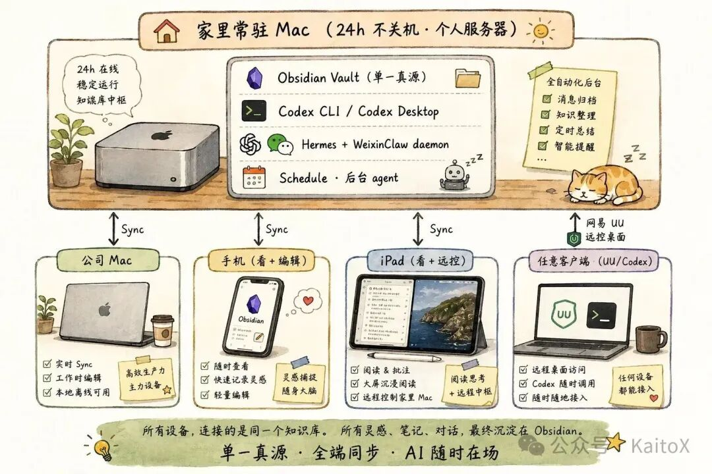

# 让AI站在我全部数据上

> 把所有东西塞进一个 Obsidian 知识库，家里一台 Mac 24h 跑着，三个入口随时触达。

这篇文章想讲的不是"我用了哪些工具"，而是一个更具体的问题：**怎么让 AI 长期站在我的全部数据上，并且在我需要的时候低摩擦地出现？**

---

<!-- more -->

## 三个痛点

- **数据散**：笔记、灵感、任务、阅读记录分散在 N 个 App，AI 看不到全貌
- **系统不活**：知识库靠手动整理，整理一次爽两天，过两周又乱
- **入口太重**：只有坐到电脑前才想得起来用 AI

## 四层架构

| 层级 | 解决 | 做法 |
|------|------|------|
| 数据底座 | AI 看不到全部上下文 | 收回本地 Obsidian vault |
| 执行环境 | Agent 需要常驻进程 | 家里 Mac 24h 跑 Codex、Hermes |
| 触达入口 | 不同场景不同摩擦 | 微信、Codex Mobile、Obsidian Sync |
| 行动能力 | AI 不只能读笔记 | 用 Skill 接富途、API 等 |

## 核心链路

> 让 AI 读得到我，跑得起来，找得到我，也能替我做事。

## 第一层：本地 Obsidian vault

把所有东西分四类塞进 Obsidian：知识沉淀、流水记录、创作产出、生活资料。

> Obsidian 的角色不是笔记软件，而是 **AI 的本地数据底座**。

## 第二层：常驻 Mac

让算力和数据留在家里，外面的设备只做窗口。Mac 能直接挂载 NAS，站在 vault + NAS 两份数据之上。云服务器解决不了 NAS 的问题。

## 第三层：三个入口

- **微信**：0 秒摩擦，秒级问答，解决"随时问一句"
- **Codex Mobile**：手机审批 agent，比 UU 流畅
- **Obsidian Sync**：写笔记主战场

使用比例 Sync 60% + 微信 30% + Codex Mobile 10%。

## 第四层：Skill

三个真实 case：
1. **理财**：futu skill × vault，让《股票大作手回忆录》参与真实决策
2. **每日推送**：vault × agent，每天早上自动生成计划
3. **每周复盘**：agent 主动分析，连续 4 天没勾掉的任务被揪出来

结构都是：**本地知识库 = 数据底盘 | Skill = 工具放大器 | Agent = 胶水**

## 核心洞察

> **错误模型**：写完 = 完成，再润色再等等
> **正确模型**：发出去 = 完成，第一篇就是 noise，反馈在数据里

这种洞察光靠人看不到，需要三个条件同时成立：全量数据 × 跨时间维度 × agent 主动分析。

## 收尾

> 真正的杠杆，是让 AI 够得着你的全部数据。

把散在 N 个工具里的东西，收回一个本地知识库。你的数据现在在 AI 够得着的地方吗？

