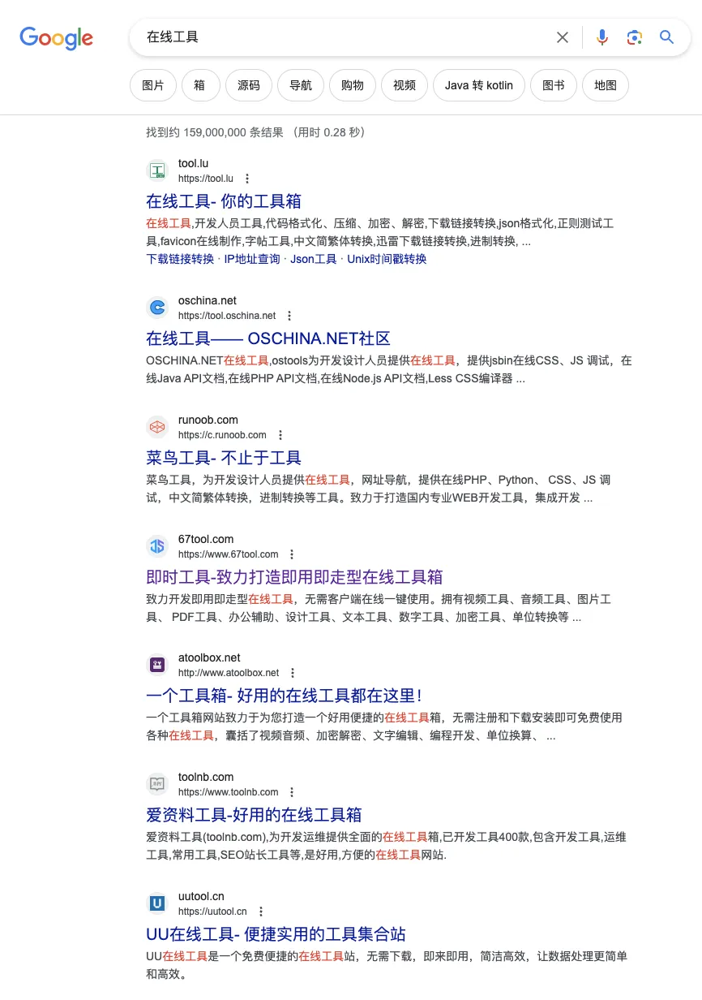
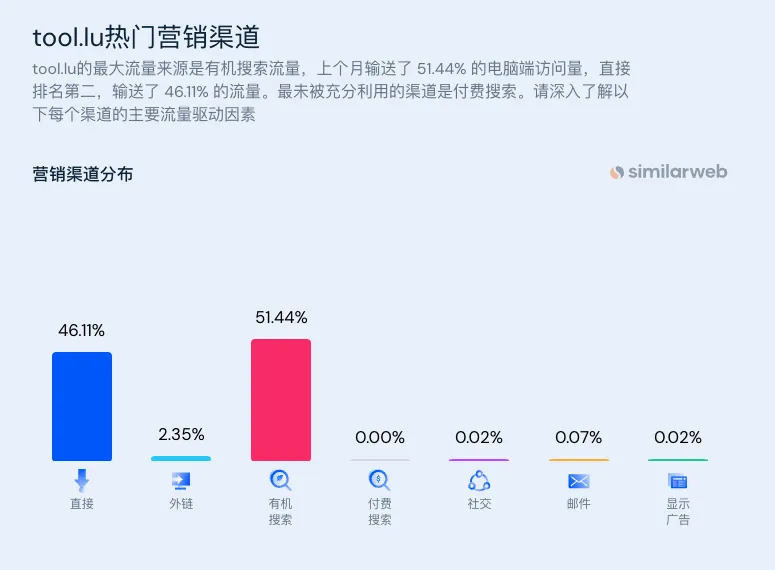
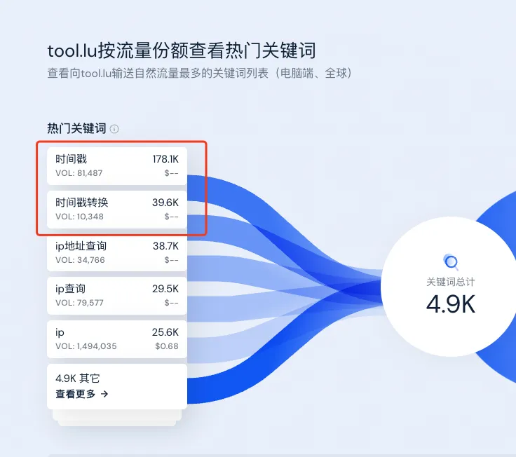

# 人人都能学会的发掘 web 产品需求方法入门
> 原文链接: https://new.web.cafe/tutorial/detail/x6FJMuPZ4Q8MskMzhE2cmh

---

哥飞2024-08-12 15:15

挖掘需求

## 挖掘需求

# 人人都能学会的发掘 web 产品需求方法入门

收藏

群友问我，如何发掘 web 产品需求，我说真传一句话，就是@弹弹心 的做法，看榜单，看数据，看别人都做了什么。

举例说明，先从看 Similarweb ( [https://www.similarweb.com/](https://www.similarweb.com/) ) 开始，因为这个不用注册就能用。

举例，你想开发在线工具，最好是前端就可以实现的，这样网站做好之后，几乎就不用去升级维护了。

但你又不知道有哪些工具有流量，那么我们就可以先在谷歌中输入“在线工具”，看下搜索结果。  第一个是 tool.lu，那就去 Similarweb 上输入域名， 打开下面网址：[https://www.similarweb.com/zh/website/tool.lu/#overview](https://www.similarweb.com/zh/website/tool.lu/#overview)  首先看下，月访问量 170 万，还是不错的。  然后看用户兴趣点中的其它受访网站，有 json.cn、bejson.com、cnblogs.com、w3cschool.cn 等，每一个都右键新标签页打开，留着备用。  再看竞争对手和类似网站，这里我不一一列举，一样每个都用右键打开新标签页，放着备用。  再看流量来源，有46.11%来自于直接访问，也就是用户记住了网址，或者从浏览器书签栏打开。有51.44%来自于搜索引擎，这里的“有机搜索”是自然搜索的意思。

这里可以看到这个站的流量来源，挺大比例来自于搜索引擎，我们可以分析下，他的流量来自于哪些搜索词。  可以看到排名前几的搜索词，有“时间戳”、“时间戳转换”、“ip地址查询”、“ip查询”、“ip”等。

这里的每个搜索词，都可以注册一个域名，单独做一个工具网站，来竞争。

我们再打开国内的爱站 aizhan.com 首页输入框输入 tool.lu ，下拉框选择“百度权重”，点击“查询”按钮。  最终打开的地址是这个 [https://baidurank.aizhan.com/baidu/tool.lu/](https://baidurank.aizhan.com/baidu/tool.lu/) ，拉到页面中部，可以看到PC端和移动端的涨入和跌出关键词列表。  因为数据不是实时的，搜索引擎的排名却是实时变化的，爱站说“时间戳转换器”百度搜索tool.lu排第一，实际我们搜索发现排第3，这是正常的。  继续看爱站网查询页面下边表格，这里列出来了tool.lu拿到了排名的所有关键字列表。第三列是预估的PC端百度搜索量。  再来回顾一下我们的整个过程，我们先在谷歌里随便输入一个“在线工具”关键字，得到了 tool.lu 网站，之后在 similarweb 和 aizhan 上，我们得到了 tool.lu 网站能够拿到排名的一些关键字，大概就是下面这些了：

时间戳、时间戳转换、ip地址查询、ip查询、ip、时间戳转换器、在线工具、整数分区、视频地址解析、下载地址转换、整数分区计算器、unix时间戳、timestamp、unixtimestamp、在线拆字

这里的每一个关键字，我们都可以用站长网的关键字优化分析工具查看SEO优化难度。打开 [https://tool.chinaz.com/kwevaluate](https://tool.chinaz.com/kwevaluate) ，输入“时间戳”。  可以看到整体优化难度分为86分，不算太难，如果是90以上，那么趁早放弃，换下一个词。

前50名搜索结果中，百度系占了12个，内页有36个，首页只有2个。

而且实际查看列表发现，首页也只是子域名而已。

那么，“时间戳”这个词，如果我们注册一个域名，专门做“时间戳”相关工具的话，假以时日，是有可能上搜索引擎首页，甚至是排到前5前3的。

[上一篇: 通过查看 vercel.app 的子域名发现新需求](https://new.web.cafe/tutorial/detail/566236a5bb414c7eba92dcbadbf00240)[下一篇: 人人都能学会的挖掘 web 产品需求之从出站域名发现新需求新产品](https://new.web.cafe/tutorial/detail/34rBHmYJe3nFSsMDLLd8KU)

评论区

-   

    阿木子三不知

    2025-07-08 16:15

    回复

    打卡

-   

    小楼

    2025-07-23 09:40

    回复

    打卡

-   

    张宇

    2025-07-29 06:38

    回复

    打卡

-   

    \- . -

    2025-08-20 11:28

    回复

    通过这一章我针对tool.lu进行探索终于发现了Semrush数据上和similarweb之间的区别，

    

    涂灵捷 Lyn

    2025-09-15 21:19

    回复

    区别是啥

-   

    班纳

    2025-10-10 08:11

    回复

    1

-   

    蔡老九

    2025-12-28 14:12

    回复

    该篇为啥用了国内的站长工具？是做中文用户的谷歌搜索？还是百度的呢？有点蒙蒙的

    

    JS

    2026-01-07 16:10

    回复

    英文是中文站，百度也有其参考价值，如果要是英文站或者其他语种，直接ahrefs 查KD值，我是这么理解的

-   

    陈慧\_Vera

    2026-04-22 21:35

    回复

    如果聚焦做海外，也可以用爱站长工具吗

-   

    孙大龙

    2026-05-09 08:54

    回复

    学习打卡

-   

    简语

    2026-05-21 22:51

    回复

    打卡

-   

    徐俊武

    2026-06-12 08:00

    回复

    1、自己想做一个类型的网站，Google搜索关键词 2、找到排名靠前的网站，用similarweb. 爱站之类的分析它哪些关键词拿到了流量 3、用 [https://tool.chinaz.com/kwevaluate查看优化难度](https://tool.chinaz.com/kwevaluate%E6%9F%A5%E7%9C%8B%E4%BC%98%E5%8C%96%E9%9A%BE%E5%BA%A6) 4、找到难度低，流量不错，且竞争对手是内页的站，用同名域名法干他

-   

    Jimmy sunshine

    2026-07-04 09:10

    回复

    打卡

添加图片添加隐藏回复

Web.Cafe

153 results

Use arrow keys ↑↓ to navigate

The action has been successful