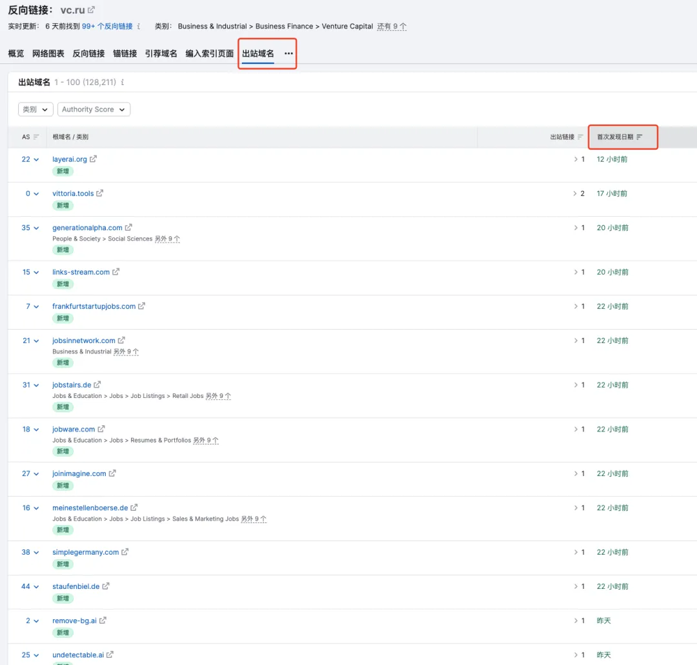
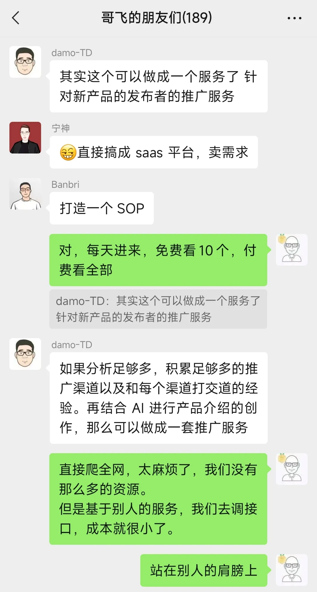

# 人人都能学会的挖掘 web 产品需求之从出站域名发现新需求新产品
> 原文链接: https://new.web.cafe/tutorial/detail/34rBHmYJe3nFSsMDLLd8KU

---

哥飞2024-08-12 15:23

挖掘需求

## 挖掘需求

# 人人都能学会的挖掘 web 产品需求之从出站域名发现新需求新产品

收藏

 大家好，我是哥飞，昨天给大家分享了 [【5000字调查分析】建站20天拿下480万访问量，俄罗斯版的妙鸭相机是怎么做到的？](https://mp.weixin.qq.com/s/9CaMuaOC4juWw6rdeI_3Lg) ，里边提到有两个站 pikabu.ru 和 vc.ru 。

哥飞在社群里给大家提醒了一下：

想法，既然这两个网站这么能给别的站带量，那就可以去分析一下他们的出站链接了，说不定可以发现一些不错的新网站。  哥飞一向是说完想法了，先自己实践一下，说干就干，打开 Semrush 查 vc.ru 的出站域名，截图如下图所示。 果然发现了很多新站，但此时又有个问题，哥飞需要手动一个一个域名去复制，然后查询whois判断域名注册时间，再去 Similarweb 查询流量。

于是哥飞就给群里的@Banbri 提供一个产品的小思路了。

 相当于把查询出来的出站域名都批量保存起来，都查一下 whois 获取注册时间，再查 Similarweb 获取流量数据，再查 Archive.org 获取收录的历史页面，还可以再用 [分享10个基于第三方谷歌搜索API的可实操赚钱方法](https://mp.weixin.qq.com/s/vQ9GJ5cHFh-z0q3lVsgteA) 这个谷歌搜索API查询更多相关信息。

最后得到的数据，我就可以用各种查询条件来限定，如查询7月份注册的新域名，谷歌收录了的，Archive 收录了的，流量大于多少的，之后再按照流量排序或者按照注册时间排序。

用这个方法，就可以找出很多新上线的，并且正在推广中的，有流量的新产品。

而最核心的思路其实是开头说过的，因为这些新网站需要去各个地方宣传推广，那么就一定会留下链接，我们根据这些网站的出站域名就能够发现这些新网站。  群友们根据哥飞的演示，马上就总结出来了这个方法的价值所在，能够研究需求，分析竞对。  damo 老板想到了更多，他说这一套方法甚至可以做成一个服务，卖给所有的需要推广的开发者。  以上就是哥飞给大家分享的如何使用Semrush的查询出站域名，发掘新产品，新需求的方法，以及群友们基于这个方法总结的更广泛的使用场景。

[上一篇: 人人都能学会的发掘 web 产品需求方法入门](https://new.web.cafe/tutorial/detail/x6FJMuPZ4Q8MskMzhE2cmh)[下一篇: 51个挖掘需求时能用得上的财富密码关键词哥飞免费赠送给大家](https://new.web.cafe/tutorial/detail/2kk1hukGPXDZfr6Ra5Ciiy)

评论区

-   

    觉

    2024-12-02 16:13

    回复

    做出来了吗？

    

    我是省外的

    2025-01-06 13:42

    回复

    这个想法不错bucuo

-   

    2025-06-16 15:28

    回复

    banbri 大佬做出来了吗

-   

    2025-06-17 16:34

    回复

    我想起以前用的脚本 影刀 rpa 自动查询，汇总到表格

-   

    阿木子三不知

    2025-07-08 16:37

    回复

    做出来了吗？之前第一次看没看懂，现在是看懂了。

    

    欲买桂花同载酒

    2025-08-18 16:02

    回复

    Banbri 大佬的 [https://traffic.cv/](https://traffic.cv/)

-   

    \- . -

    2025-08-20 17:43

    回复

    了解到一个新的挖掘需求的方法，通过一些初期产品宣传的大站，通过出站的域名来了解到一些新的产品需求

-   

    陈慧\_Vera

    2026-04-22 21:42

    回复

    打卡

-   

    简语

    2026-05-21 23:06

    回复

    打卡

添加图片添加隐藏回复

Web.Cafe

153 results

Use arrow keys ↑↓ to navigate

The action has been successful